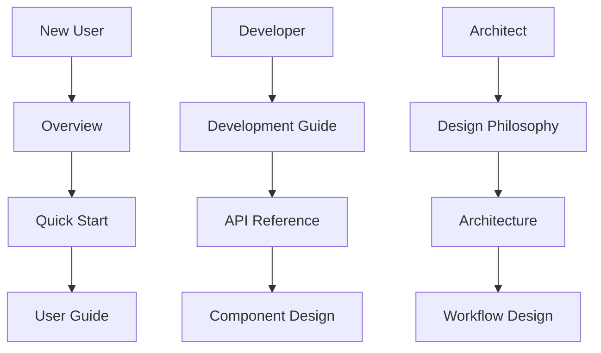

# TradingAgents Documentation

Welcome to the TradingAgents documentation! This comprehensive guide covers everything you need to know about the Multi-Agents LLM Financial Trading Framework.

## 📚 Documentation Structure

### 👥 User Documentation
- **[Project Overview](user/overview.md)** - Understanding TradingAgents and its capabilities
- **[System Capabilities & Limitations](user/system-capabilities.md)** - ⚠️ **IMPORTANT**: What TradingAgents does and doesn't do
- **[Quick Start Guide](user/quick-start.md)** - Get up and running in minutes
- **[User Guide](user/user-guide.md)** - Comprehensive usage instructions
- **[Configuration](user/configuration.md)** - Detailed configuration options

### 🎨 Design Documentation
- **[Design Philosophy](design/design-philosophy.md)** - Core principles and design thinking
- **[System Architecture](design/architecture.md)** - Technical architecture overview
- **[Workflow Design](design/workflow-design.md)** - Multi-agent workflow explanation
- **[Decision Framework](design/decision-making-framework.md)** - How decisions are made

### 🛠️ Developer Documentation
- **[Development Guide](developer/development-guide.md)** - Setting up development environment
- **[API Reference](developer/api-reference.md)** - Complete API documentation
- **[Component Design](developer/component-design.md)** - Internal component architecture
- **[Extending Agents](developer/extending-agents.md)** - How to add new agents

## 🚀 Quick Navigation

## 📖 Getting Started

1. **New to TradingAgents?** Start with the [Project Overview](user/overview.md)
2. **⚠️ IMPORTANT:** Read [System Capabilities & Limitations](user/system-capabilities.md) to understand what TradingAgents does and doesn't do
3. **Want to try it quickly?** Jump to [Quick Start Guide](user/quick-start.md)
4. **Planning to develop?** Check [Development Guide](developer/development-guide.md)
5. **Understanding the design?** Read [Design Philosophy](design/design-philosophy.md)

## 🔗 External Resources

- [GitHub Repository](https://github.com/TauricResearch/TradingAgents)
- [Research Paper](https://arxiv.org/abs/2412.20138)
- [Discord Community](https://discord.com/invite/hk9PGKShPK)
- [Twitter](https://x.com/TauricResearch)

---

*Built with ❤️ by [Tauric Research](https://github.com/TauricResearch)*