# System Architecture

## 🏗️ High-Level Architecture Overview

TradingAgents follows a **layered, modular architecture** designed for scalability, maintainability, and extensibility. The system is built around the concept of specialized AI agents working together in a coordinated workflow.

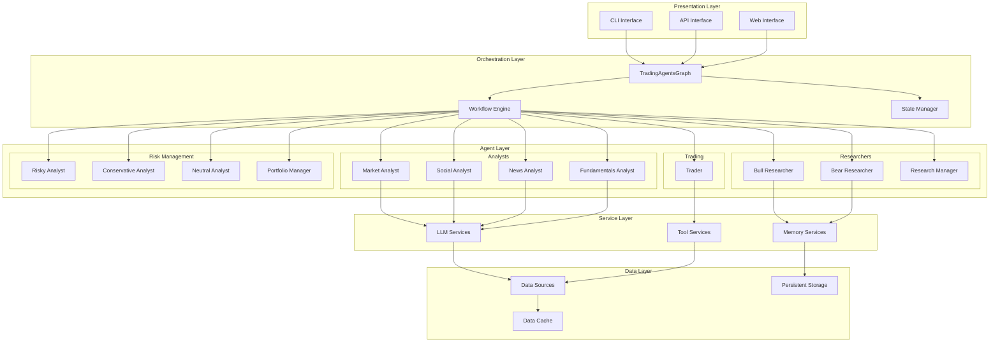

## 🔧 Core Components

### 1. TradingAgentsGraph (Orchestrator)

The central orchestrator that coordinates all agents and manages the overall workflow.

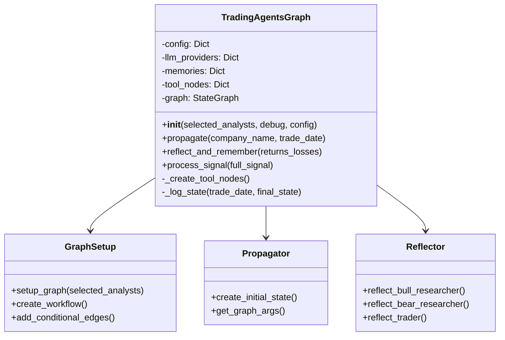

**Key Responsibilities**:
- Initialize and configure all agents
- Manage the workflow execution
- Handle state transitions
- Coordinate inter-agent communication
- Process final decisions

### 2. Agent Architecture

Each agent follows a consistent architectural pattern:

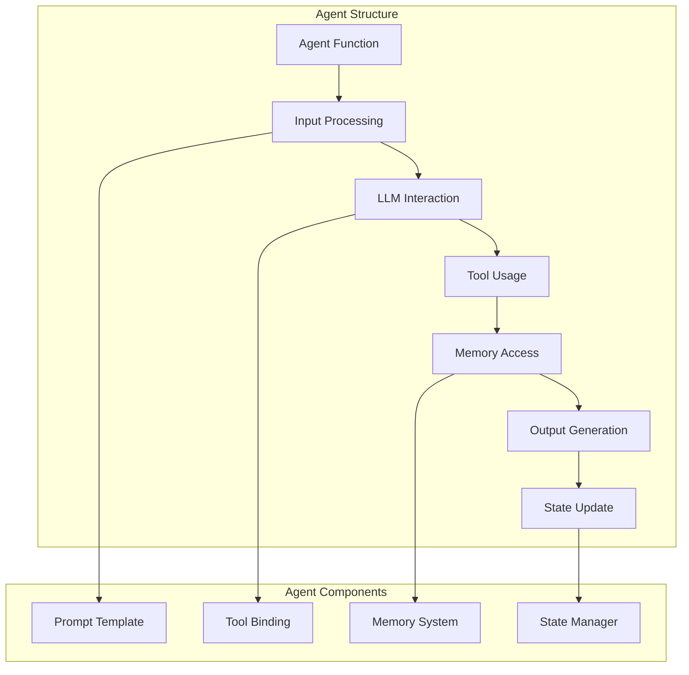

#### Agent Implementation Pattern
```python
def create_agent(llm, toolkit, memory=None):
    def agent_node(state):
        # 1. Extract relevant state information
        context = extract_context(state)
        
        # 2. Access memory for past experiences
        if memory:
            past_memories = memory.get_memories(context)
        
        # 3. Create prompt with context and memories
        prompt = create_prompt(context, past_memories)
        
        # 4. Bind tools if needed
        chain = prompt | llm.bind_tools(tools)
        
        # 5. Execute analysis
        result = chain.invoke(state["messages"])
        
        # 6. Update state
        return update_state(result)
    
    return agent_node
```

### 3. Memory System Architecture

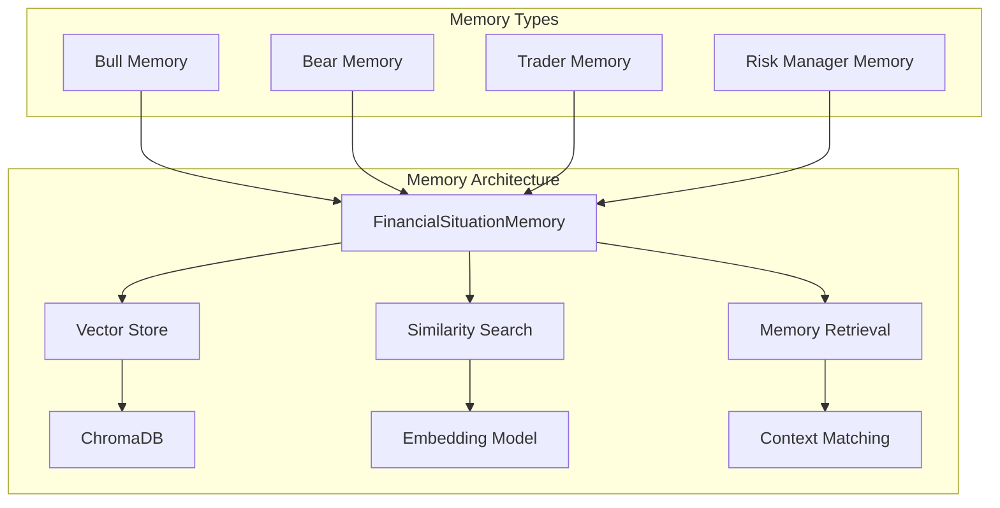

**Memory System Features**:
- **Semantic Search**: Find relevant past experiences
- **Context Awareness**: Match current situation to historical patterns
- **Learning Integration**: Update memories based on outcomes
- **Agent-Specific**: Each agent maintains its own memory

### 4. Data Flow Architecture

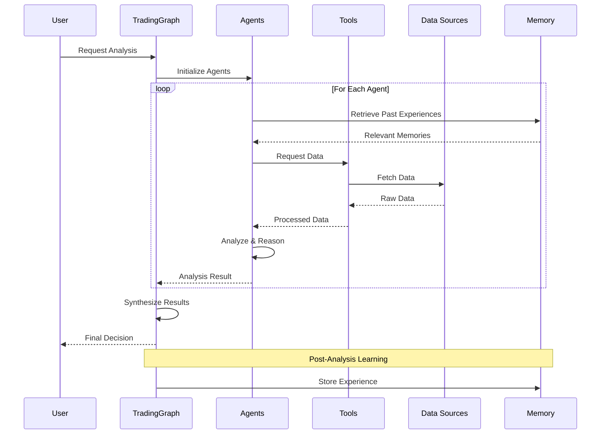

## 🔄 Workflow Engine

### State Management

The system uses a sophisticated state management system to track the analysis progress:

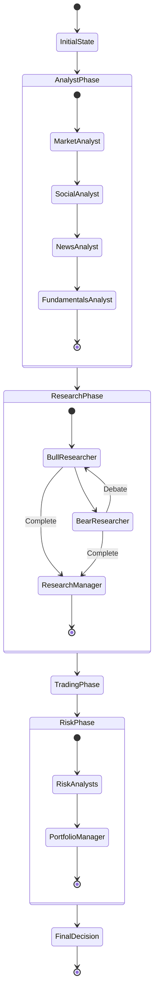

### Agent State Schema

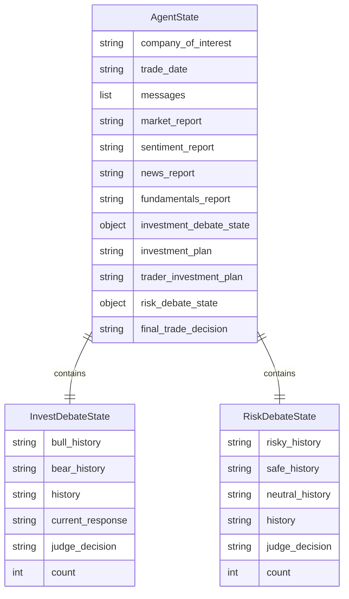

## 🛠️ Tool System Architecture

### Tool Organization

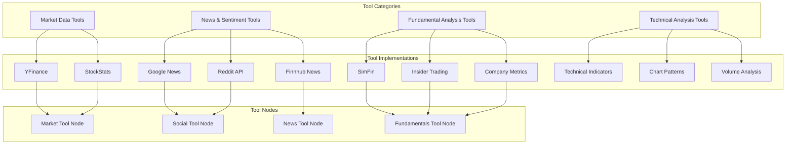

### Tool Interface Design

```python
class Toolkit:
    def __init__(self, config):
        self.config = config
        self.online_mode = config.get("online_tools", True)
    
    # Market Data Tools
    def get_YFin_data_online(self, ticker: str, period: str) -> str:
        """Fetch real-time market data"""
        pass
    
    def get_stockstats_indicators_report_online(self, ticker: str) -> str:
        """Calculate technical indicators"""
        pass
    
    # News & Sentiment Tools
    def get_google_news(self, query: str) -> str:
        """Fetch latest news"""
        pass
    
    def get_reddit_stock_info(self, ticker: str) -> str:
        """Analyze social sentiment"""
        pass
    
    # Fundamental Analysis Tools
    def get_fundamentals_openai(self, ticker: str) -> str:
        """Get fundamental analysis"""
        pass
```

## 🧠 LLM Integration Architecture

### Multi-Provider Support

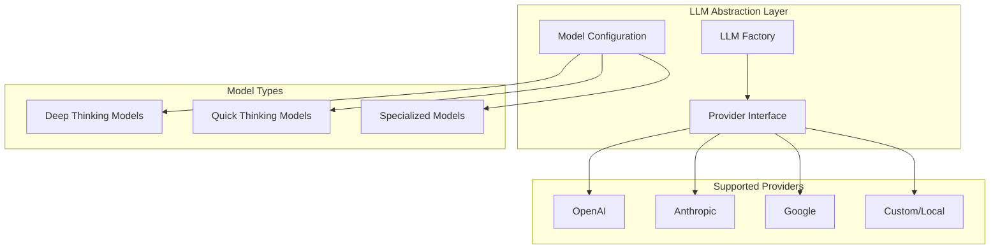

### LLM Configuration Strategy

```python
class LLMConfig:
    def __init__(self, config):
        self.provider = config["llm_provider"]
        self.deep_model = config["deep_think_llm"]
        self.quick_model = config["quick_think_llm"]
        self.backend_url = config["backend_url"]
    
    def create_llms(self):
        if self.provider == "openai":
            deep_llm = ChatOpenAI(
                model=self.deep_model,
                base_url=self.backend_url
            )
            quick_llm = ChatOpenAI(
                model=self.quick_model,
                base_url=self.backend_url
            )
        elif self.provider == "anthropic":
            deep_llm = ChatAnthropic(
                model=self.deep_model,
                base_url=self.backend_url
            )
            quick_llm = ChatAnthropic(
                model=self.quick_model,
                base_url=self.backend_url
            )
        # ... other providers
        
        return deep_llm, quick_llm
```

## 📊 Data Architecture

### Data Source Integration

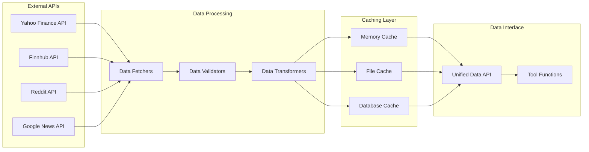

### Caching Strategy

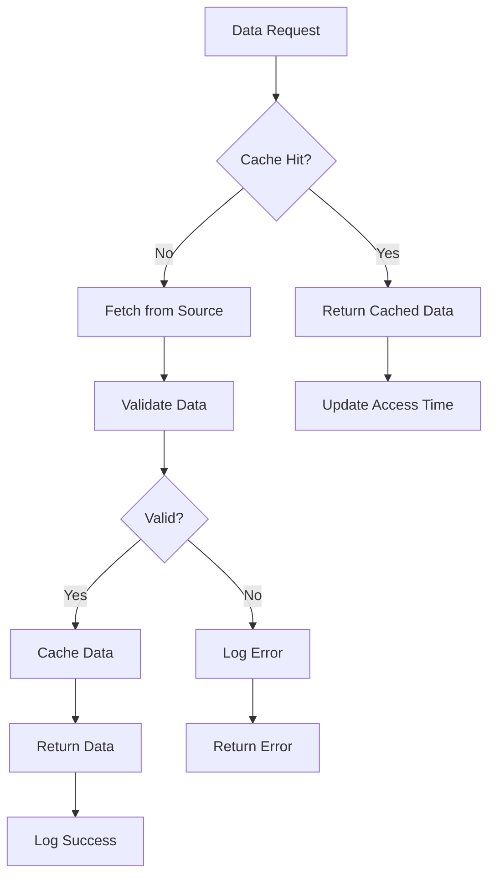

## 🔧 Configuration Architecture

### Hierarchical Configuration

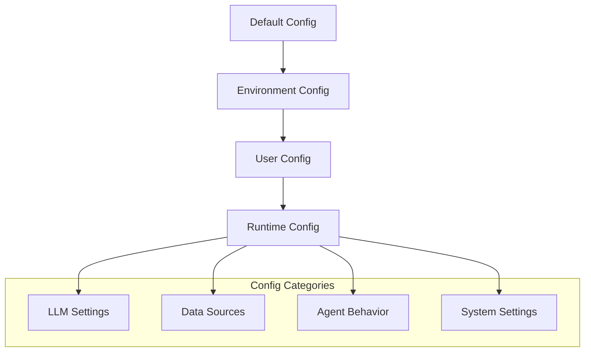

### Configuration Schema

```python
DEFAULT_CONFIG = {
    # System Settings
    "project_dir": "path/to/project",
    "results_dir": "./results",
    "data_cache_dir": "./cache",
    
    # LLM Settings
    "llm_provider": "openai",
    "deep_think_llm": "gpt-4",
    "quick_think_llm": "gpt-3.5-turbo",
    "backend_url": "https://api.openai.com/v1",
    
    # Agent Behavior
    "max_debate_rounds": 3,
    "max_risk_discuss_rounds": 2,
    "max_recur_limit": 100,
    
    # Tool Settings
    "online_tools": True,
}
```

## 🚀 Deployment Architecture

### Scalability Considerations

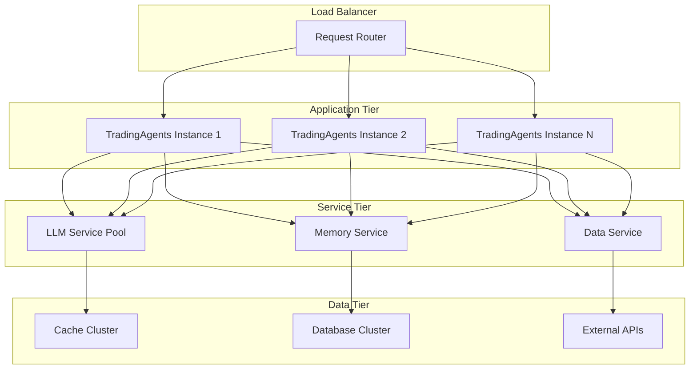

## 🔍 Monitoring and Observability

### System Monitoring

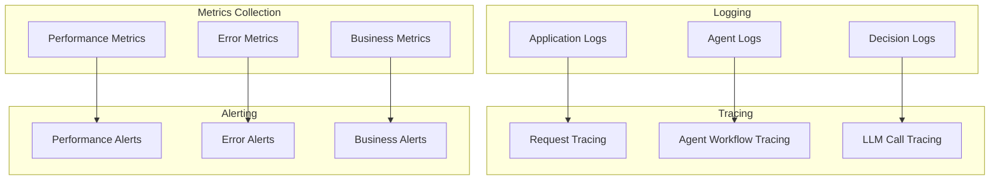

---

This architecture provides a solid foundation for building, scaling, and maintaining the TradingAgents system while ensuring flexibility for future enhancements.

**Next**: Explore the detailed [Workflow Design](workflow-design.md) to understand how agents collaborate.