# Design Philosophy

## 🎯 Core Design Principles

TradingAgents is built on fundamental principles that mirror how professional investment teams operate in the real world. Our design philosophy emphasizes **collective intelligence**, **systematic decision-making**, and **continuous learning**.

## 🧠 Multi-Agent Intelligence Philosophy

### The Wisdom of Crowds
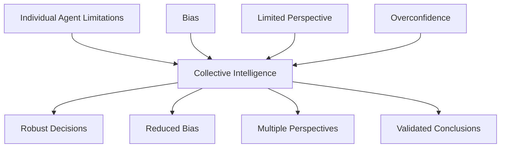

**Core Belief**: No single AI agent, regardless of sophistication, can match the collective intelligence of a well-designed team of specialized agents.

### Specialization Over Generalization
Each agent in TradingAgents has a **specific role and expertise**:

- **Market Analyst**: Technical analysis specialist
- **News Analyst**: Information processing expert
- **Bull/Bear Researchers**: Opposing perspective advocates
- **Risk Analysts**: Risk assessment specialists

This mirrors real-world investment teams where specialists collaborate rather than generalists working in isolation.

## 🔄 Adversarial Collaboration

### The Bull-Bear Debate Mechanism
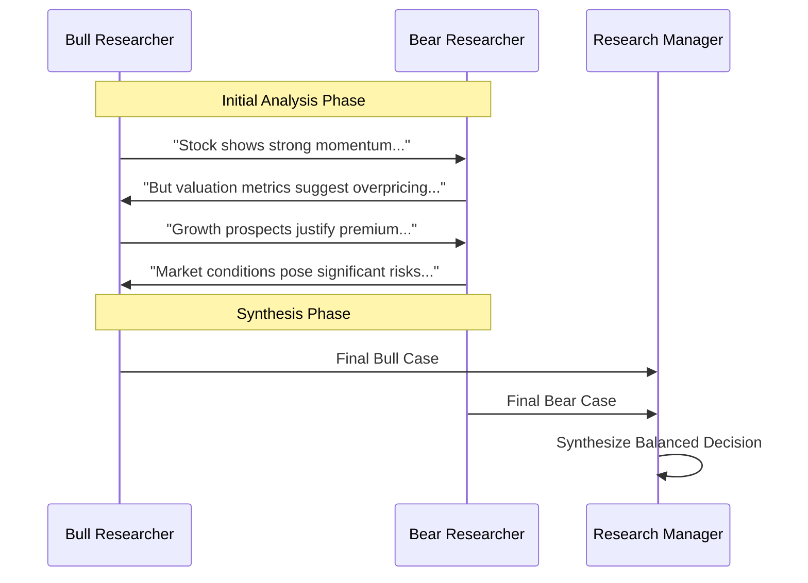

**Philosophy**: Truth emerges through constructive conflict. By forcing agents to argue opposing viewpoints, we:
- Expose hidden assumptions
- Identify weak arguments
- Strengthen final conclusions
- Reduce confirmation bias

### Hierarchical Decision Making
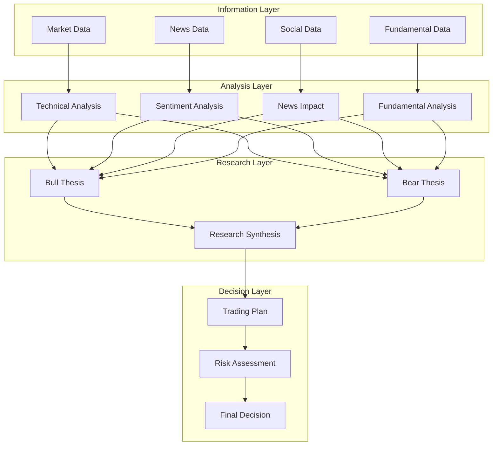

## 🎭 Role-Based Agent Design

### Agent Personality and Behavior
Each agent has a distinct "personality" that influences its analysis:

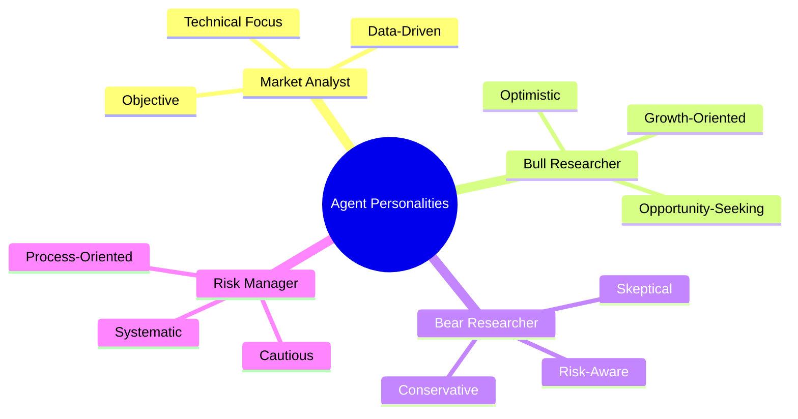

**Design Rationale**: Different perspectives require different cognitive approaches. By giving agents distinct personalities, we ensure diverse analytical approaches.

### Memory and Learning Architecture
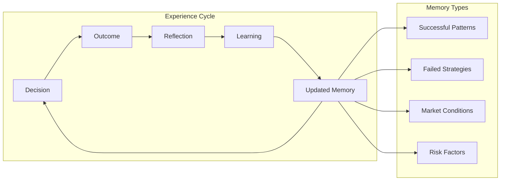

**Philosophy**: Intelligence emerges from experience. Each agent maintains its own memory system to learn from past decisions and continuously improve.

## 🏗️ Modular Architecture Philosophy

### Separation of Concerns
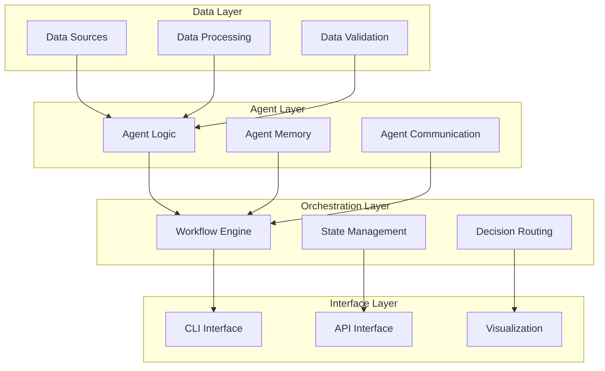

**Benefits**:
- **Maintainability**: Each component has a single responsibility
- **Extensibility**: New agents can be added without affecting existing ones
- **Testability**: Components can be tested in isolation
- **Scalability**: Components can be scaled independently

### Plugin Architecture
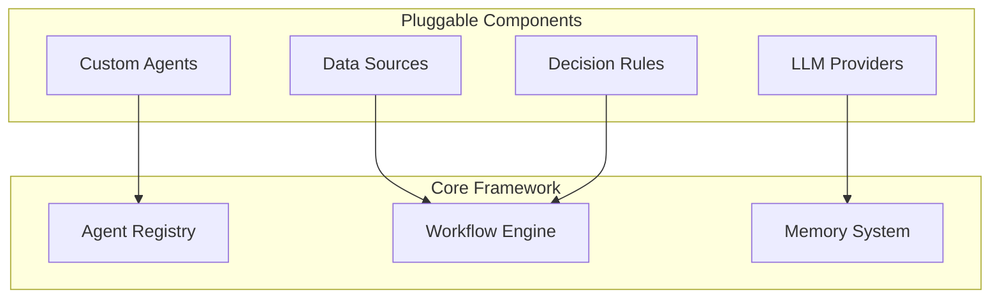

**Design Goal**: Enable easy customization and extension without modifying core framework code.

## 🔬 Scientific Approach to Trading

### Hypothesis-Driven Analysis
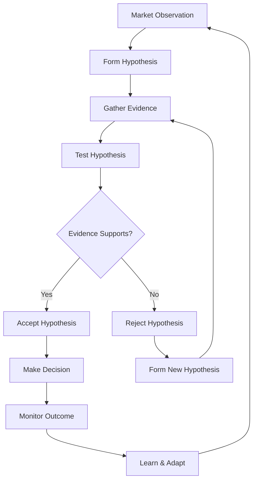

**Principle**: Every trading decision should be based on testable hypotheses backed by evidence.

### Quantitative and Qualitative Integration
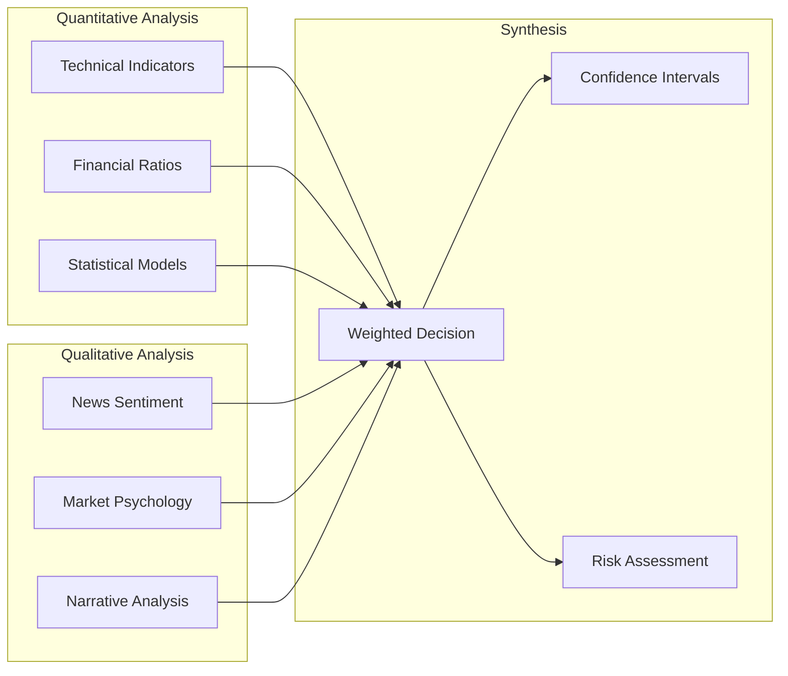

**Philosophy**: Markets are driven by both quantitative factors and human psychology. Effective analysis must integrate both dimensions.

## 🎯 Risk-First Design

### Risk as a First-Class Citizen
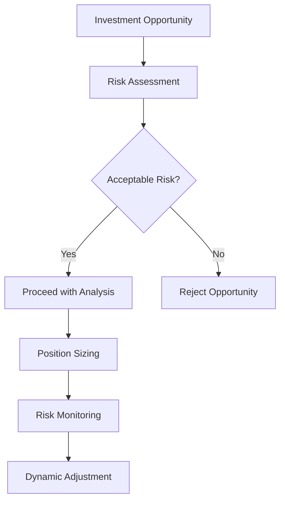

**Core Principle**: Risk management is not an afterthought but an integral part of every decision.

### Multi-Layered Risk Framework
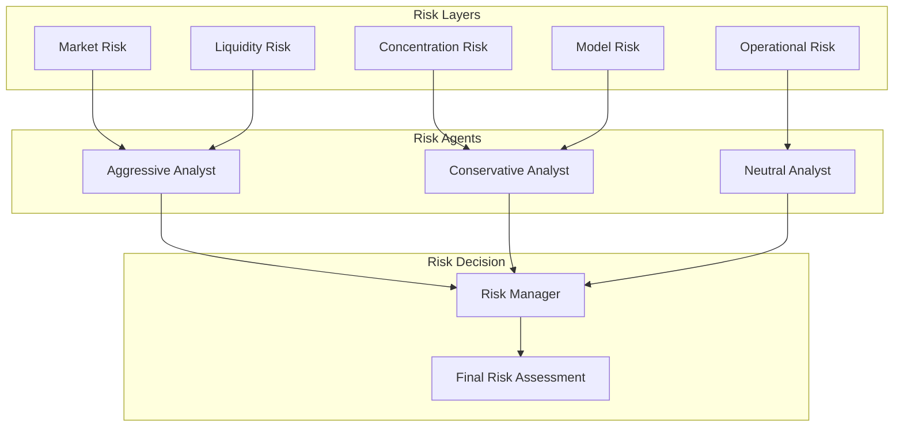

## 🔄 Continuous Improvement Philosophy

### Feedback Loop Design
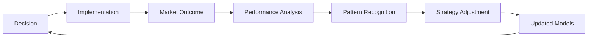

**Belief**: The best trading systems are those that continuously learn and adapt to changing market conditions.

### Error Analysis and Learning
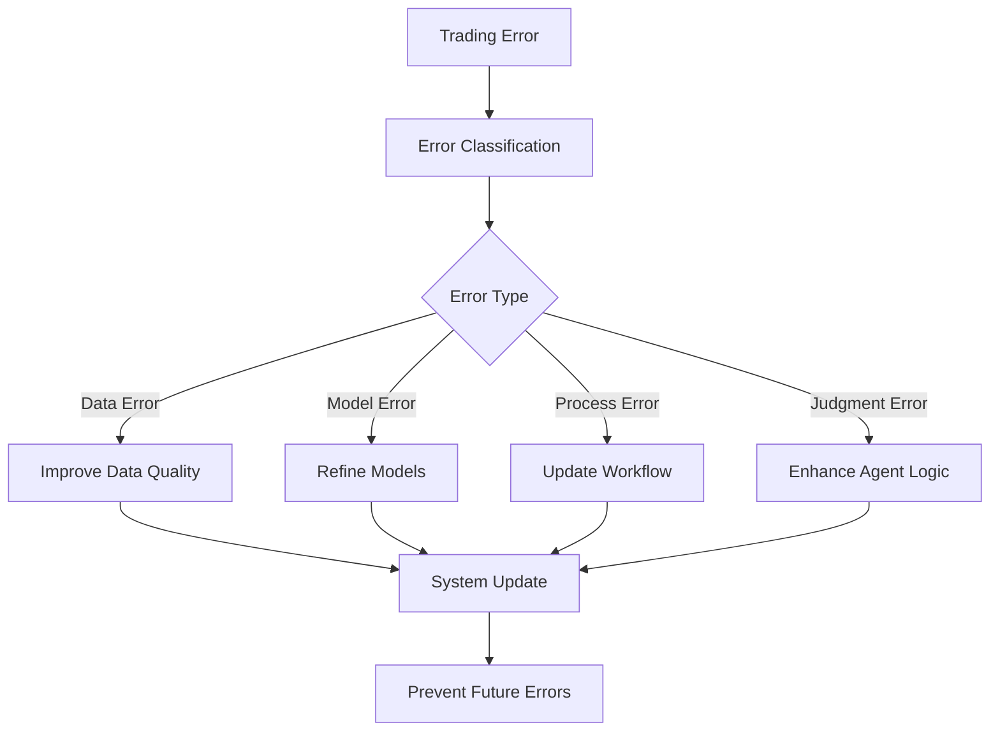

**Philosophy**: Every mistake is a learning opportunity. Systematic error analysis leads to continuous improvement.

## 🌐 Transparency and Explainability

### Decision Audit Trail
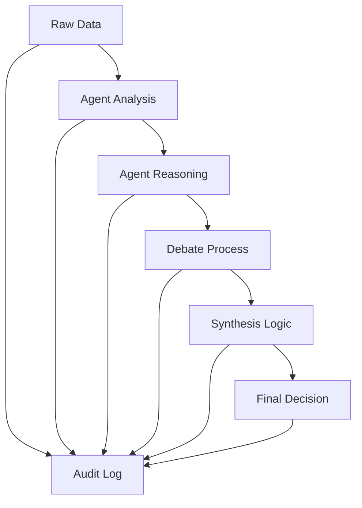

**Principle**: Every decision must be fully traceable and explainable. Users should understand not just what decision was made, but why.

### Human-AI Collaboration
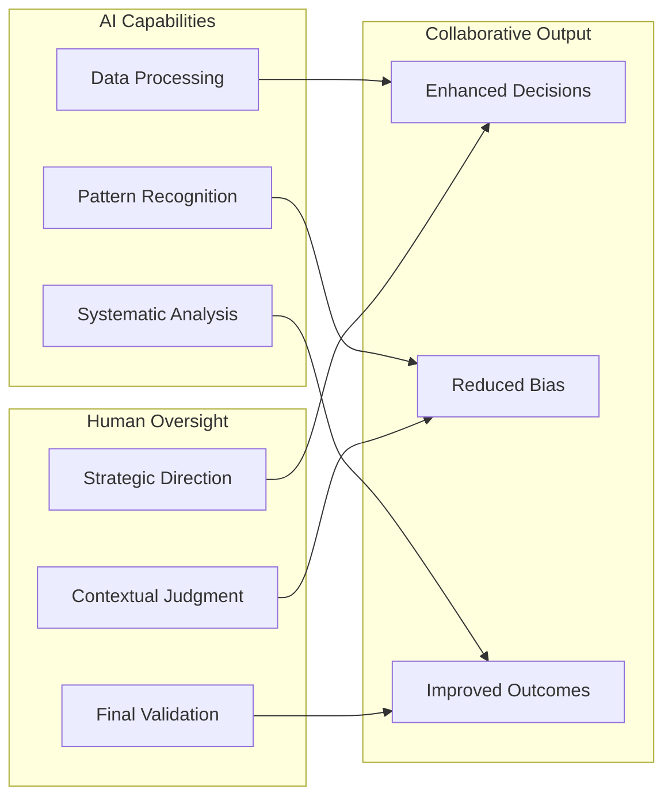

**Vision**: TradingAgents augments human intelligence rather than replacing it. The system provides comprehensive analysis while humans retain ultimate decision authority.

---

This design philosophy guides every aspect of TradingAgents development, ensuring that the system remains true to its core mission of providing intelligent, transparent, and continuously improving investment analysis.

**Next**: Explore how these principles are implemented in our [System Architecture](architecture.md).