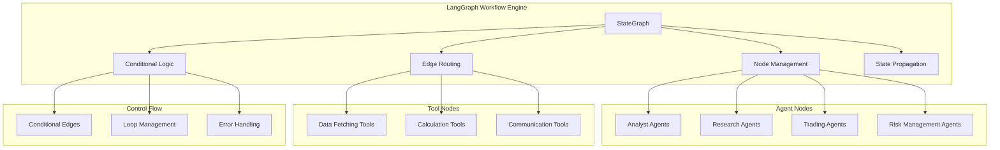
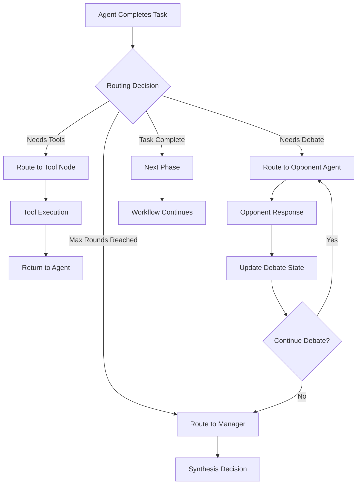
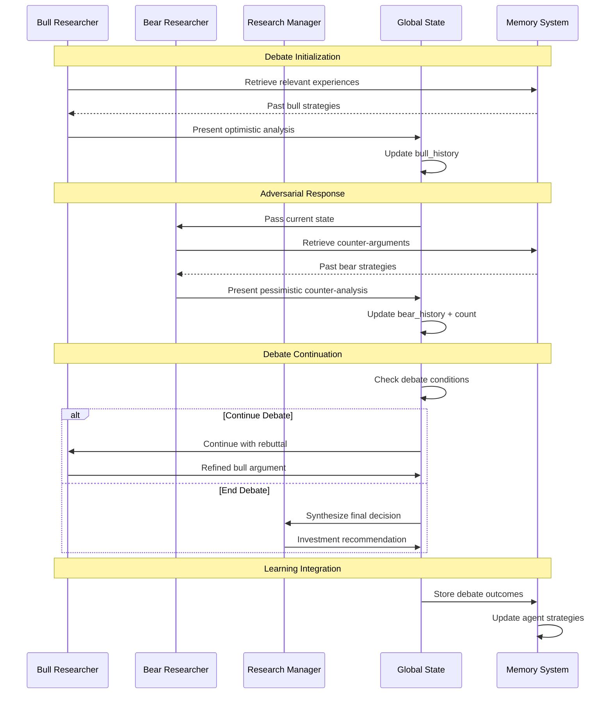
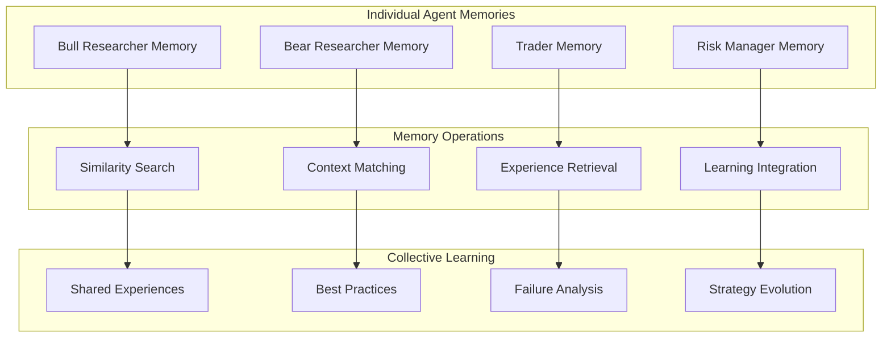

# Multi-Agent Collaboration Architecture

## 🎯 Overview

TradingAgents implements a sophisticated **multi-agent collaboration framework** that can be abstracted and applied to various industries beyond finance. This document provides a comprehensive technical analysis of the architecture, implementation details, and cross-industry application potential.

## 🏗️ Core Technical Architecture

### 1. State Management System

The foundation of multi-agent collaboration is a sophisticated state management system that maintains global context while allowing individual agents to contribute their expertise.

```mermaid
graph TB
    subgraph "Global State Management"
        A[AgentState] --> B[Domain Data]
        A --> C[Conversation History]
        A --> D[Agent Outputs]
        A --> E[Debate States]
        A --> F[Decision Trail]
    end
    
    subgraph "State Components"
        B --> B1[company_of_interest]
        B --> B2[trade_date]
        C --> C1[messages: List[BaseMessage]]
        D --> D1[market_report]
        D --> D2[sentiment_report]
        D --> D3[news_report]
        E --> E1[investment_debate_state]
        E --> E2[risk_debate_state]
        F --> F1[decision_audit_trail]
    end
```

#### Core State Schema
```python
class AgentState(MessagesState):
    """Global state shared across all agents"""
    
    # Domain-specific data
    company_of_interest: str
    trade_date: str
    messages: List[BaseMessage]
    
    # Agent outputs
    market_report: Optional[str] = None
    sentiment_report: Optional[str] = None
    news_report: Optional[str] = None
    fundamentals_report: Optional[str] = None
    
    # Collaboration states
    investment_debate_state: Optional[InvestDebateState] = None
    risk_debate_state: Optional[RiskDebateState] = None
    
    # Decision tracking
    investment_plan: Optional[str] = None
    trader_investment_plan: Optional[str] = None
    final_trade_decision: Optional[str] = None
```

#### Debate State Management
```python
class InvestDebateState(TypedDict):
    """Manages multi-agent debate conversations"""
    bull_history: str          # Optimistic viewpoint history
    bear_history: str          # Pessimistic viewpoint history
    history: str              # Complete conversation log
    current_response: str     # Current agent response
    judge_decision: str       # Final synthesis decision
    count: int               # Conversation round counter

class RiskDebateState(TypedDict):
    """Manages risk assessment debates"""
    risky_history: str        # Aggressive risk perspective
    safe_history: str         # Conservative risk perspective
    neutral_history: str      # Balanced risk perspective
    history: str             # Complete risk discussion
    judge_decision: str      # Final risk assessment
    count: int              # Discussion round counter
```

### 2. Workflow Orchestration Engine

The system uses LangGraph to create dynamic, conditional workflows that adapt based on agent outputs and system state.



#### Dynamic Workflow Construction
```python
class WorkflowBuilder:
    def __init__(self, selected_analysts, config):
        self.selected_analysts = selected_analysts
        self.config = config
        self.workflow = StateGraph(AgentState)
    
    def setup_graph(self):
        """Dynamically construct workflow based on configuration"""
        
        # Add analyst nodes
        analyst_nodes = self._create_analyst_nodes()
        for name, node in analyst_nodes.items():
            self.workflow.add_node(f"{name.capitalize()} Analyst", node)
        
        # Add research debate nodes
        self.workflow.add_node("Bull Researcher", self.bull_researcher)
        self.workflow.add_node("Bear Researcher", self.bear_researcher)
        self.workflow.add_node("Research Manager", self.research_manager)
        
        # Add trading and risk nodes
        self.workflow.add_node("Trader", self.trader)
        self.workflow.add_node("Risk Manager", self.risk_manager)
        
        # Add tool nodes
        self._add_tool_nodes()
        
        # Configure conditional edges
        self._setup_conditional_routing()
        
        return self.workflow.compile()
```

### 3. Conditional Routing System

The system implements intelligent routing that determines the next agent based on current state, conversation history, and predefined logic.



#### Intelligent Routing Logic
```python
class ConditionalLogic:
    def __init__(self, max_debate_rounds, max_risk_rounds):
        self.max_debate_rounds = max_debate_rounds
        self.max_risk_rounds = max_risk_rounds
    
    def should_continue_debate(self, state: AgentState) -> str:
        """Determine next speaker in investment debate"""
        debate_state = state["investment_debate_state"]
        
        # Check if maximum rounds reached
        if debate_state["count"] >= 2 * self.max_debate_rounds:
            return "Research Manager"
        
        # Alternate between bull and bear researchers
        if debate_state["current_response"].startswith("Bull"):
            return "Bear Researcher"
        return "Bull Researcher"
    
    def should_continue_risk_discussion(self, state: AgentState) -> str:
        """Determine next speaker in risk discussion"""
        risk_state = state["risk_debate_state"]
        
        if risk_state["count"] >= 3 * self.max_risk_rounds:
            return "Risk Manager"
        
        # Cycle through risk perspectives
        speakers = ["Risky Analyst", "Conservative Analyst", "Neutral Analyst"]
        next_index = risk_state["count"] % len(speakers)
        return speakers[next_index]
    
    def route_to_tools(self, state: AgentState) -> str:
        """Route to appropriate tool based on agent needs"""
        last_message = state["messages"][-1]
        
        if "market data" in last_message.content.lower():
            return "Market Tool Node"
        elif "news" in last_message.content.lower():
            return "News Tool Node"
        elif "social" in last_message.content.lower():
            return "Social Tool Node"
        else:
            return "Fundamentals Tool Node"
```

### 4. Conversation Management System

The framework implements sophisticated conversation management that tracks multi-party discussions, maintains context, and ensures productive collaboration.



#### Conversation State Tracking
```python
class ConversationManager:
    def __init__(self, participants, memory_system):
        self.participants = participants
        self.memory_system = memory_system
        self.conversation_log = []
    
    def manage_debate_turn(self, current_agent, state):
        """Manage individual debate turns with context"""
        
        # Retrieve relevant memories
        context = self._extract_context(state)
        memories = self.memory_system.get_memories(context)
        
        # Prepare agent input with full context
        agent_input = {
            "current_state": state,
            "conversation_history": self._format_history(state),
            "relevant_memories": memories,
            "opponent_arguments": self._extract_opponent_args(state)
        }
        
        # Execute agent reasoning
        response = current_agent.invoke(agent_input)
        
        # Update conversation state
        self._update_conversation_state(state, current_agent.name, response)
        
        return response
    
    def _extract_context(self, state):
        """Extract relevant context for memory retrieval"""
        return {
            "company": state["company_of_interest"],
            "date": state["trade_date"],
            "market_conditions": self._analyze_market_conditions(state),
            "debate_topic": self._identify_debate_topic(state)
        }
    
    def _format_history(self, state):
        """Format conversation history for agent context"""
        if "investment_debate_state" in state:
            debate = state["investment_debate_state"]
            return f"""
            Bull Arguments: {debate['bull_history']}
            Bear Arguments: {debate['bear_history']}
            Current Round: {debate['count']}
            """
        return ""
```

### 5. Memory Integration System

Each agent maintains its own memory system while contributing to collective organizational learning.



#### Memory-Enhanced Agent Behavior
```python
class MemoryEnhancedAgent:
    def __init__(self, agent_function, memory_system, agent_name):
        self.agent_function = agent_function
        self.memory_system = memory_system
        self.agent_name = agent_name
    
    def invoke(self, state):
        """Execute agent with memory-enhanced context"""
        
        # Extract current situation
        situation = self._describe_situation(state)
        
        # Retrieve relevant past experiences
        relevant_memories = self.memory_system.get_memories(
            situation, n_matches=5
        )
        
        # Enhance state with memory context
        enhanced_state = state.copy()
        enhanced_state["relevant_memories"] = relevant_memories
        enhanced_state["agent_context"] = {
            "past_successes": self._filter_successes(relevant_memories),
            "past_failures": self._filter_failures(relevant_memories),
            "learned_patterns": self._extract_patterns(relevant_memories)
        }
        
        # Execute agent reasoning
        result = self.agent_function(enhanced_state)
        
        # Store experience for future learning
        self._store_experience(situation, result, state)
        
        return result
    
    def _describe_situation(self, state):
        """Create situation description for memory matching"""
        return f"""
        Company: {state['company_of_interest']}
        Market Analysis: {state.get('market_report', 'N/A')[:200]}
        News Context: {state.get('news_report', 'N/A')[:200]}
        Current Phase: {self._identify_phase(state)}
        """
    
    def _store_experience(self, situation, decision, outcome_state):
        """Store decision experience for future learning"""
        experience = {
            "situation": situation,
            "decision": decision,
            "context": outcome_state,
            "timestamp": datetime.now(),
            "agent": self.agent_name
        }
        
        self.memory_system.add_memory(
            situation=situation,
            decision=str(decision),
            outcome=0.0,  # Will be updated when actual outcome is known
            reasoning=decision.get("reasoning", "")
        )
```

## 🔧 Key Technical Innovations

### 1. Dynamic Agent Assembly
The system can dynamically select and configure agents based on the analysis requirements:

```python
def create_dynamic_workflow(selected_analysts, config):
    """Create workflow with only selected analysts"""
    workflow = StateGraph(AgentState)
    
    # Only add selected analyst nodes
    for analyst_type in selected_analysts:
        if analyst_type == "market":
            workflow.add_node("Market Analyst", create_market_analyst(llm, toolkit))
        elif analyst_type == "social":
            workflow.add_node("Social Analyst", create_social_analyst(llm, toolkit))
        # ... other analysts
    
    # Always add research and decision nodes
    workflow.add_node("Bull Researcher", create_bull_researcher(llm, memory))
    workflow.add_node("Bear Researcher", create_bear_researcher(llm, memory))
    
    return workflow.compile()
```

### 2. Intelligent State Propagation
The state management system ensures that information flows efficiently between agents:

```python
def propagate_state(self, company_name, trade_date):
    """Execute the complete analysis workflow"""
    
    # Initialize state
    initial_state = {
        "company_of_interest": company_name,
        "trade_date": trade_date,
        "messages": [],
        "investment_debate_state": InvestDebateState(
            bull_history="",
            bear_history="",
            history="",
            current_response="",
            judge_decision="",
            count=0
        )
    }
    
    # Execute workflow
    final_state = self.workflow.invoke(initial_state)
    
    return final_state
```

### 3. Adaptive Debate Management
The debate system adapts based on the quality and convergence of arguments:

```python
def assess_debate_quality(self, debate_state):
    """Assess if debate should continue based on argument quality"""
    
    recent_arguments = self._get_recent_arguments(debate_state)
    
    # Check for new insights
    novelty_score = self._calculate_novelty(recent_arguments)
    
    # Check for convergence
    convergence_score = self._calculate_convergence(debate_state)
    
    # Decide continuation
    if novelty_score < 0.3 and convergence_score > 0.7:
        return "end_debate"
    elif debate_state["count"] >= self.max_rounds:
        return "force_end"
    else:
        return "continue"
```

## 🎯 Architectural Advantages

### 1. Modularity and Extensibility
- **Agent Pluggability**: Easy to add new specialized agents
- **Workflow Flexibility**: Configurable analysis pipelines
- **State Extensibility**: Adaptable to different domain requirements

### 2. Scalability and Performance
- **Parallel Processing**: Agents can work simultaneously on different aspects
- **Efficient State Management**: Minimal memory overhead with shared state
- **Conditional Execution**: Only necessary agents are invoked

### 3. Reliability and Robustness
- **Error Handling**: Graceful degradation when agents fail
- **State Consistency**: Atomic state updates prevent corruption
- **Audit Trail**: Complete decision history for debugging and compliance

### 4. Learning and Adaptation
- **Memory Integration**: Agents learn from past experiences
- **Performance Tracking**: System improves over time
- **Strategy Evolution**: Successful patterns are reinforced

---

This multi-agent architecture represents a significant advancement in collaborative AI systems, providing a robust foundation for building sophisticated decision support tools across various industries.

**Next**: See [Cross-Industry Patterns](multi-agent-patterns.md) for specific applications and implementation examples.