# Multi-Agent Collaboration Patterns and Cross-Industry Applications

## 🔄 Abstractable Collaboration Patterns

### 1. Multi-Perspective Debate Pattern

This pattern can be abstracted to any domain requiring multiple viewpoints and consensus building.

```mermaid
graph TB
    subgraph "Generic Debate Framework"
        A[Perspective A Agent] ↔ B[Perspective B Agent]
        A ↔ C[Neutral Agent]
        B ↔ C
        C --> D[Synthesis Agent]
    end
    
    subgraph "Domain Applications"
        E[Legal: Prosecution vs Defense]
        F[Medical: Conservative vs Aggressive Treatment]
        G[Engineering: Innovation vs Reliability]
        H[Business: Growth vs Stability]
        I[Research: Theory A vs Theory B]
    end
    
    D --> E
    D --> F
    D --> G
    D --> H
    D --> I
```

#### Generic Debate Framework Implementation
```python
class GenericDebateFramework:
    def __init__(self, perspectives, max_rounds, synthesis_agent):
        self.perspectives = perspectives  # List of opposing viewpoints
        self.max_rounds = max_rounds
        self.synthesis_agent = synthesis_agent
        self.debate_state = self._initialize_debate_state()
    
    def _initialize_debate_state(self):
        """Initialize debate tracking state"""
        state = {"count": 0, "history": ""}
        for perspective in self.perspectives:
            state[f"{perspective}_history"] = ""
        return state
    
    def should_continue_debate(self, state):
        """Generic debate continuation logic"""
        if state["debate_state"]["count"] >= len(self.perspectives) * self.max_rounds:
            return self.synthesis_agent
        
        # Round-robin through perspectives
        current_speaker_index = state["debate_state"]["count"] % len(self.perspectives)
        return self.perspectives[current_speaker_index]
    
    def synthesize_debate(self, debate_history):
        """Synthesize final decision from debate"""
        synthesis_input = {
            "all_perspectives": debate_history,
            "debate_quality": self._assess_debate_quality(debate_history),
            "consensus_areas": self._find_consensus(debate_history),
            "key_disagreements": self._identify_disagreements(debate_history)
        }
        
        return self.synthesis_agent.make_decision(synthesis_input)
```

### 2. Hierarchical Decision Pattern

This pattern implements layered decision-making with escalation and delegation.

```mermaid
graph TB
    subgraph "Decision Hierarchy"
        A[Data Collection Layer] --> B[Analysis Layer]
        B --> C[Expert Consultation Layer]
        C --> D[Synthesis Layer]
        D --> E[Executive Decision Layer]
    end
    
    subgraph "Cross-Industry Applications"
        F[Healthcare: Symptom → Diagnosis → Treatment]
        G[Legal: Facts → Analysis → Judgment]
        H[Engineering: Requirements → Design → Approval]
        I[Business: Data → Analysis → Strategy]
    end
    
    E --> F
    E --> G
    E --> H
    E --> I
```



#### Hierarchical Decision Implementation
```python
class HierarchicalDecisionFramework:
    def __init__(self, layers, escalation_rules):
        self.layers = layers  # Ordered list of decision layers
        self.escalation_rules = escalation_rules
        self.decision_trail = []
    
    def process_decision(self, initial_input):
        """Process decision through hierarchical layers"""
        current_input = initial_input
        
        for layer_name, layer_agents in self.layers.items():
            layer_result = self._process_layer(layer_name, layer_agents, current_input)
            
            # Check if escalation is needed
            if self._should_escalate(layer_result):
                current_input = self._prepare_escalation(layer_result, current_input)
                continue
            
            # Check if decision is final
            if self._is_final_decision(layer_name, layer_result):
                return self._finalize_decision(layer_result)
            
            # Prepare input for next layer
            current_input = self._prepare_next_layer_input(layer_result, current_input)
        
        return self._handle_no_decision()
```

### 3. Specialized Expert Pool Pattern

This pattern maintains a pool of specialized agents that can be dynamically assembled based on problem requirements.


#### Expert Pool Implementation
```python
class ExpertPoolFramework:
    def __init__(self):
        self.expert_pool = {}
        self.capability_matrix = {}
        self.collaboration_history = {}
    
    def register_expert(self, expert_id, expert_agent, capabilities):
        """Register a new expert in the pool"""
        self.expert_pool[expert_id] = expert_agent
        self.capability_matrix[expert_id] = capabilities
    
    def assemble_team(self, problem_requirements):
        """Dynamically assemble expert team based on requirements"""
        required_capabilities = problem_requirements["capabilities"]
        team_size_limit = problem_requirements.get("max_team_size", 5)
        
        # Score experts based on capability match
        expert_scores = {}
        for expert_id, capabilities in self.capability_matrix.items():
            score = self._calculate_capability_match(capabilities, required_capabilities)
            expert_scores[expert_id] = score
        
        # Select top experts
        selected_experts = sorted(expert_scores.items(), 
                                key=lambda x: x[1], reverse=True)[:team_size_limit]
        
        # Create collaborative team
        team = {}
        for expert_id, score in selected_experts:
            team[expert_id] = {
                "agent": self.expert_pool[expert_id],
                "capabilities": self.capability_matrix[expert_id],
                "match_score": score
            }
        
        return team
    
    def _calculate_capability_match(self, expert_caps, required_caps):
        """Calculate how well expert capabilities match requirements"""
        match_score = 0
        for req_cap, importance in required_caps.items():
            if req_cap in expert_caps:
                match_score += expert_caps[req_cap] * importance
        return match_score
```

## 🌐 Cross-Industry Applications

### 1. Healthcare Diagnostic System

```python
# Healthcare Multi-Agent System
class HealthcareDiagnosticSystem:
    def __init__(self):
        self.agents = {
            "symptom_analyzer": SymptomAnalysisAgent(),
            "imaging_specialist": ImagingAnalysisAgent(),
            "lab_interpreter": LabResultsAgent(),
            "differential_diagnostician": DifferentialDiagnosisAgent(),
            "treatment_planner": TreatmentPlanningAgent()
        }
        
        self.debate_agents = {
            "conservative_doctor": ConservativeTreatmentAgent(),
            "aggressive_doctor": AggressiveTreatmentAgent(),
            "evidence_based_doctor": EvidenceBasedAgent(),
            "specialist_consultant": SpecialistAgent()
        }
    
    def diagnose_patient(self, patient_data):
        """Multi-agent diagnostic process"""
        
        # Phase 1: Data Analysis
        analysis_results = {}
        for agent_name, agent in self.agents.items():
            analysis_results[agent_name] = agent.analyze(patient_data)
        
        # Phase 2: Differential Diagnosis Debate
        diagnosis_debate = self._conduct_diagnosis_debate(analysis_results)
        
        # Phase 3: Treatment Planning Debate
        treatment_debate = self._conduct_treatment_debate(diagnosis_debate)
        
        # Phase 4: Final Recommendation
        final_recommendation = self._synthesize_medical_decision(
            analysis_results, diagnosis_debate, treatment_debate
        )
        
        return final_recommendation
    
    def _conduct_diagnosis_debate(self, analysis_results):
        """Debate between different diagnostic approaches"""
        debate_state = {
            "conservative_diagnosis": "",
            "aggressive_diagnosis": "",
            "evidence_based_diagnosis": "",
            "specialist_opinion": "",
            "round": 0
        }
        
        max_rounds = 3
        while debate_state["round"] < max_rounds:
            for agent_name, agent in self.debate_agents.items():
                response = agent.contribute_to_diagnosis(analysis_results, debate_state)
                debate_state[f"{agent_name.split('_')[0]}_diagnosis"] = response
            debate_state["round"] += 1
        
        return debate_state
```

### 2. Legal Case Analysis System

```python
# Legal Multi-Agent System
class LegalCaseAnalysisSystem:
    def __init__(self):
        self.analysis_agents = {
            "fact_analyzer": FactAnalysisAgent(),
            "precedent_researcher": PrecedentResearchAgent(),
            "statute_interpreter": StatuteInterpretationAgent(),
            "evidence_evaluator": EvidenceEvaluationAgent()
        }
        
        self.adversarial_agents = {
            "prosecution_advocate": ProsecutionAgent(),
            "defense_advocate": DefenseAgent(),
            "neutral_judge": JudicialAgent()
        }
    
    def analyze_case(self, case_data):
        """Multi-agent legal case analysis"""
        
        # Phase 1: Fact and Law Analysis
        legal_analysis = {}
        for agent_name, agent in self.analysis_agents.items():
            legal_analysis[agent_name] = agent.analyze(case_data)
        
        # Phase 2: Adversarial Arguments
        adversarial_debate = self._conduct_adversarial_debate(
            case_data, legal_analysis
        )
        
        # Phase 3: Judicial Synthesis
        judicial_opinion = self._synthesize_judicial_decision(
            legal_analysis, adversarial_debate
        )
        
        return {
            "legal_analysis": legal_analysis,
            "adversarial_arguments": adversarial_debate,
            "judicial_opinion": judicial_opinion
        }
    
    def _conduct_adversarial_debate(self, case_data, analysis):
        """Simulate adversarial legal debate"""
        debate_rounds = 3
        debate_state = {
            "prosecution_arguments": [],
            "defense_arguments": [],
            "judicial_questions": [],
            "round": 0
        }
        
        for round_num in range(debate_rounds):
            # Prosecution argument
            pros_arg = self.adversarial_agents["prosecution_advocate"].argue(
                case_data, analysis, debate_state
            )
            debate_state["prosecution_arguments"].append(pros_arg)
            
            # Defense counter-argument
            def_arg = self.adversarial_agents["defense_advocate"].argue(
                case_data, analysis, debate_state
            )
            debate_state["defense_arguments"].append(def_arg)
            
            # Judicial questions/clarifications
            judicial_q = self.adversarial_agents["neutral_judge"].question(
                debate_state
            )
            debate_state["judicial_questions"].append(judicial_q)
            
            debate_state["round"] = round_num + 1
        
        return debate_state
```

### 3. Engineering Project Evaluation System

```python
# Engineering Multi-Agent System
class EngineeringProjectEvaluationSystem:
    def __init__(self):
        self.evaluation_agents = {
            "technical_analyst": TechnicalFeasibilityAgent(),
            "cost_estimator": CostEstimationAgent(),
            "risk_assessor": RiskAssessmentAgent(),
            "timeline_planner": TimelinePlanningAgent(),
            "quality_assessor": QualityAssuranceAgent()
        }
        
        self.approach_agents = {
            "innovative_engineer": InnovativeApproachAgent(),
            "conservative_engineer": ConservativeApproachAgent(),
            "cost_optimizer": CostOptimizationAgent(),
            "time_optimizer": TimeOptimizationAgent()
        }
    
    def evaluate_project(self, project_requirements):
        """Multi-agent project evaluation"""
        
        # Phase 1: Technical Evaluation
        technical_evaluation = {}
        for agent_name, agent in self.evaluation_agents.items():
            technical_evaluation[agent_name] = agent.evaluate(project_requirements)
        
        # Phase 2: Approach Debate
        approach_debate = self._conduct_approach_debate(
            project_requirements, technical_evaluation
        )
        
        # Phase 3: Integrated Recommendation
        final_recommendation = self._synthesize_engineering_decision(
            technical_evaluation, approach_debate
        )
        
        return {
            "technical_evaluation": technical_evaluation,
            "approach_debate": approach_debate,
            "recommendation": final_recommendation
        }
    
    def _conduct_approach_debate(self, requirements, evaluation):
        """Debate between different engineering approaches"""
        debate_state = {
            "innovative_proposal": "",
            "conservative_proposal": "",
            "cost_optimized_proposal": "",
            "time_optimized_proposal": "",
            "synthesis_needed": True,
            "round": 0
        }
        
        max_rounds = 4
        while debate_state["round"] < max_rounds and debate_state["synthesis_needed"]:
            for agent_name, agent in self.approach_agents.items():
                proposal = agent.propose_approach(requirements, evaluation, debate_state)
                debate_state[f"{agent_name.split('_')[0]}_proposal"] = proposal
            
            # Check if synthesis is needed
            debate_state["synthesis_needed"] = self._needs_more_debate(debate_state)
            debate_state["round"] += 1
        
        return debate_state
```

### 4. Business Strategy Development System

```python
# Business Strategy Multi-Agent System
class BusinessStrategySystem:
    def __init__(self):
        self.analysis_agents = {
            "market_analyst": MarketAnalysisAgent(),
            "competitive_analyst": CompetitiveAnalysisAgent(),
            "financial_analyst": FinancialAnalysisAgent(),
            "operational_analyst": OperationalAnalysisAgent(),
            "risk_analyst": BusinessRiskAgent()
        }
        
        self.strategy_agents = {
            "growth_strategist": GrowthStrategyAgent(),
            "stability_strategist": StabilityStrategyAgent(),
            "innovation_strategist": InnovationStrategyAgent(),
            "efficiency_strategist": EfficiencyStrategyAgent()
        }
    
    def develop_strategy(self, business_context):
        """Multi-agent business strategy development"""
        
        # Phase 1: Business Analysis
        business_analysis = {}
        for agent_name, agent in self.analysis_agents.items():
            business_analysis[agent_name] = agent.analyze(business_context)
        
        # Phase 2: Strategy Debate
        strategy_debate = self._conduct_strategy_debate(
            business_context, business_analysis
        )
        
        # Phase 3: Strategic Synthesis
        strategic_plan = self._synthesize_business_strategy(
            business_analysis, strategy_debate
        )
        
        return {
            "business_analysis": business_analysis,
            "strategy_debate": strategy_debate,
            "strategic_plan": strategic_plan
        }
```

## 🛠️ Universal Framework Components

### 1. Generic State Management
```python
class UniversalState:
    def __init__(self, domain_schema):
        self.domain_data = domain_schema
        self.conversation_history = {}
        self.agent_outputs = {}
        self.debate_states = {}
        self.decision_trail = []
        self.metadata = {}
    
    def update_agent_output(self, agent_id, output):
        """Update output from specific agent"""
        self.agent_outputs[agent_id] = output
        self.decision_trail.append({
            "agent": agent_id,
            "output": output,
            "timestamp": datetime.now()
        })
    
    def get_context_for_agent(self, agent_id):
        """Get relevant context for specific agent"""
        return {
            "domain_data": self.domain_data,
            "relevant_outputs": self._get_relevant_outputs(agent_id),
            "conversation_context": self._get_conversation_context(agent_id),
            "decision_history": self.decision_trail
        }
```

### 2. Universal Workflow Engine
```python
class UniversalWorkflowEngine:
    def __init__(self, agents, routing_logic, state_schema):
        self.agents = agents
        self.routing_logic = routing_logic
        self.state_schema = state_schema
        self.workflow = self._build_workflow()
    
    def _build_workflow(self):
        """Build dynamic workflow based on agents and routing"""
        workflow = StateGraph(self.state_schema)
        
        # Add agent nodes
        for agent_id, agent in self.agents.items():
            workflow.add_node(agent_id, agent)
        
        # Add routing logic
        for source_agent, routing_func in self.routing_logic.items():
            workflow.add_conditional_edges(source_agent, routing_func)
        
        return workflow.compile()
    
    def execute(self, initial_state):
        """Execute workflow with initial state"""
        return self.workflow.invoke(initial_state)
```

### 3. Universal Debate Manager
```python
class UniversalDebateManager:
    def __init__(self, participants, max_rounds, synthesis_agent):
        self.participants = participants
        self.max_rounds = max_rounds
        self.synthesis_agent = synthesis_agent
        self.debate_history = []
    
    def manage_debate(self, initial_topic, context):
        """Manage multi-agent debate process"""
        debate_state = self._initialize_debate(initial_topic, context)
        
        while self._should_continue_debate(debate_state):
            current_speaker = self._get_next_speaker(debate_state)
            response = current_speaker.contribute(debate_state, context)
            self._update_debate_state(debate_state, current_speaker, response)
        
        final_decision = self.synthesis_agent.synthesize(debate_state)
        return final_decision
    
    def _should_continue_debate(self, debate_state):
        """Determine if debate should continue"""
        return (debate_state["round"] < self.max_rounds and 
                not debate_state.get("consensus_reached", False))
```

## 🚀 Commercial Applications and Business Value

### 1. Enterprise Decision Support Platform
- **Multi-perspective analysis** for complex business decisions
- **Risk assessment** from multiple expert viewpoints
- **Consensus building** across different departments
- **Decision audit trails** for compliance and learning

### 2. Professional Services Automation
- **Legal case analysis** with adversarial reasoning
- **Medical diagnosis support** with specialist consultation
- **Engineering project evaluation** with multi-criteria analysis
- **Financial investment analysis** with risk management

### 3. Research and Development Tool
- **Scientific hypothesis testing** with opposing theories
- **Product development** with multiple design approaches
- **Market research** with diverse analytical perspectives
- **Academic research** with peer review simulation

### 4. Training and Education Platform
- **Professional training** simulating real-world team dynamics
- **Decision-making education** with multiple expert perspectives
- **Case study analysis** with interactive expert agents
- **Skill development** in collaborative problem-solving

## 📈 Implementation Roadmap

### Phase 1: Core Framework Development
1. **Universal State Management System**
2. **Generic Workflow Engine**
3. **Debate Management Framework**
4. **Memory Integration System**

### Phase 2: Domain Adaptation Toolkit
1. **Domain-Specific Agent Templates**
2. **Industry-Specific Routing Logic**
3. **Customizable Debate Patterns**
4. **Integration APIs**

### Phase 3: Commercial Platform
1. **Multi-Tenant Architecture**
2. **Enterprise Integration**
3. **Performance Optimization**
4. **Monitoring and Analytics**

### Phase 4: Advanced Features
1. **Machine Learning Integration**
2. **Real-time Collaboration**
3. **Advanced Visualization**
4. **Predictive Analytics**

---

This multi-agent collaboration architecture represents a significant advancement in AI system design, offering unprecedented flexibility and applicability across industries. The framework's modular design and abstractable patterns make it a valuable foundation for building sophisticated decision support systems in any domain requiring expert collaboration and consensus building.