# Workflow Design

## 🔄 Overview

TradingAgents implements a sophisticated **5-stage workflow** that mirrors the decision-making process of professional investment teams. Each stage builds upon the previous one, creating a comprehensive analysis pipeline that culminates in a well-reasoned trading decision.

## 🎯 Workflow Philosophy

### Sequential Processing with Feedback Loops
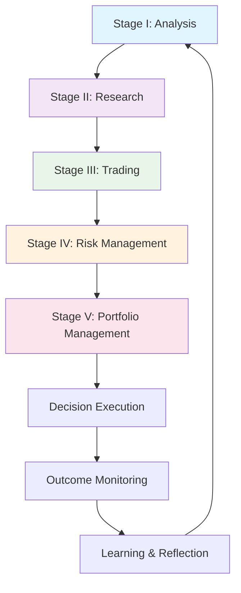
```mermaid
graph TB
    A[Stage I: Analysis] --> B[Stage II: Research]
    B --> C[Stage III: Trading]
    C --> D[Stage IV: Risk Management]
    D --> E[Stage V: Portfolio Management]
    
    E --> F[Decision Execution]
    F --> G[Outcome Monitoring]
    G --> H[Learning & Reflection]
    H --> A
    
    style A fill:#e1f5fe
    style B fill:#f3e5f5
    style C fill:#e8f5e8
    style D fill:#fff3e0
    style E fill:#fce4ec
```

**Key Principles**:
- **Information Flows Forward**: Each stage enriches the analysis
- **Decisions Build Incrementally**: Complex decisions broken into manageable steps
- **Quality Gates**: Each stage validates and refines the previous stage's output
- **Feedback Integration**: Learning from outcomes improves future decisions

## 📊 Stage I: Analyst Team

### Purpose
Gather and analyze raw market data from multiple perspectives to create a comprehensive information foundation.

### Workflow Structure
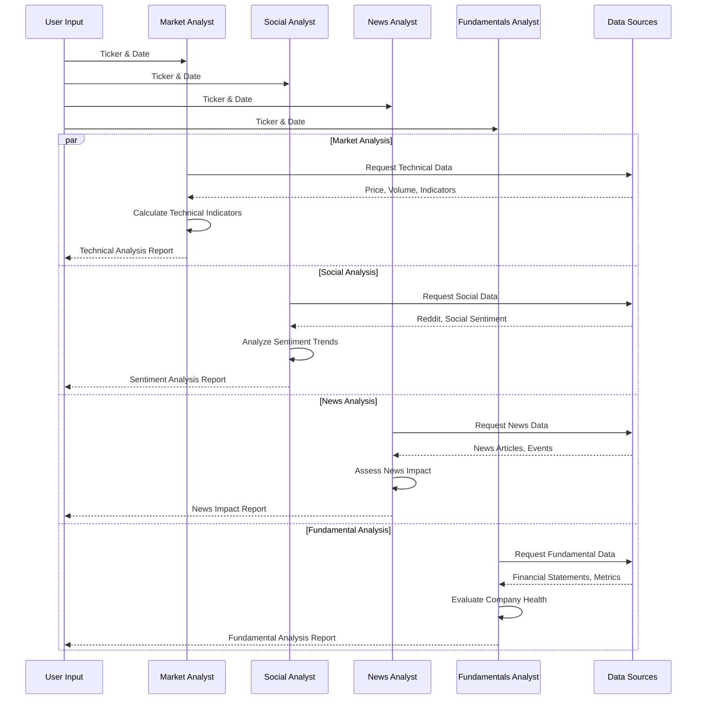
```mermaid
sequenceDiagram
    participant U as User Input
    participant MA as Market Analyst
    participant SA as Social Analyst
    participant NA as News Analyst
    participant FA as Fundamentals Analyst
    participant DS as Data Sources
    
    U->>MA: Ticker & Date
    U->>SA: Ticker & Date
    U->>NA: Ticker & Date
    U->>FA: Ticker & Date
    
    par Market Analysis
        MA->>DS: Request Technical Data
        DS-->>MA: Price, Volume, Indicators
        MA->>MA: Calculate Technical Indicators
        MA-->>U: Technical Analysis Report
    and Social Analysis
        SA->>DS: Request Social Data
        DS-->>SA: Reddit, Social Sentiment
        SA->>SA: Analyze Sentiment Trends
        SA-->>U: Sentiment Analysis Report
    and News Analysis
        NA->>DS: Request News Data
        DS-->>NA: News Articles, Events
        NA->>NA: Assess News Impact
        NA-->>U: News Impact Report
    and Fundamental Analysis
        FA->>DS: Request Fundamental Data
        DS-->>FA: Financial Statements, Metrics
        FA->>FA: Evaluate Company Health
        FA-->>U: Fundamental Analysis Report
    end
```

### Agent Specializations

#### Market Analyst
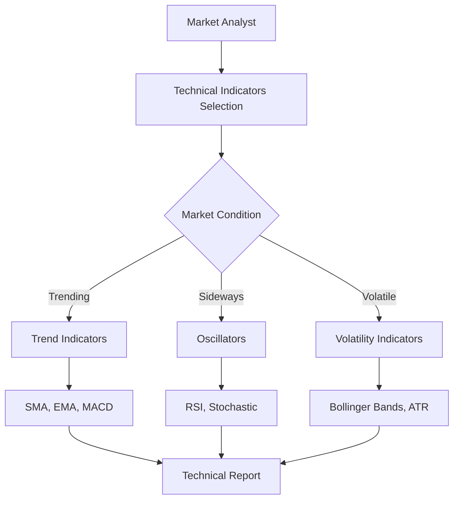
```mermaid
flowchart TD
    A[Market Analyst] --> B[Technical Indicators Selection]
    B --> C{Market Condition}
    C -->|Trending| D[Trend Indicators]
    C -->|Sideways| E[Oscillators]
    C -->|Volatile| F[Volatility Indicators]
    
    D --> G[SMA, EMA, MACD]
    E --> H[RSI, Stochastic]
    F --> I[Bollinger Bands, ATR]
    
    G --> J[Technical Report]
    H --> J
    I --> J
```

**Key Responsibilities**:
- Select relevant technical indicators based on market conditions
- Analyze price action and volume patterns
- Identify support/resistance levels
- Assess momentum and trend strength

#### Social Media Analyst
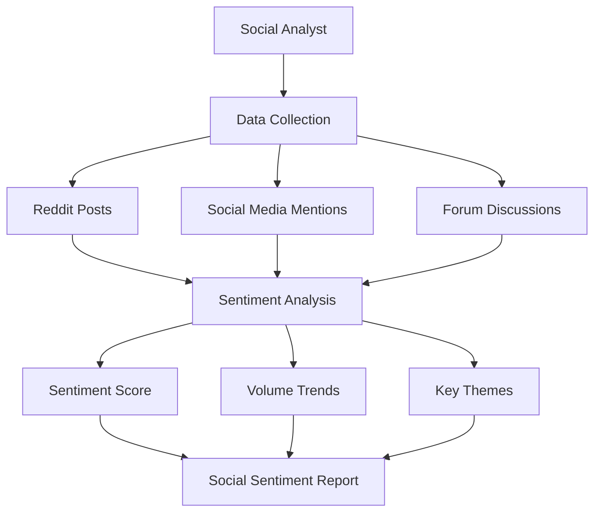
```mermaid
flowchart TD
    A[Social Analyst] --> B[Data Collection]
    B --> C[Reddit Posts]
    B --> D[Social Media Mentions]
    B --> E[Forum Discussions]
    
    C --> F[Sentiment Analysis]
    D --> F
    E --> F
    
    F --> G[Sentiment Score]
    F --> H[Volume Trends]
    F --> I[Key Themes]
    
    G --> J[Social Sentiment Report]
    H --> J
    I --> J
```

**Key Responsibilities**:
- Monitor social media sentiment
- Identify trending topics and discussions
- Assess retail investor sentiment
- Track sentiment momentum changes

#### News Analyst
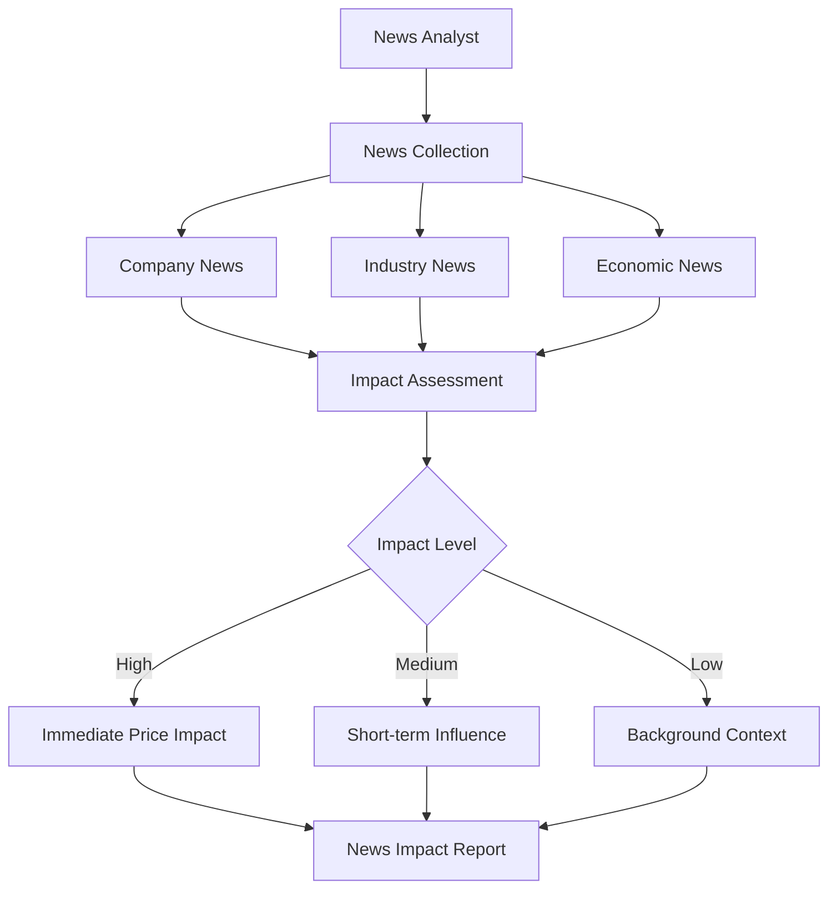
```mermaid
flowchart TD
    A[News Analyst] --> B[News Collection]
    B --> C[Company News]
    B --> D[Industry News]
    B --> E[Economic News]
    
    C --> F[Impact Assessment]
    D --> F
    E --> F
    
    F --> G{Impact Level}
    G -->|High| H[Immediate Price Impact]
    G -->|Medium| I[Short-term Influence]
    G -->|Low| J[Background Context]
    
    H --> K[News Impact Report]
    I --> K
    J --> K
```

**Key Responsibilities**:
- Collect relevant news from multiple sources
- Assess news impact on stock price
- Identify market-moving events
- Analyze narrative trends

#### Fundamentals Analyst
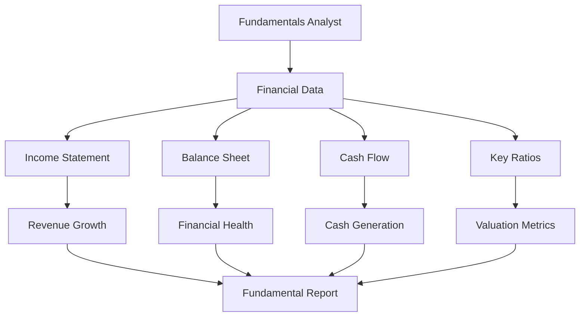
```mermaid
flowchart TD
    A[Fundamentals Analyst] --> B[Financial Data]
    B --> C[Income Statement]
    B --> D[Balance Sheet]
    B --> E[Cash Flow]
    B --> F[Key Ratios]
    
    C --> G[Revenue Growth]
    D --> H[Financial Health]
    E --> I[Cash Generation]
    F --> J[Valuation Metrics]
    
    G --> K[Fundamental Report]
    H --> K
    I --> K
    J --> K
```

**Key Responsibilities**:
- Analyze financial statements
- Calculate key financial ratios
- Assess company valuation
- Evaluate business fundamentals

### Stage Output
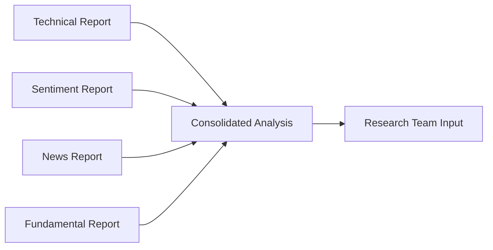
```mermaid
graph LR
    A[Technical Report] --> E[Consolidated Analysis]
    B[Sentiment Report] --> E
    C[News Report] --> E
    D[Fundamental Report] --> E
    
    E --> F[Research Team Input]
```

## 🎭 Stage II: Research Team

### Purpose
Synthesize analyst reports into investment thesis through structured debate between opposing viewpoints.

### Debate Mechanism
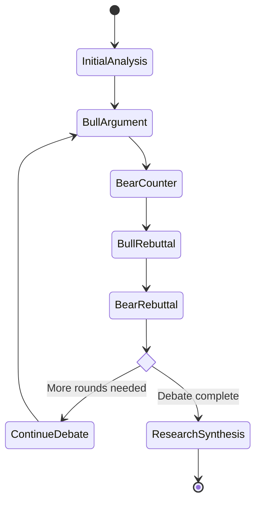
```mermaid
stateDiagram-v2
    [*] --> InitialAnalysis
    InitialAnalysis --> BullArgument
    BullArgument --> BearCounter
    BearCounter --> BullRebuttal
    BullRebuttal --> BearRebuttal
    
    state DecisionPoint <<choice>>
    BearRebuttal --> DecisionPoint
    DecisionPoint --> ContinueDebate : More rounds needed
    DecisionPoint --> ResearchSynthesis : Debate complete
    
    ContinueDebate --> BullArgument
    ResearchSynthesis --> [*]
```

### Research Workflow
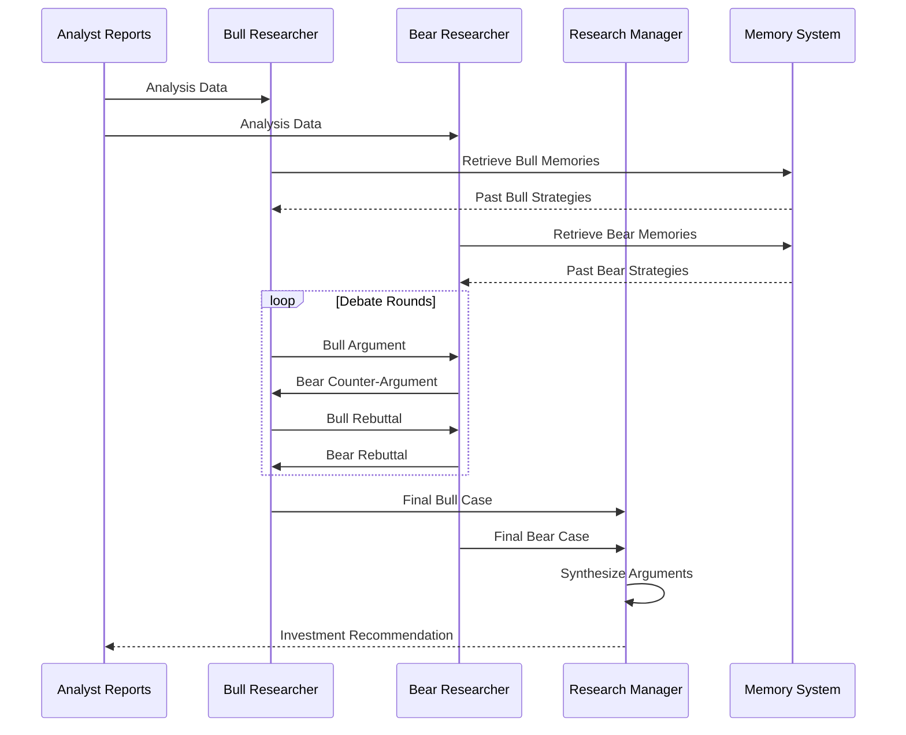
```mermaid
sequenceDiagram
    participant AR as Analyst Reports
    participant BR as Bull Researcher
    participant BER as Bear Researcher
    participant RM as Research Manager
    participant M as Memory System
    
    AR->>BR: Analysis Data
    AR->>BER: Analysis Data
    
    BR->>M: Retrieve Bull Memories
    M-->>BR: Past Bull Strategies
    
    BER->>M: Retrieve Bear Memories
    M-->>BER: Past Bear Strategies
    
    loop Debate Rounds
        BR->>BER: Bull Argument
        BER->>BR: Bear Counter-Argument
        BR->>BER: Bull Rebuttal
        BER->>BR: Bear Rebuttal
    end
    
    BR->>RM: Final Bull Case
    BER->>RM: Final Bear Case
    RM->>RM: Synthesize Arguments
    RM-->>AR: Investment Recommendation
```

### Agent Roles in Research

#### Bull Researcher
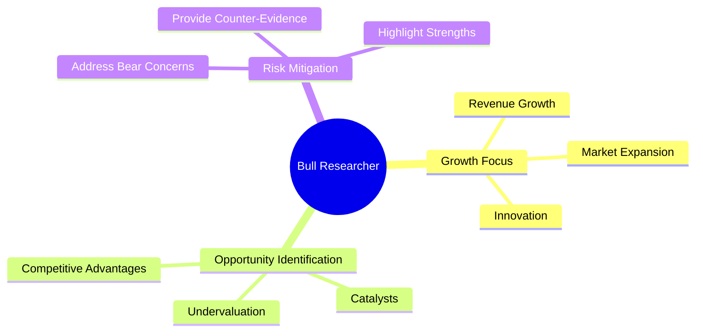
```mermaid
mindmap
  root((Bull Researcher))
    Growth Focus
      Revenue Growth
      Market Expansion
      Innovation
    Opportunity Identification
      Undervaluation
      Catalysts
      Competitive Advantages
    Risk Mitigation
      Address Bear Concerns
      Provide Counter-Evidence
      Highlight Strengths
```

**Strategy**:
- Emphasize growth potential and positive indicators
- Identify undervalued opportunities
- Counter bear arguments with evidence
- Highlight competitive advantages

#### Bear Researcher
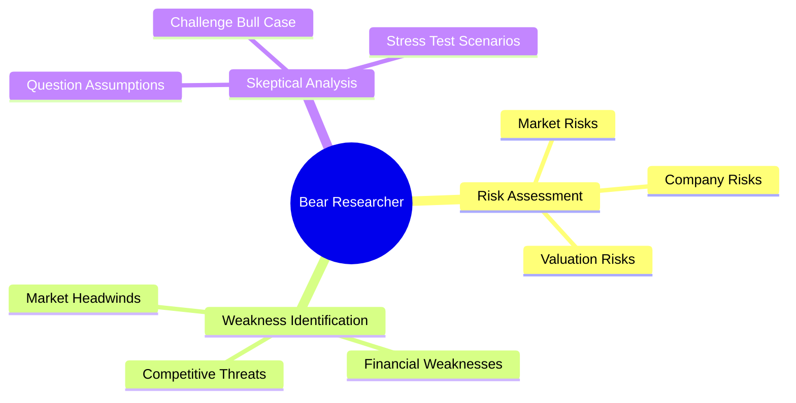
```mermaid
mindmap
  root((Bear Researcher))
    Risk Assessment
      Market Risks
      Company Risks
      Valuation Risks
    Weakness Identification
      Financial Weaknesses
      Competitive Threats
      Market Headwinds
    Skeptical Analysis
      Question Assumptions
      Challenge Bull Case
      Stress Test Scenarios
```

**Strategy**:
- Identify and emphasize risks
- Challenge optimistic assumptions
- Highlight potential weaknesses
- Stress-test investment thesis

#### Research Manager
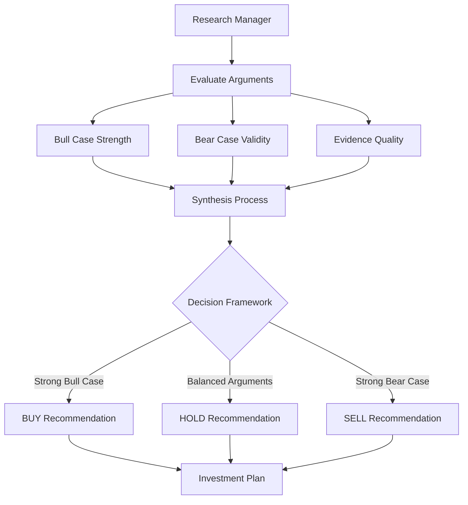
```mermaid
flowchart TD
    A[Research Manager] --> B[Evaluate Arguments]
    B --> C[Bull Case Strength]
    B --> D[Bear Case Validity]
    B --> E[Evidence Quality]
    
    C --> F[Synthesis Process]
    D --> F
    E --> F
    
    F --> G{Decision Framework}
    G -->|Strong Bull Case| H[BUY Recommendation]
    G -->|Balanced Arguments| I[HOLD Recommendation]
    G -->|Strong Bear Case| J[SELL Recommendation]
    
    H --> K[Investment Plan]
    I --> K
    J --> K
```

**Responsibilities**:
- Objectively evaluate both bull and bear arguments
- Synthesize competing viewpoints
- Make balanced investment recommendation
- Provide clear reasoning for decision

### Memory Integration
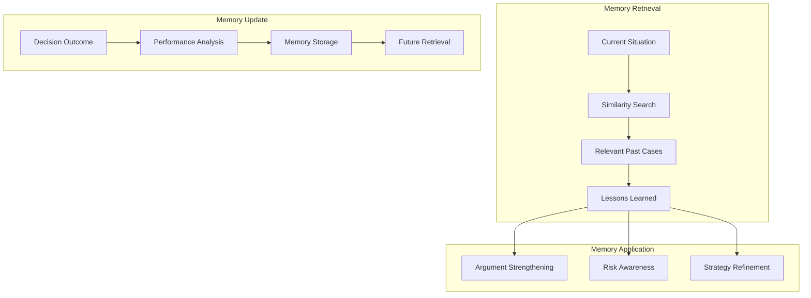
```mermaid
graph TB
    subgraph "Memory Retrieval"
        A[Current Situation] --> B[Similarity Search]
        B --> C[Relevant Past Cases]
        C --> D[Lessons Learned]
    end
    
    subgraph "Memory Application"
        D --> E[Argument Strengthening]
        D --> F[Risk Awareness]
        D --> G[Strategy Refinement]
    end
    
    subgraph "Memory Update"
        H[Decision Outcome] --> I[Performance Analysis]
        I --> J[Memory Storage]
        J --> K[Future Retrieval]
    end
```

## 💼 Stage III: Trading Team

### Purpose
Transform research recommendation into actionable trading plan with specific entry/exit strategies.

### Trading Workflow
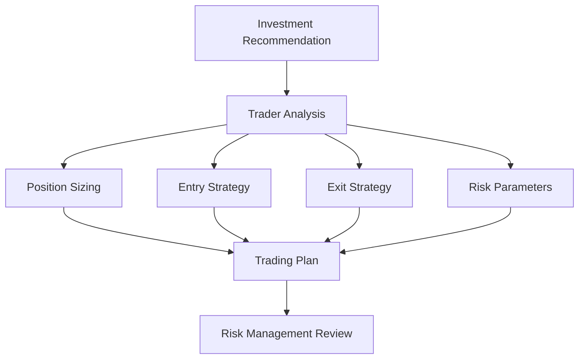
```mermaid
flowchart TD
    A[Investment Recommendation] --> B[Trader Analysis]
    B --> C[Position Sizing]
    B --> D[Entry Strategy]
    B --> E[Exit Strategy]
    B --> F[Risk Parameters]
    
    C --> G[Trading Plan]
    D --> G
    E --> G
    F --> G
    
    G --> H[Risk Management Review]
```

### Trader Decision Process
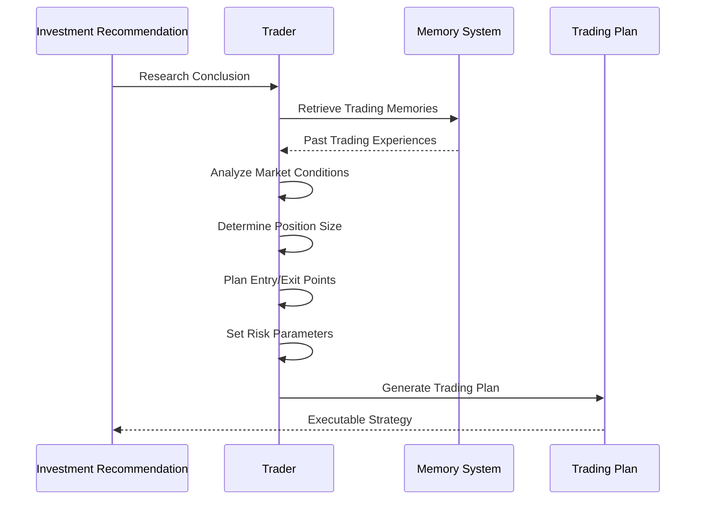
```mermaid
sequenceDiagram
    participant IR as Investment Recommendation
    participant T as Trader
    participant M as Memory System
    participant TP as Trading Plan
    
    IR->>T: Research Conclusion
    T->>M: Retrieve Trading Memories
    M-->>T: Past Trading Experiences
    
    T->>T: Analyze Market Conditions
    T->>T: Determine Position Size
    T->>T: Plan Entry/Exit Points
    T->>T: Set Risk Parameters
    
    T->>TP: Generate Trading Plan
    TP-->>IR: Executable Strategy
```

### Trading Plan Components
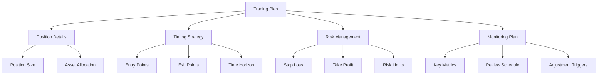
```mermaid
graph TB
    A[Trading Plan] --> B[Position Details]
    A --> C[Timing Strategy]
    A --> D[Risk Management]
    A --> E[Monitoring Plan]
    
    B --> B1[Position Size]
    B --> B2[Asset Allocation]
    
    C --> C1[Entry Points]
    C --> C2[Exit Points]
    C --> C3[Time Horizon]
    
    D --> D1[Stop Loss]
    D --> D2[Take Profit]
    D --> D3[Risk Limits]
    
    E --> E1[Key Metrics]
    E --> E2[Review Schedule]
    E --> E3[Adjustment Triggers]
```

## ⚠️ Stage IV: Risk Management Team

### Purpose
Evaluate trading plan from multiple risk perspectives and ensure appropriate risk-adjusted returns.

### Risk Assessment Workflow
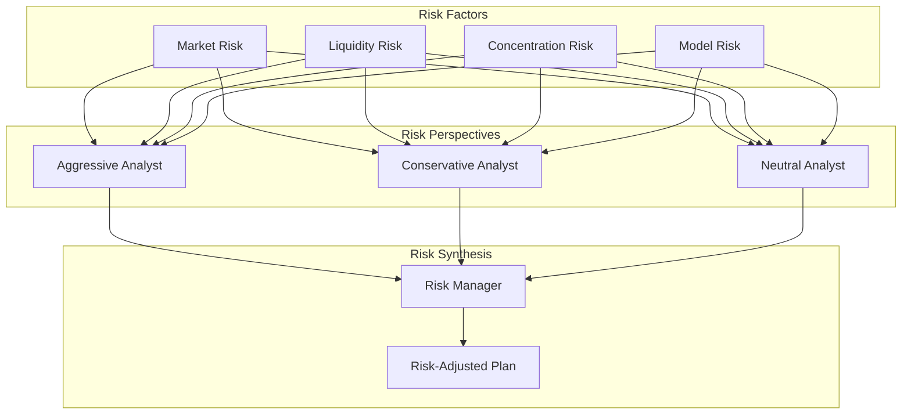
```mermaid
graph TB
    subgraph "Risk Perspectives"
        A[Aggressive Analyst]
        B[Conservative Analyst]
        C[Neutral Analyst]
    end
    
    subgraph "Risk Factors"
        D[Market Risk]
        E[Liquidity Risk]
        F[Concentration Risk]
        G[Model Risk]
    end
    
    subgraph "Risk Synthesis"
        H[Risk Manager]
        I[Risk-Adjusted Plan]
    end
    
    A --> H
    B --> H
    C --> H
    
    D --> A
    D --> B
    D --> C
    
    E --> A
    E --> B
    E --> C
    
    F --> A
    F --> B
    F --> C
    
    G --> A
    G --> B
    G --> C
    
    H --> I
```

### Risk Debate Process
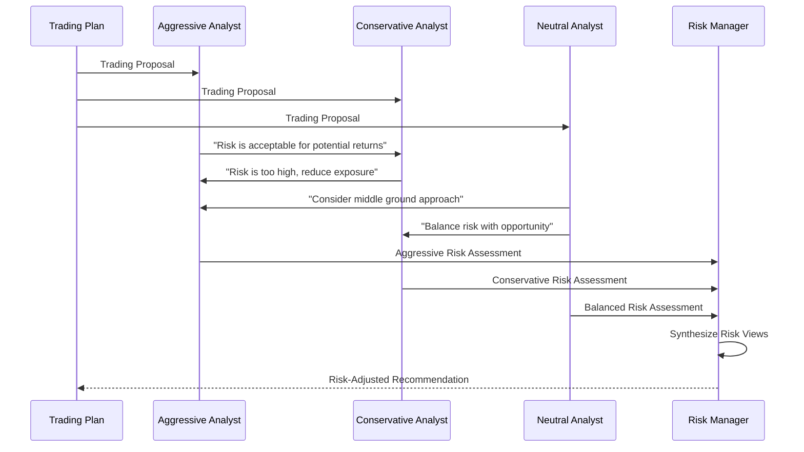
```mermaid
sequenceDiagram
    participant TP as Trading Plan
    participant AA as Aggressive Analyst
    participant CA as Conservative Analyst
    participant NA as Neutral Analyst
    participant RM as Risk Manager
    
    TP->>AA: Trading Proposal
    TP->>CA: Trading Proposal
    TP->>NA: Trading Proposal
    
    AA->>CA: "Risk is acceptable for potential returns"
    CA->>AA: "Risk is too high, reduce exposure"
    NA->>AA: "Consider middle ground approach"
    NA->>CA: "Balance risk with opportunity"
    
    AA->>RM: Aggressive Risk Assessment
    CA->>RM: Conservative Risk Assessment
    NA->>RM: Balanced Risk Assessment
    
    RM->>RM: Synthesize Risk Views
    RM-->>TP: Risk-Adjusted Recommendation
```

### Risk Analyst Specializations

#### Aggressive Analyst
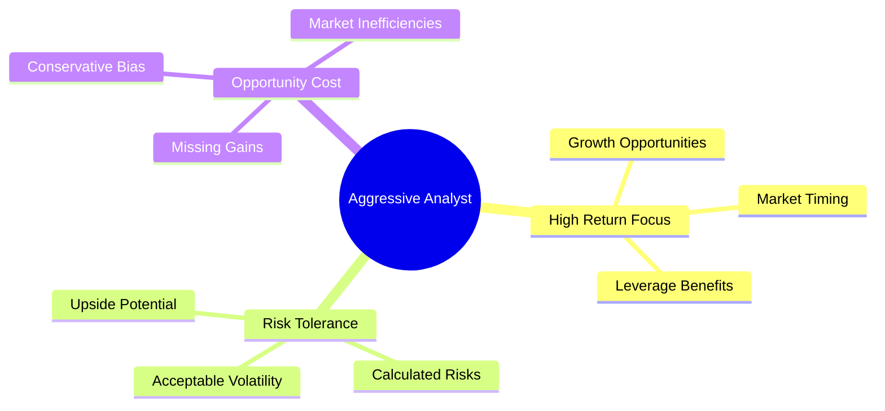
```mermaid
mindmap
  root((Aggressive Analyst))
    High Return Focus
      Growth Opportunities
      Market Timing
      Leverage Benefits
    Risk Tolerance
      Acceptable Volatility
      Calculated Risks
      Upside Potential
    Opportunity Cost
      Missing Gains
      Conservative Bias
      Market Inefficiencies
```

#### Conservative Analyst
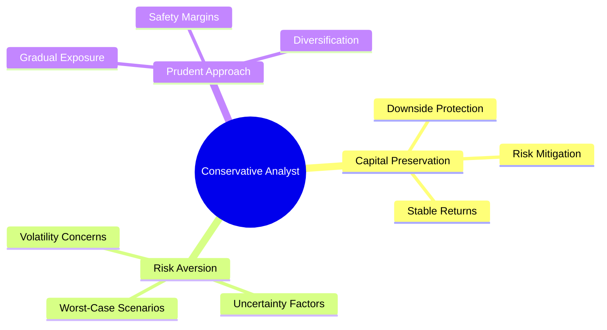
```mermaid
mindmap
  root((Conservative Analyst))
    Capital Preservation
      Downside Protection
      Risk Mitigation
      Stable Returns
    Risk Aversion
      Volatility Concerns
      Uncertainty Factors
      Worst-Case Scenarios
    Prudent Approach
      Gradual Exposure
      Safety Margins
      Diversification
```

#### Neutral Analyst
```mermaid
mindmap
  root((Neutral Analyst))
    Balanced Perspective
      Risk-Return Balance
      Objective Analysis
      Middle Ground
    Systematic Approach
      Data-Driven Decisions
      Quantitative Metrics
      Structured Process
    Pragmatic View
      Realistic Expectations
      Practical Solutions
      Adaptive Strategy
```

## 🎯 Stage V: Portfolio Management

### Purpose
Make final investment decision considering overall portfolio context and risk management constraints.

### Portfolio Decision Process
```mermaid
flowchart TD
    A[Risk-Adjusted Plan] --> B[Portfolio Manager]
    B --> C[Portfolio Context Analysis]
    B --> D[Risk Budget Assessment]
    B --> E[Correlation Analysis]
    B --> F[Liquidity Requirements]
    
    C --> G[Final Decision Matrix]
    D --> G
    E --> G
    F --> G
    
    G --> H{Decision}
    H -->|High Conviction| I[BUY]
    H -->|Moderate Conviction| J[HOLD]
    H -->|Low/Negative Conviction| K[SELL]
```

### Decision Framework
```mermaid
graph TB
    subgraph "Decision Inputs"
        A[Research Quality]
        B[Risk Assessment]
        C[Portfolio Fit]
        D[Market Timing]
        E[Liquidity Needs]
    end
    
    subgraph "Decision Matrix"
        F[Conviction Level]
        G[Risk Tolerance]
        H[Position Size]
        I[Time Horizon]
    end
    
    subgraph "Final Output"
        J[BUY/HOLD/SELL]
        K[Position Details]
        L[Monitoring Plan]
    end
    
    A --> F
    B --> G
    C --> H
    D --> I
    E --> I
    
    F --> J
    G --> K
    H --> K
    I --> L
```

## 🔄 Workflow Orchestration

### State Transitions
```mermaid
stateDiagram-v2
    [*] --> Initialization
    
    Initialization --> AnalystTeam
    
    state AnalystTeam {
        [*] --> MarketAnalyst
        MarketAnalyst --> SocialAnalyst
        SocialAnalyst --> NewsAnalyst
        NewsAnalyst --> FundamentalsAnalyst
        FundamentalsAnalyst --> [*]
    }
    
    AnalystTeam --> ResearchTeam
    
    state ResearchTeam {
        [*] --> BullResearcher
        BullResearcher --> BearResearcher
        BearResearcher --> BullResearcher : Continue Debate
        BullResearcher --> ResearchManager : Debate Complete
        BearResearcher --> ResearchManager : Debate Complete
        ResearchManager --> [*]
    }
    
    ResearchTeam --> TradingTeam
    TradingTeam --> RiskManagement
    
    state RiskManagement {
        [*] --> RiskAnalysts
        RiskAnalysts --> RiskManager
        RiskManager --> [*]
    }
    
    RiskManagement --> PortfolioManagement
    PortfolioManagement --> FinalDecision
    FinalDecision --> [*]
```

### Error Handling and Recovery
```mermaid
flowchart TD
    A[Agent Execution] --> B{Success?}
    B -->|Yes| C[Continue Workflow]
    B -->|No| D[Error Analysis]
    
    D --> E{Error Type}
    E -->|Recoverable| F[Retry with Backoff]
    E -->|Data Issue| G[Use Cached Data]
    E -->|LLM Issue| H[Switch Provider]
    E -->|Critical| I[Abort Workflow]
    
    F --> A
    G --> C
    H --> A
    I --> J[Error Report]
```

### Performance Monitoring
```mermaid
graph TB
    subgraph "Workflow Metrics"
        A[Execution Time]
        B[Agent Performance]
        C[Decision Quality]
        D[Resource Usage]
    end
    
    subgraph "Quality Gates"
        E[Data Validation]
        F[Logic Verification]
        G[Output Quality]
        H[Consistency Checks]
    end
    
    subgraph "Optimization"
        I[Bottleneck Identification]
        J[Resource Allocation]
        K[Caching Strategy]
        L[Parallel Execution]
    end
    
    A --> I
    B --> J
    C --> G
    D --> K
    
    E --> F
    F --> G
    G --> H
    
    I --> L
    J --> L
    K --> L
```

## 🎛️ Configuration and Customization

### Workflow Customization
```mermaid
graph TB
    A[Workflow Configuration] --> B[Agent Selection]
    A --> C[Debate Rounds]
    A --> D[Quality Thresholds]
    A --> E[Timeout Settings]
    
    B --> F[Custom Workflow]
    C --> F
    D --> F
    E --> F
    
    F --> G[Execution Engine]
```

### Adaptive Workflow
```mermaid
flowchart TD
    A[Market Conditions] --> B{Volatility Level}
    B -->|High| C[Extended Analysis]
    B -->|Normal| D[Standard Workflow]
    B -->|Low| E[Simplified Analysis]
    
    C --> F[More Debate Rounds]
    C --> G[Additional Risk Analysis]
    
    D --> H[Normal Processing]
    
    E --> I[Reduced Complexity]
    E --> J[Faster Execution]
```

---

This workflow design ensures systematic, thorough, and balanced investment decision-making while maintaining flexibility for different market conditions and user requirements.

**Next**: Explore the [Decision Making Framework](decision-making-framework.md) to understand how final decisions are reached.