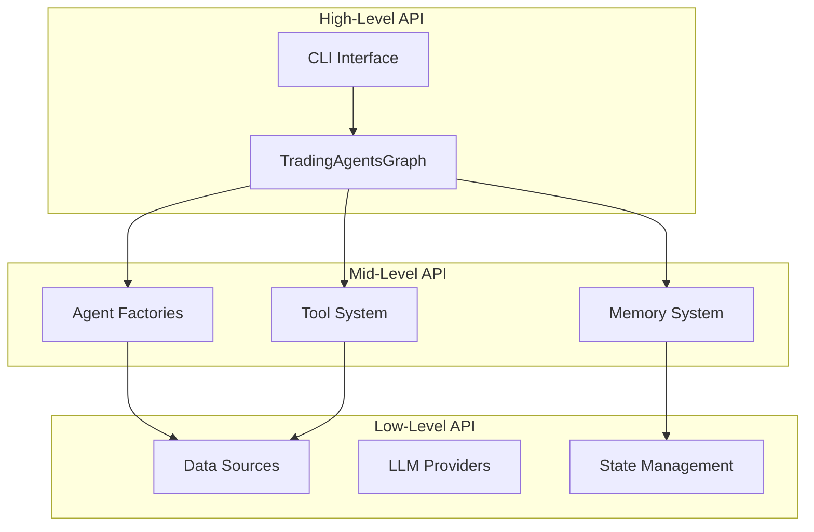

# API Reference

## 📚 Overview

This document provides comprehensive API reference for TradingAgents. The framework exposes both high-level and low-level APIs for different use cases.

## 🏗️ Core API Structure



## 🎯 TradingAgentsGraph (Main API)

### Class Definition

```python
class TradingAgentsGraph:
    """Main orchestrator for the trading agents framework."""
    
    def __init__(
        self,
        selected_analysts: List[str] = ["market", "social", "news", "fundamentals"],
        debug: bool = False,
        config: Optional[Dict[str, Any]] = None
    ):
        """Initialize the trading agents graph.
        
        Args:
            selected_analysts: List of analyst types to include
            debug: Enable debug mode for detailed logging
            config: Configuration dictionary (uses DEFAULT_CONFIG if None)
        """
```

### Methods

#### propagate()
```python
def propagate(
    self, 
    company_name: str, 
    trade_date: str
) -> Tuple[Dict[str, Any], str]:
    """Execute the complete trading analysis workflow.
    
    Args:
        company_name: Stock ticker symbol (e.g., "AAPL", "TSLA")
        trade_date: Analysis date in YYYY-MM-DD format
        
    Returns:
        Tuple containing:
        - final_state: Complete analysis state with all reports
        - decision: Processed trading signal (BUY/HOLD/SELL)
        
    Raises:
        ValueError: If ticker symbol is invalid
        ConnectionError: If data sources are unavailable
        
    Example:
        >>> ta = TradingAgentsGraph()
        >>> state, decision = ta.propagate("AAPL", "2024-01-15")
        >>> print(f"Decision: {decision}")
    """
```

#### reflect_and_remember()
```python
def reflect_and_remember(self, returns_losses: float) -> None:
    """Update agent memories based on trading outcomes.
    
    Args:
        returns_losses: Actual returns/losses from the trade
                       Positive values indicate gains, negative indicate losses
        
    Example:
        >>> ta.reflect_and_remember(0.15)  # 15% gain
        >>> ta.reflect_and_remember(-0.05)  # 5% loss
    """
```

#### process_signal()
```python
def process_signal(self, full_signal: str) -> str:
    """Extract core trading decision from detailed analysis.
    
    Args:
        full_signal: Complete analysis text from agents
        
    Returns:
        Simplified trading signal: "BUY", "HOLD", or "SELL"
        
    Example:
        >>> signal = ta.process_signal(final_state["final_trade_decision"])
        >>> print(signal)  # "BUY"
    """
```

### Usage Examples

#### Basic Usage
```python
from tradingagents.graph.trading_graph import TradingAgentsGraph

# Initialize with default settings
ta = TradingAgentsGraph()

# Analyze a stock
final_state, decision = ta.propagate("NVDA", "2024-01-15")
print(f"Decision: {decision}")
```

#### Custom Configuration
```python
from tradingagents.default_config import DEFAULT_CONFIG

# Create custom config
config = DEFAULT_CONFIG.copy()
config.update({
    "llm_provider": "anthropic",
    "deep_think_llm": "claude-3-opus-20240229",
    "max_debate_rounds": 3,
})

# Initialize with custom config
ta = TradingAgentsGraph(
    selected_analysts=["market", "fundamentals"],
    debug=True,
    config=config
)
```

#### Batch Analysis
```python
tickers = ["AAPL", "GOOGL", "MSFT", "TSLA"]
results = {}

for ticker in tickers:
    try:
        state, decision = ta.propagate(ticker, "2024-01-15")
        results[ticker] = {
            "decision": decision,
            "confidence": state.get("confidence_score", 0),
            "final_analysis": state["final_trade_decision"]
        }
    except Exception as e:
        results[ticker] = {"error": str(e)}

# Process results
for ticker, result in results.items():
    if "error" not in result:
        print(f"{ticker}: {result['decision']}")
```

## 🤖 Agent Factory APIs

### Analyst Agents

#### create_market_analyst()
```python
def create_market_analyst(llm, toolkit) -> Callable:
    """Create a market analyst agent.
    
    Args:
        llm: Language model instance
        toolkit: Tool collection for data access
        
    Returns:
        Agent function that analyzes technical indicators
        
    Agent Capabilities:
        - Technical indicator analysis (RSI, MACD, Bollinger Bands)
        - Price action analysis
        - Volume analysis
        - Support/resistance identification
    """
```

#### create_social_media_analyst()
```python
def create_social_media_analyst(llm, toolkit) -> Callable:
    """Create a social media sentiment analyst.
    
    Args:
        llm: Language model instance
        toolkit: Tool collection for data access
        
    Returns:
        Agent function that analyzes social sentiment
        
    Agent Capabilities:
        - Reddit sentiment analysis
        - Social media trend detection
        - Retail investor sentiment assessment
        - Viral content impact analysis
    """
```

#### create_news_analyst()
```python
def create_news_analyst(llm, toolkit) -> Callable:
    """Create a news impact analyst.
    
    Args:
        llm: Language model instance
        toolkit: Tool collection for data access
        
    Returns:
        Agent function that analyzes news impact
        
    Agent Capabilities:
        - News event analysis
        - Market-moving event identification
        - Narrative trend analysis
        - Economic impact assessment
    """
```

#### create_fundamentals_analyst()
```python
def create_fundamentals_analyst(llm, toolkit) -> Callable:
    """Create a fundamental analysis agent.
    
    Args:
        llm: Language model instance
        toolkit: Tool collection for data access
        
    Returns:
        Agent function that analyzes company fundamentals
        
    Agent Capabilities:
        - Financial statement analysis
        - Ratio analysis
        - Valuation assessment
        - Business model evaluation
    """
```

### Research Agents

#### create_bull_researcher()
```python
def create_bull_researcher(llm, memory) -> Callable:
    """Create a bull (optimistic) researcher agent.
    
    Args:
        llm: Language model instance
        memory: Memory system for learning
        
    Returns:
        Agent function that argues for buying the stock
        
    Agent Behavior:
        - Emphasizes growth opportunities
        - Highlights positive indicators
        - Counters bearish arguments
        - Identifies undervaluation
    """
```

#### create_bear_researcher()
```python
def create_bear_researcher(llm, memory) -> Callable:
    """Create a bear (pessimistic) researcher agent.
    
    Args:
        llm: Language model instance
        memory: Memory system for learning
        
    Returns:
        Agent function that argues against buying the stock
        
    Agent Behavior:
        - Identifies risks and threats
        - Challenges optimistic assumptions
        - Highlights overvaluation
        - Emphasizes downside scenarios
    """
```

#### create_research_manager()
```python
def create_research_manager(llm, memory) -> Callable:
    """Create a research manager agent.
    
    Args:
        llm: Language model instance
        memory: Memory system for learning
        
    Returns:
        Agent function that synthesizes bull/bear arguments
        
    Agent Responsibilities:
        - Evaluate argument quality
        - Synthesize opposing viewpoints
        - Make balanced recommendations
        - Provide clear reasoning
    """
```

### Trading and Risk Agents

#### create_trader()
```python
def create_trader(llm, memory) -> Callable:
    """Create a trader agent.
    
    Args:
        llm: Language model instance
        memory: Memory system for learning
        
    Returns:
        Agent function that creates trading plans
        
    Agent Capabilities:
        - Position sizing
        - Entry/exit strategy
        - Risk parameter setting
        - Market timing
    """
```

#### create_risk_manager()
```python
def create_risk_manager(llm, memory) -> Callable:
    """Create a risk manager agent.
    
    Args:
        llm: Language model instance
        memory: Memory system for learning
        
    Returns:
        Agent function that manages portfolio risk
        
    Agent Responsibilities:
        - Risk assessment
        - Portfolio allocation
        - Risk limit enforcement
        - Final decision making
    """
```

## 🛠️ Tool System API

### Toolkit Class

```python
class Toolkit:
    """Collection of tools for data access and analysis."""
    
    def __init__(self, config: Dict[str, Any]):
        """Initialize toolkit with configuration.
        
        Args:
            config: Configuration dictionary
        """
        self.config = config
        self.online_mode = config.get("online_tools", True)
```

### Market Data Tools

#### get_YFin_data_online()
```python
def get_YFin_data_online(
    self, 
    ticker: str, 
    period: str = "1y"
) -> str:
    """Fetch real-time market data from Yahoo Finance.
    
    Args:
        ticker: Stock symbol (e.g., "AAPL")
        period: Time period ("1d", "5d", "1mo", "3mo", "6mo", "1y", "2y", "5y", "10y", "ytd", "max")
        
    Returns:
        JSON string containing OHLCV data
        
    Example:
        >>> toolkit = Toolkit(config)
        >>> data = toolkit.get_YFin_data_online("AAPL", "3mo")
    """
```

#### get_stockstats_indicators_report_online()
```python
def get_stockstats_indicators_report_online(
    self,
    ticker: str,
    indicators: List[str] = None
) -> str:
    """Calculate technical indicators for a stock.
    
    Args:
        ticker: Stock symbol
        indicators: List of indicator names (e.g., ["rsi", "macd", "boll"])
        
    Returns:
        JSON string containing calculated indicators
        
    Available Indicators:
        - rsi: Relative Strength Index
        - macd: MACD line
        - macds: MACD signal line
        - macdh: MACD histogram
        - boll: Bollinger middle band
        - boll_ub: Bollinger upper band
        - boll_lb: Bollinger lower band
        - atr: Average True Range
        - close_10_ema: 10-period EMA
        - close_50_sma: 50-period SMA
        - close_200_sma: 200-period SMA
    """
```

### News and Sentiment Tools

#### get_google_news()
```python
def get_google_news(
    self,
    query: str,
    num_articles: int = 10
) -> str:
    """Fetch news articles from Google News.
    
    Args:
        query: Search query (company name or ticker)
        num_articles: Number of articles to fetch
        
    Returns:
        JSON string containing news articles
        
    Example:
        >>> news = toolkit.get_google_news("Apple Inc", 5)
    """
```

#### get_reddit_stock_info()
```python
def get_reddit_stock_info(
    self,
    ticker: str,
    limit: int = 50
) -> str:
    """Analyze stock sentiment from Reddit.
    
    Args:
        ticker: Stock symbol
        limit: Number of posts to analyze
        
    Returns:
        JSON string containing sentiment analysis
        
    Example:
        >>> sentiment = toolkit.get_reddit_stock_info("TSLA", 25)
    """
```

### Fundamental Analysis Tools

#### get_fundamentals_openai()
```python
def get_fundamentals_openai(
    self,
    ticker: str
) -> str:
    """Get comprehensive fundamental analysis.
    
    Args:
        ticker: Stock symbol
        
    Returns:
        Detailed fundamental analysis report
        
    Analysis Includes:
        - Financial ratios
        - Growth metrics
        - Profitability analysis
        - Balance sheet health
        - Cash flow analysis
    """
```

## 💾 Memory System API

### FinancialSituationMemory

```python
class FinancialSituationMemory:
    """Memory system for storing and retrieving trading experiences."""
    
    def __init__(self, memory_name: str, config: Dict[str, Any]):
        """Initialize memory system.
        
        Args:
            memory_name: Unique identifier for this memory instance
            config: Configuration dictionary
        """
```

#### get_memories()
```python
def get_memories(
    self,
    situation: str,
    n_matches: int = 5
) -> List[Dict[str, Any]]:
    """Retrieve relevant past experiences.
    
    Args:
        situation: Current market situation description
        n_matches: Number of similar situations to retrieve
        
    Returns:
        List of relevant memory records
        
    Example:
        >>> memories = memory.get_memories(
        ...     "High volatility tech stock with strong earnings",
        ...     n_matches=3
        ... )
    """
```

#### add_memory()
```python
def add_memory(
    self,
    situation: str,
    decision: str,
    outcome: float,
    reasoning: str
) -> None:
    """Store a new trading experience.
    
    Args:
        situation: Market situation description
        decision: Trading decision made
        outcome: Actual outcome (returns/losses)
        reasoning: Reasoning behind the decision
        
    Example:
        >>> memory.add_memory(
        ...     situation="Tech stock after earnings beat",
        ...     decision="BUY with 2% position",
        ...     outcome=0.15,
        ...     reasoning="Strong fundamentals and positive sentiment"
        ... )
    """
```

## 📊 State Management API

### AgentState

```python
class AgentState(MessagesState):
    """State object passed between agents."""
    
    # Core fields
    company_of_interest: str
    trade_date: str
    messages: List[BaseMessage]
    
    # Analysis reports
    market_report: Optional[str] = None
    sentiment_report: Optional[str] = None
    news_report: Optional[str] = None
    fundamentals_report: Optional[str] = None
    
    # Decision states
    investment_debate_state: Optional[InvestDebateState] = None
    investment_plan: Optional[str] = None
    trader_investment_plan: Optional[str] = None
    risk_debate_state: Optional[RiskDebateState] = None
    final_trade_decision: Optional[str] = None
```

### InvestDebateState

```python
class InvestDebateState:
    """State for bull/bear research debate."""
    
    bull_history: str = ""
    bear_history: str = ""
    history: str = ""
    current_response: str = ""
    judge_decision: str = ""
    count: int = 0
```

### RiskDebateState

```python
class RiskDebateState:
    """State for risk management debate."""
    
    risky_history: str = ""
    safe_history: str = ""
    neutral_history: str = ""
    history: str = ""
    judge_decision: str = ""
    count: int = 0
```

## ⚙️ Configuration API

### Default Configuration

```python
DEFAULT_CONFIG = {
    # System paths
    "project_dir": str,
    "results_dir": str,
    "data_cache_dir": str,
    
    # LLM settings
    "llm_provider": str,  # "openai", "anthropic", "google"
    "deep_think_llm": str,  # Model for complex reasoning
    "quick_think_llm": str,  # Model for simple tasks
    "backend_url": str,  # API endpoint
    
    # Agent behavior
    "max_debate_rounds": int,  # Bull/bear debate rounds
    "max_risk_discuss_rounds": int,  # Risk discussion rounds
    "max_recur_limit": int,  # Maximum recursion depth
    
    # Tool settings
    "online_tools": bool,  # Use online data sources
}
```

### Configuration Validation

```python
def validate_config(config: Dict[str, Any]) -> Dict[str, Any]:
    """Validate and normalize configuration.
    
    Args:
        config: Configuration dictionary
        
    Returns:
        Validated configuration
        
    Raises:
        ValueError: If configuration is invalid
        
    Example:
        >>> config = validate_config(user_config)
    """
```

## 🔧 Utility Functions

### Signal Processing

```python
def process_signal(signal_text: str) -> str:
    """Extract trading decision from analysis text.
    
    Args:
        signal_text: Full analysis text
        
    Returns:
        "BUY", "HOLD", or "SELL"
    """
```

### Data Validation

```python
def validate_ticker(ticker: str) -> bool:
    """Validate stock ticker symbol.
    
    Args:
        ticker: Stock symbol to validate
        
    Returns:
        True if valid, False otherwise
    """

def validate_date(date_str: str) -> bool:
    """Validate date format.
    
    Args:
        date_str: Date string in YYYY-MM-DD format
        
    Returns:
        True if valid, False otherwise
    """
```

## 🚨 Error Handling

### Exception Classes

```python
class TradingAgentsError(Exception):
    """Base exception for TradingAgents."""
    pass

class ConfigurationError(TradingAgentsError):
    """Configuration-related errors."""
    pass

class DataSourceError(TradingAgentsError):
    """Data source access errors."""
    pass

class LLMError(TradingAgentsError):
    """LLM provider errors."""
    pass

class MemoryError(TradingAgentsError):
    """Memory system errors."""
    pass
```

### Error Handling Examples

```python
from tradingagents.exceptions import DataSourceError, LLMError

try:
    final_state, decision = ta.propagate("INVALID_TICKER", "2024-01-15")
except DataSourceError as e:
    print(f"Data error: {e}")
except LLMError as e:
    print(f"LLM error: {e}")
except Exception as e:
    print(f"Unexpected error: {e}")
```

## 📈 Performance Monitoring

### Metrics Collection

```python
def get_performance_metrics() -> Dict[str, Any]:
    """Get system performance metrics.
    
    Returns:
        Dictionary containing:
        - execution_time: Total analysis time
        - llm_calls: Number of LLM API calls
        - data_fetches: Number of data source calls
        - memory_usage: Memory consumption
        - cache_hits: Cache hit rate
    """
```

### Logging Configuration

```python
import logging

# Configure logging for TradingAgents
logging.basicConfig(
    level=logging.INFO,
    format='%(asctime)s - %(name)s - %(levelname)s - %(message)s'
)

# Enable debug logging
logger = logging.getLogger('tradingagents')
logger.setLevel(logging.DEBUG)
```

---

This API reference provides comprehensive documentation for all public interfaces in TradingAgents. For implementation details, see the [Component Design](component-design.md) documentation.

**Next**: Explore [Development Guide](development-guide.md) for setting up your development environment.