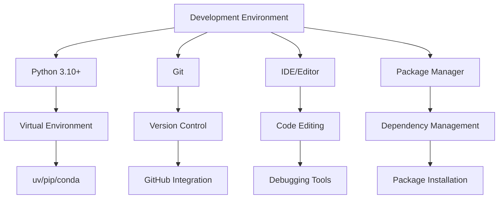
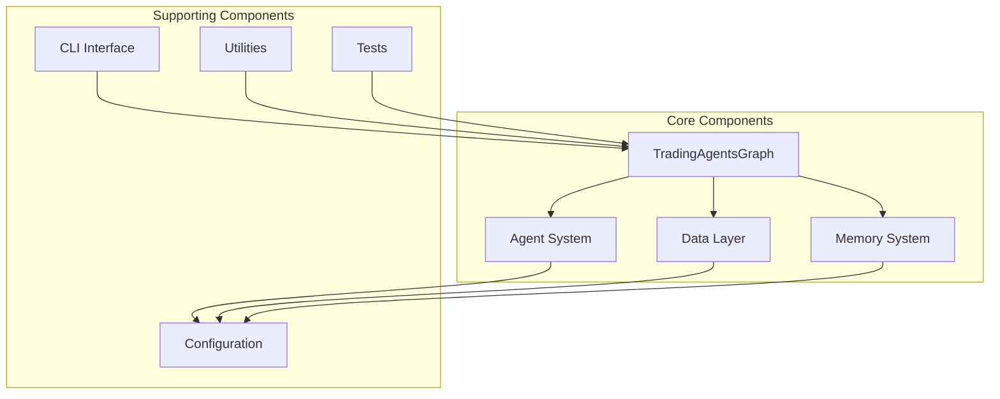
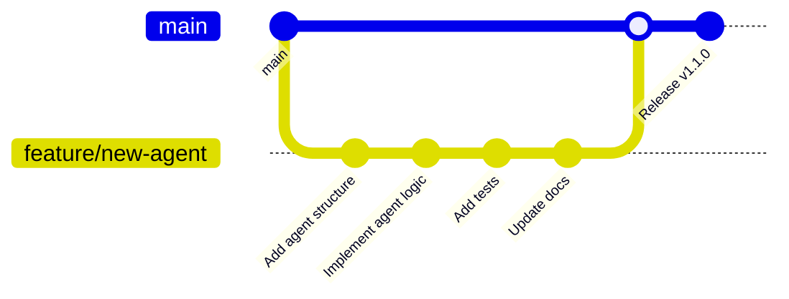

# Development Guide

## 🛠️ Setting Up Development Environment

This guide helps you set up a development environment for contributing to TradingAgents or building custom extensions.

## 📋 Prerequisites

### System Requirements
- **Python**: 3.10 or higher
- **Git**: Latest version
- **IDE**: VS Code, PyCharm, or similar
- **Memory**: At least 8GB RAM for development
- **Storage**: 5GB free space

### Development Tools


## 🚀 Quick Setup

### 1. Clone Repository
```bash
# Clone the main repository
git clone https://github.com/TauricResearch/TradingAgents.git
cd TradingAgents

# Or fork and clone your fork
git clone https://github.com/YOUR_USERNAME/TradingAgents.git
cd TradingAgents
```

### 2. Set Up Virtual Environment

#### Using uv (Recommended)
```bash
# Install uv if not already installed
pip install uv

# Create virtual environment
uv venv

# Activate virtual environment
# On Windows:
.venv\Scripts\activate
# On macOS/Linux:
source .venv/bin/activate

# Install dependencies
uv pip install -r requirements.txt
uv pip install -e .
```

#### Using pip
```bash
# Create virtual environment
python -m venv .venv

# Activate virtual environment
# On Windows:
.venv\Scripts\activate
# On macOS/Linux:
source .venv/bin/activate

# Install dependencies
pip install -r requirements.txt
pip install -e .
```

#### Using conda
```bash
# Create conda environment
conda create -n tradingagents python=3.10
conda activate tradingagents

# Install dependencies
pip install -r requirements.txt
pip install -e .
```

### 3. Install Development Dependencies
```bash
# Install development tools
pip install -r requirements-dev.txt

# Or manually install key tools
pip install pytest pytest-cov black isort flake8 mypy pre-commit
```

### 4. Set Up Pre-commit Hooks
```bash
# Install pre-commit hooks
pre-commit install

# Test pre-commit hooks
pre-commit run --all-files
```

## 🔧 Development Tools Configuration

### VS Code Setup

Create `.vscode/settings.json`:
```json
{
    "python.defaultInterpreterPath": "./.venv/bin/python",
    "python.linting.enabled": true,
    "python.linting.flake8Enabled": true,
    "python.formatting.provider": "black",
    "python.sortImports.args": ["--profile", "black"],
    "editor.formatOnSave": true,
    "editor.codeActionsOnSave": {
        "source.organizeImports": true
    },
    "python.testing.pytestEnabled": true,
    "python.testing.pytestArgs": ["tests/"],
    "files.exclude": {
        "**/__pycache__": true,
        "**/*.pyc": true,
        ".pytest_cache": true,
        ".coverage": true,
        "htmlcov": true
    }
}
```

Create `.vscode/launch.json` for debugging:
```json
{
    "version": "0.2.0",
    "configurations": [
        {
            "name": "Debug TradingAgents",
            "type": "python",
            "request": "launch",
            "program": "${workspaceFolder}/main.py",
            "console": "integratedTerminal",
            "env": {
                "PYTHONPATH": "${workspaceFolder}"
            }
        },
        {
            "name": "Debug CLI",
            "type": "python",
            "request": "launch",
            "module": "cli.main",
            "args": ["analyze"],
            "console": "integratedTerminal"
        },
        {
            "name": "Debug Tests",
            "type": "python",
            "request": "launch",
            "module": "pytest",
            "args": ["tests/", "-v"],
            "console": "integratedTerminal"
        }
    ]
}
```

### PyCharm Setup

1. **Open Project**: File → Open → Select TradingAgents directory
2. **Configure Interpreter**: Settings → Project → Python Interpreter → Add → Existing environment → Select `.venv/bin/python`
3. **Configure Code Style**: Settings → Editor → Code Style → Python → Set to Black
4. **Enable Type Checking**: Settings → Editor → Inspections → Python → Type checker → Enable mypy

## 🏗️ Project Structure Understanding

### Directory Layout
```
TradingAgents/
├── tradingagents/           # Main package
│   ├── agents/             # Agent implementations
│   │   ├── analysts/       # Market analysis agents
│   │   ├── researchers/    # Bull/bear researchers
│   │   ├── managers/       # Management agents
│   │   ├── trader/         # Trading agents
│   │   ├── risk_mgmt/      # Risk management agents
│   │   └── utils/          # Agent utilities
│   ├── dataflows/          # Data source integrations
│   ├── graph/              # Workflow orchestration
│   └── default_config.py   # Default configuration
├── cli/                    # Command-line interface
├── tests/                  # Test suite
├── docs/                   # Documentation
├── examples/               # Example scripts
└── scripts/                # Utility scripts
```

### Key Components


## 🧪 Testing Framework

### Test Structure
```
tests/
├── unit/                   # Unit tests
│   ├── test_agents/        # Agent tests
│   ├── test_dataflows/     # Data layer tests
│   ├── test_graph/         # Graph tests
│   └── test_utils/         # Utility tests
├── integration/            # Integration tests
├── e2e/                   # End-to-end tests
├── fixtures/              # Test fixtures
└── conftest.py            # Pytest configuration
```

### Running Tests

#### All Tests
```bash
# Run all tests
pytest

# Run with coverage
pytest --cov=tradingagents --cov-report=html

# Run with verbose output
pytest -v
```

#### Specific Test Categories
```bash
# Unit tests only
pytest tests/unit/

# Integration tests only
pytest tests/integration/

# Specific test file
pytest tests/unit/test_agents/test_market_analyst.py

# Specific test function
pytest tests/unit/test_agents/test_market_analyst.py::test_market_analysis
```

#### Test Markers
```bash
# Run only fast tests
pytest -m "not slow"

# Run only tests that require API keys
pytest -m "requires_api"

# Run only LLM tests
pytest -m "llm"
```

### Writing Tests

#### Unit Test Example
```python
# tests/unit/test_agents/test_market_analyst.py
import pytest
from unittest.mock import Mock, patch
from tradingagents.agents.analysts.market_analyst import create_market_analyst

class TestMarketAnalyst:
    @pytest.fixture
    def mock_llm(self):
        """Mock LLM for testing."""
        llm = Mock()
        llm.invoke.return_value = Mock(content="Technical analysis complete")
        return llm
    
    @pytest.fixture
    def mock_toolkit(self):
        """Mock toolkit for testing."""
        toolkit = Mock()
        toolkit.get_YFin_data.return_value = "OHLCV data"
        return toolkit
    
    def test_market_analyst_creation(self, mock_llm, mock_toolkit):
        """Test market analyst creation."""
        analyst = create_market_analyst(mock_llm, mock_toolkit)
        assert callable(analyst)
    
    def test_market_analysis(self, mock_llm, mock_toolkit):
        """Test market analysis execution."""
        analyst = create_market_analyst(mock_llm, mock_toolkit)
        
        state = {
            "company_of_interest": "AAPL",
            "trade_date": "2024-01-15",
            "messages": []
        }
        
        result = analyst(state)
        
        assert "messages" in result
        assert result["market_report"] is not None
        mock_llm.invoke.assert_called_once()
```

#### Integration Test Example
```python
# tests/integration/test_workflow.py
import pytest
from tradingagents.graph.trading_graph import TradingAgentsGraph

class TestWorkflowIntegration:
    @pytest.fixture
    def trading_graph(self):
        """Create trading graph for testing."""
        config = {
            "llm_provider": "openai",
            "quick_think_llm": "gpt-3.5-turbo",
            "deep_think_llm": "gpt-3.5-turbo",
            "max_debate_rounds": 1,
            "online_tools": False,  # Use cached data for tests
        }
        return TradingAgentsGraph(
            selected_analysts=["market"],
            debug=True,
            config=config
        )
    
    @pytest.mark.slow
    @pytest.mark.requires_api
    def test_full_workflow(self, trading_graph):
        """Test complete workflow execution."""
        final_state, decision = trading_graph.propagate("AAPL", "2024-01-15")
        
        assert decision in ["BUY", "HOLD", "SELL"]
        assert "final_trade_decision" in final_state
        assert final_state["market_report"] is not None
```

### Test Configuration

#### conftest.py
```python
# tests/conftest.py
import pytest
import os
from unittest.mock import Mock

@pytest.fixture(scope="session")
def test_config():
    """Test configuration."""
    return {
        "llm_provider": "openai",
        "quick_think_llm": "gpt-3.5-turbo",
        "deep_think_llm": "gpt-3.5-turbo",
        "max_debate_rounds": 1,
        "online_tools": False,
    }

@pytest.fixture
def mock_llm():
    """Mock LLM for testing."""
    llm = Mock()
    llm.invoke.return_value = Mock(content="Mock response")
    return llm

# Skip tests that require API keys if not available
def pytest_configure(config):
    config.addinivalue_line(
        "markers", "requires_api: mark test as requiring API keys"
    )

def pytest_collection_modifyitems(config, items):
    if not os.getenv("OPENAI_API_KEY"):
        skip_api = pytest.mark.skip(reason="API key not available")
        for item in items:
            if "requires_api" in item.keywords:
                item.add_marker(skip_api)
```

## 🔍 Code Quality Tools

### Linting and Formatting

#### Black (Code Formatting)
```bash
# Format all Python files
black .

# Check formatting without making changes
black --check .

# Format specific file
black tradingagents/agents/market_analyst.py
```

#### isort (Import Sorting)
```bash
# Sort imports
isort .

# Check import sorting
isort --check-only .

# Sort imports with Black compatibility
isort --profile black .
```

#### flake8 (Linting)
```bash
# Run linting
flake8 tradingagents/

# Run with specific configuration
flake8 --max-line-length=88 --extend-ignore=E203,W503 tradingagents/
```

#### mypy (Type Checking)
```bash
# Run type checking
mypy tradingagents/

# Run with specific configuration
mypy --ignore-missing-imports tradingagents/
```

### Configuration Files

#### pyproject.toml
```toml
[tool.black]
line-length = 88
target-version = ['py310']
include = '\.pyi?$'
extend-exclude = '''
/(
  # directories
  \.eggs
  | \.git
  | \.hg
  | \.mypy_cache
  | \.tox
  | \.venv
  | build
  | dist
)/
'''

[tool.isort]
profile = "black"
multi_line_output = 3
line_length = 88
known_first_party = ["tradingagents"]

[tool.mypy]
python_version = "3.10"
warn_return_any = true
warn_unused_configs = true
disallow_untyped_defs = true
ignore_missing_imports = true

[tool.pytest.ini_options]
testpaths = ["tests"]
python_files = ["test_*.py"]
python_classes = ["Test*"]
python_functions = ["test_*"]
addopts = "-v --tb=short"
markers = [
    "slow: marks tests as slow (deselect with '-m \"not slow\"')",
    "requires_api: marks tests as requiring API keys",
    "llm: marks tests that use LLM services",
]
```

#### .flake8
```ini
[flake8]
max-line-length = 88
extend-ignore = E203, W503, E501
exclude = 
    .git,
    __pycache__,
    .venv,
    build,
    dist,
    *.egg-info
```

## 🔄 Development Workflow

### Git Workflow


### Branch Naming Convention
- **Feature branches**: `feature/description` (e.g., `feature/social-media-agent`)
- **Bug fixes**: `fix/description` (e.g., `fix/memory-leak`)
- **Documentation**: `docs/description` (e.g., `docs/api-reference`)
- **Refactoring**: `refactor/description` (e.g., `refactor/agent-factory`)

### Commit Message Format
```
type(scope): description

[optional body]

[optional footer]
```

Examples:
```
feat(agents): add social media sentiment analyzer

- Implement Reddit API integration
- Add sentiment scoring algorithm
- Include tests and documentation

Closes #123
```

```
fix(dataflows): handle API rate limiting

- Add exponential backoff for API calls
- Improve error handling and logging
- Update tests for new behavior

Fixes #456
```

### Pull Request Process

1. **Create Feature Branch**
   ```bash
   git checkout -b feature/your-feature
   ```

2. **Make Changes and Test**
   ```bash
   # Make your changes
   # Run tests
   pytest
   # Run linting
   black . && isort . && flake8
   ```

3. **Commit Changes**
   ```bash
   git add .
   git commit -m "feat(scope): description"
   ```

4. **Push and Create PR**
   ```bash
   git push origin feature/your-feature
   # Create pull request on GitHub
   ```

5. **Code Review Process**
   - Automated checks must pass
   - At least one reviewer approval
   - All conversations resolved

## 🐛 Debugging

### Debug Configuration

#### Environment Variables
```bash
# Enable debug logging
export TRADINGAGENTS_DEBUG=true
export TRADINGAGENTS_LOG_LEVEL=DEBUG

# Enable LLM call logging
export LANGCHAIN_TRACING_V2=true
export LANGCHAIN_ENDPOINT="https://api.smith.langchain.com"
export LANGCHAIN_API_KEY="your_api_key"
```

#### Debug Mode Usage
```python
# Enable debug mode in TradingAgentsGraph
ta = TradingAgentsGraph(debug=True, config=config)

# This will print detailed execution traces
final_state, decision = ta.propagate("AAPL", "2024-01-15")
```

### Common Debugging Scenarios

#### Agent Not Executing
```python
# Check agent registration
print(ta.graph.nodes)

# Check state transitions
for chunk in ta.graph.stream(initial_state):
    print(f"Current node: {chunk}")
```

#### LLM Errors
```python
# Test LLM directly
from langchain_openai import ChatOpenAI

llm = ChatOpenAI(model="gpt-3.5-turbo")
try:
    response = llm.invoke("Test message")
    print(response.content)
except Exception as e:
    print(f"LLM Error: {e}")
```

#### Data Source Issues
```python
# Test data sources
from tradingagents.agents.utils.agent_utils import Toolkit

toolkit = Toolkit(config)
try:
    data = toolkit.get_YFin_data_online("AAPL", "1mo")
    print("Data fetch successful")
except Exception as e:
    print(f"Data Error: {e}")
```

### Logging Configuration

```python
import logging

# Configure detailed logging
logging.basicConfig(
    level=logging.DEBUG,
    format='%(asctime)s - %(name)s - %(levelname)s - %(message)s',
    handlers=[
        logging.FileHandler('tradingagents.log'),
        logging.StreamHandler()
    ]
)

# Enable specific loggers
logging.getLogger('tradingagents.agents').setLevel(logging.DEBUG)
logging.getLogger('tradingagents.dataflows').setLevel(logging.INFO)
```

## 📦 Building and Distribution

### Building Package
```bash
# Build source distribution and wheel
python -m build

# Check package
twine check dist/*
```

### Local Installation
```bash
# Install in development mode
pip install -e .

# Install with specific extras
pip install -e ".[dev,test]"
```

### Documentation Building
```bash
# Install documentation dependencies
pip install -r docs/requirements.txt

# Build documentation (if using Sphinx)
cd docs
make html

# Serve documentation locally
python -m http.server 8000 -d _build/html
```

## 🚀 Performance Optimization

### Profiling
```python
import cProfile
import pstats

# Profile TradingAgents execution
profiler = cProfile.Profile()
profiler.enable()

# Your TradingAgents code here
final_state, decision = ta.propagate("AAPL", "2024-01-15")

profiler.disable()
stats = pstats.Stats(profiler)
stats.sort_stats('cumulative')
stats.print_stats(20)  # Top 20 functions
```

### Memory Profiling
```bash
# Install memory profiler
pip install memory-profiler

# Profile memory usage
python -m memory_profiler your_script.py
```

### Optimization Tips
- **Cache API calls** to reduce latency
- **Use async/await** for concurrent operations
- **Optimize LLM calls** by batching requests
- **Profile regularly** to identify bottlenecks

---

This development guide provides everything you need to contribute effectively to TradingAgents. For specific implementation details, see the [Component Design](component-design.md) documentation.

**Next**: Learn how to [Extend Agents](extending-agents.md) to add custom functionality.