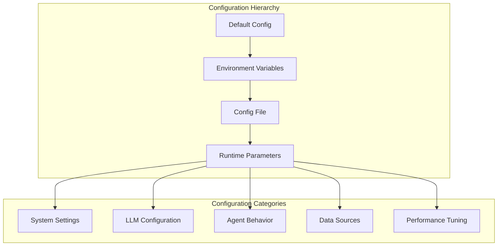
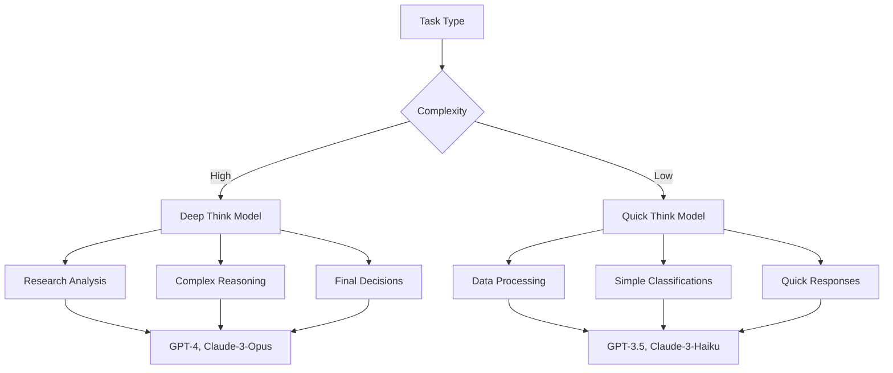

# Configuration Guide

## 🎛️ Overview

TradingAgents provides extensive configuration options to customize behavior, performance, and integration with various services. This guide covers all available configuration parameters and best practices.

## 🏗️ Configuration Architecture



## 📋 Default Configuration

### Complete Default Config
```python
DEFAULT_CONFIG = {
    # System Settings
    "project_dir": os.path.abspath(os.path.join(os.path.dirname(__file__), ".")),
    "results_dir": os.getenv("TRADINGAGENTS_RESULTS_DIR", "./results"),
    "data_dir": "/path/to/data",
    "data_cache_dir": os.path.join(project_dir, "dataflows/data_cache"),
    
    # LLM Settings
    "llm_provider": "openai",
    "deep_think_llm": "gpt-4",
    "quick_think_llm": "gpt-3.5-turbo",
    "backend_url": "https://api.openai.com/v1",
    
    # Agent Behavior
    "max_debate_rounds": 3,
    "max_risk_discuss_rounds": 2,
    "max_recur_limit": 100,
    
    # Tool Settings
    "online_tools": True,
}
```

## 🔧 Configuration Methods

### Method 1: Environment Variables
```bash
# System settings
export TRADINGAGENTS_RESULTS_DIR="/path/to/results"
export TRADINGAGENTS_DATA_DIR="/path/to/data"
export TRADINGAGENTS_DEBUG="true"

# LLM settings
export TRADINGAGENTS_LLM_PROVIDER="anthropic"
export TRADINGAGENTS_DEEP_MODEL="claude-3-opus-20240229"
export TRADINGAGENTS_QUICK_MODEL="claude-3-haiku-20240307"

# Agent behavior
export TRADINGAGENTS_MAX_DEBATE_ROUNDS="5"
export TRADINGAGENTS_ONLINE_TOOLS="false"

# API keys
export OPENAI_API_KEY="your_openai_key"
export ANTHROPIC_API_KEY="your_anthropic_key"
export GOOGLE_API_KEY="your_google_key"
export FINNHUB_API_KEY="your_finnhub_key"
```

### Method 2: Configuration File
Create `config.yaml`:
```yaml
# TradingAgents Configuration
system:
  project_dir: "/path/to/project"
  results_dir: "./results"
  data_cache_dir: "./cache"
  debug: true

llm:
  provider: "openai"
  deep_think_model: "gpt-4"
  quick_think_model: "gpt-3.5-turbo"
  backend_url: "https://api.openai.com/v1"
  temperature: 0.1
  max_tokens: 2000

agents:
  max_debate_rounds: 3
  max_risk_discuss_rounds: 2
  selected_analysts: ["market", "news", "fundamentals"]
  
data_sources:
  online_tools: true
  cache_enabled: true
  cache_ttl: 3600  # 1 hour
  
performance:
  parallel_execution: true
  max_workers: 4
  timeout: 300  # 5 minutes
```

Load configuration:
```python
import yaml
from tradingagents.default_config import DEFAULT_CONFIG

# Load from YAML
with open('config.yaml', 'r') as f:
    user_config = yaml.safe_load(f)

# Merge with defaults
config = DEFAULT_CONFIG.copy()
config.update(flatten_config(user_config))
```

### Method 3: Python Dictionary
```python
from tradingagents.default_config import DEFAULT_CONFIG

# Create custom configuration
custom_config = DEFAULT_CONFIG.copy()
custom_config.update({
    "llm_provider": "anthropic",
    "deep_think_llm": "claude-3-opus-20240229",
    "quick_think_llm": "claude-3-haiku-20240307",
    "max_debate_rounds": 5,
    "online_tools": True,
})

# Use with TradingAgentsGraph
ta = TradingAgentsGraph(config=custom_config)
```

### Method 4: Runtime Parameters
```python
# Override specific parameters at runtime
ta = TradingAgentsGraph(
    selected_analysts=["market", "fundamentals"],
    debug=True,
    config={
        "llm_provider": "google",
        "max_debate_rounds": 1,
    }
)
```

## 🤖 LLM Configuration

### Supported Providers

#### OpenAI Configuration
```python
openai_config = {
    "llm_provider": "openai",
    "backend_url": "https://api.openai.com/v1",
    "deep_think_llm": "gpt-4",
    "quick_think_llm": "gpt-3.5-turbo",
    
    # Optional OpenAI-specific settings
    "openai_api_key": "your_key",  # or use env var
    "openai_organization": "your_org_id",
    "temperature": 0.1,
    "max_tokens": 2000,
    "top_p": 1.0,
    "frequency_penalty": 0.0,
    "presence_penalty": 0.0,
}
```

#### Anthropic Configuration
```python
anthropic_config = {
    "llm_provider": "anthropic",
    "backend_url": "https://api.anthropic.com",
    "deep_think_llm": "claude-3-opus-20240229",
    "quick_think_llm": "claude-3-haiku-20240307",
    
    # Optional Anthropic-specific settings
    "anthropic_api_key": "your_key",
    "temperature": 0.1,
    "max_tokens": 2000,
    "top_p": 1.0,
}
```

#### Google Configuration
```python
google_config = {
    "llm_provider": "google",
    "deep_think_llm": "gemini-pro",
    "quick_think_llm": "gemini-pro",
    
    # Optional Google-specific settings
    "google_api_key": "your_key",
    "temperature": 0.1,
    "max_output_tokens": 2000,
    "top_p": 1.0,
    "top_k": 40,
}
```

#### Custom/Local Provider
```python
custom_config = {
    "llm_provider": "ollama",  # or "openrouter", "custom"
    "backend_url": "http://localhost:11434/v1",
    "deep_think_llm": "llama2:13b",
    "quick_think_llm": "llama2:7b",
    
    # Custom headers if needed
    "custom_headers": {
        "Authorization": "Bearer your_token",
        "X-Custom-Header": "value",
    }
}
```

### Model Selection Strategy



**Recommended Combinations**:
- **High Quality**: GPT-4 + GPT-3.5-turbo
- **Balanced**: Claude-3-Opus + Claude-3-Haiku
- **Cost-Effective**: GPT-3.5-turbo + GPT-3.5-turbo
- **Local**: Llama2-13B + Llama2-7B

## 🎭 Agent Behavior Configuration

### Debate Configuration
```python
debate_config = {
    # Research team debate rounds
    "max_debate_rounds": 3,  # Bull vs Bear rounds
    
    # Risk management discussion rounds
    "max_risk_discuss_rounds": 2,  # Risk team rounds
    
    # Recursion limits
    "max_recur_limit": 100,
    
    # Debate quality thresholds
    "min_argument_length": 100,
    "max_argument_length": 2000,
    
    # Convergence criteria
    "convergence_threshold": 0.8,
    "max_iterations_without_progress": 3,
}
```

### Agent Selection
```python
# Available analysts
AVAILABLE_ANALYSTS = [
    "market",        # Technical analysis
    "social",        # Social media sentiment
    "news",          # News impact analysis
    "fundamentals",  # Financial fundamentals
]

# Configuration examples
config_conservative = {
    "selected_analysts": ["fundamentals", "news"],
    "max_debate_rounds": 1,
}

config_comprehensive = {
    "selected_analysts": ["market", "social", "news", "fundamentals"],
    "max_debate_rounds": 5,
}

config_technical = {
    "selected_analysts": ["market"],
    "max_debate_rounds": 1,
}
```

### Memory Configuration
```python
memory_config = {
    # Memory system settings
    "memory_enabled": True,
    "memory_backend": "chromadb",  # or "faiss", "pinecone"
    "memory_collection_name": "trading_memories",
    
    # Retrieval settings
    "max_memories_retrieved": 5,
    "memory_similarity_threshold": 0.7,
    
    # Storage settings
    "memory_persist_directory": "./memories",
    "memory_embedding_model": "text-embedding-ada-002",
    
    # Cleanup settings
    "memory_max_size": 10000,
    "memory_cleanup_interval": 86400,  # 24 hours
}
```

## 📊 Data Source Configuration

### Online Data Sources
```python
data_config = {
    "online_tools": True,
    
    # Yahoo Finance settings
    "yfinance_enabled": True,
    "yfinance_timeout": 30,
    
    # Finnhub settings
    "finnhub_enabled": True,
    "finnhub_api_key": "your_key",
    "finnhub_rate_limit": 60,  # calls per minute
    
    # Reddit settings
    "reddit_enabled": True,
    "reddit_client_id": "your_client_id",
    "reddit_client_secret": "your_secret",
    "reddit_user_agent": "TradingAgents/1.0",
    
    # Google News settings
    "google_news_enabled": True,
    "google_news_language": "en",
    "google_news_country": "US",
}
```

### Caching Configuration
```python
cache_config = {
    "cache_enabled": True,
    "cache_backend": "file",  # or "redis", "memory"
    "cache_directory": "./cache",
    
    # TTL settings (in seconds)
    "market_data_ttl": 300,     # 5 minutes
    "news_data_ttl": 1800,      # 30 minutes
    "fundamental_data_ttl": 86400,  # 24 hours
    "social_data_ttl": 600,     # 10 minutes
    
    # Cache size limits
    "max_cache_size": "1GB",
    "cache_cleanup_threshold": 0.8,
}
```

### Offline Mode Configuration
```python
offline_config = {
    "online_tools": False,
    "data_directory": "/path/to/offline/data",
    "fallback_to_cache": True,
    "require_fresh_data": False,
    
    # Offline data file patterns
    "market_data_pattern": "{ticker}_{date}_market.json",
    "news_data_pattern": "{ticker}_{date}_news.json",
    "fundamental_data_pattern": "{ticker}_fundamentals.json",
}
```

## ⚡ Performance Configuration

### Execution Settings
```python
performance_config = {
    # Parallel execution
    "parallel_agents": True,
    "max_workers": 4,
    
    # Timeouts
    "agent_timeout": 300,      # 5 minutes per agent
    "total_timeout": 1800,     # 30 minutes total
    "llm_timeout": 60,         # 1 minute per LLM call
    
    # Rate limiting
    "llm_rate_limit": 10,      # calls per minute
    "data_rate_limit": 60,     # calls per minute
    
    # Retry settings
    "max_retries": 3,
    "retry_delay": 1,          # seconds
    "exponential_backoff": True,
}
```

### Resource Management
```python
resource_config = {
    # Memory management
    "max_memory_usage": "4GB",
    "memory_cleanup_interval": 300,  # 5 minutes
    
    # Disk usage
    "max_disk_usage": "10GB",
    "cleanup_old_results": True,
    "result_retention_days": 30,
    
    # Network settings
    "connection_pool_size": 10,
    "keep_alive": True,
    "verify_ssl": True,
}
```

## 🔒 Security Configuration

### API Key Management
```python
security_config = {
    # API key sources (in order of preference)
    "api_key_sources": [
        "environment",     # Environment variables
        "config_file",     # Configuration file
        "keyring",         # System keyring
        "vault",           # HashiCorp Vault
    ],
    
    # Key rotation
    "rotate_keys": False,
    "key_rotation_interval": 86400,  # 24 hours
    
    # Encryption
    "encrypt_cache": False,
    "encryption_key": "your_encryption_key",
    
    # Audit logging
    "audit_api_calls": True,
    "audit_log_file": "./audit.log",
}
```

### Data Privacy
```python
privacy_config = {
    # Data anonymization
    "anonymize_data": False,
    "hash_sensitive_data": True,
    
    # Data retention
    "data_retention_policy": "30_days",
    "auto_delete_old_data": True,
    
    # Compliance
    "gdpr_compliance": True,
    "data_processing_consent": True,
}
```

## 🎯 Use Case Configurations

### Day Trading Configuration
```python
day_trading_config = {
    "llm_provider": "openai",
    "quick_think_llm": "gpt-3.5-turbo",
    "deep_think_llm": "gpt-4",
    "selected_analysts": ["market", "news"],
    "max_debate_rounds": 1,
    "max_risk_discuss_rounds": 1,
    "online_tools": True,
    "cache_enabled": False,  # Always fresh data
    "agent_timeout": 60,     # Fast execution
}
```

### Long-term Investment Configuration
```python
long_term_config = {
    "llm_provider": "anthropic",
    "deep_think_llm": "claude-3-opus-20240229",
    "quick_think_llm": "claude-3-haiku-20240307",
    "selected_analysts": ["market", "social", "news", "fundamentals"],
    "max_debate_rounds": 5,
    "max_risk_discuss_rounds": 3,
    "online_tools": True,
    "memory_enabled": True,
    "agent_timeout": 600,    # Thorough analysis
}
```

### Research Configuration
```python
research_config = {
    "llm_provider": "google",
    "deep_think_llm": "gemini-pro",
    "quick_think_llm": "gemini-pro",
    "selected_analysts": ["fundamentals", "news"],
    "max_debate_rounds": 3,
    "online_tools": True,
    "save_detailed_logs": True,
    "export_analysis": True,
    "output_format": "detailed_report",
}
```

### Budget-Conscious Configuration
```python
budget_config = {
    "llm_provider": "openai",
    "quick_think_llm": "gpt-3.5-turbo",
    "deep_think_llm": "gpt-3.5-turbo",  # Use cheaper model
    "selected_analysts": ["market"],     # Fewer analysts
    "max_debate_rounds": 1,              # Fewer rounds
    "online_tools": False,               # Use cached data
    "cache_enabled": True,
    "llm_rate_limit": 5,                 # Slower execution
}
```

## 🔧 Configuration Validation

### Validation Function
```python
def validate_config(config: Dict[str, Any]) -> Dict[str, Any]:
    """Validate and normalize configuration."""
    
    # Required fields
    required_fields = ["llm_provider", "deep_think_llm", "quick_think_llm"]
    for field in required_fields:
        if field not in config:
            raise ValueError(f"Missing required field: {field}")
    
    # Validate LLM provider
    valid_providers = ["openai", "anthropic", "google", "ollama", "custom"]
    if config["llm_provider"] not in valid_providers:
        raise ValueError(f"Invalid LLM provider: {config['llm_provider']}")
    
    # Validate numeric ranges
    if config.get("max_debate_rounds", 0) < 1:
        config["max_debate_rounds"] = 1
    if config.get("max_debate_rounds", 0) > 10:
        config["max_debate_rounds"] = 10
    
    # Validate paths
    if "results_dir" in config:
        os.makedirs(config["results_dir"], exist_ok=True)
    
    return config
```

### Configuration Schema
```python
from typing import Optional, List, Union
from pydantic import BaseModel, validator

class TradingAgentsConfig(BaseModel):
    # System settings
    project_dir: str
    results_dir: str = "./results"
    data_cache_dir: Optional[str] = None
    
    # LLM settings
    llm_provider: str
    deep_think_llm: str
    quick_think_llm: str
    backend_url: str
    
    # Agent behavior
    max_debate_rounds: int = 3
    max_risk_discuss_rounds: int = 2
    selected_analysts: List[str] = ["market", "news", "fundamentals"]
    
    # Tool settings
    online_tools: bool = True
    
    @validator('llm_provider')
    def validate_provider(cls, v):
        valid_providers = ["openai", "anthropic", "google", "ollama"]
        if v not in valid_providers:
            raise ValueError(f"Invalid provider: {v}")
        return v
    
    @validator('max_debate_rounds')
    def validate_debate_rounds(cls, v):
        if v < 1 or v > 10:
            raise ValueError("Debate rounds must be between 1 and 10")
        return v
```

## 📝 Configuration Best Practices

### 1. Environment-Specific Configs
```python
# config/development.py
DEV_CONFIG = {
    "debug": True,
    "llm_provider": "openai",
    "quick_think_llm": "gpt-3.5-turbo",
    "max_debate_rounds": 1,
    "online_tools": False,
}

# config/production.py
PROD_CONFIG = {
    "debug": False,
    "llm_provider": "anthropic",
    "deep_think_llm": "claude-3-opus-20240229",
    "max_debate_rounds": 3,
    "online_tools": True,
}
```

### 2. Configuration Inheritance
```python
class ConfigManager:
    def __init__(self, environment="development"):
        self.base_config = DEFAULT_CONFIG.copy()
        self.env_config = self.load_env_config(environment)
        self.user_config = self.load_user_config()
        
    def get_config(self):
        config = self.base_config.copy()
        config.update(self.env_config)
        config.update(self.user_config)
        return validate_config(config)
```

### 3. Dynamic Configuration
```python
def get_adaptive_config(market_conditions: str) -> Dict[str, Any]:
    """Adapt configuration based on market conditions."""
    base_config = DEFAULT_CONFIG.copy()
    
    if market_conditions == "high_volatility":
        base_config.update({
            "max_debate_rounds": 5,
            "selected_analysts": ["market", "news", "fundamentals"],
            "agent_timeout": 600,
        })
    elif market_conditions == "stable":
        base_config.update({
            "max_debate_rounds": 2,
            "selected_analysts": ["fundamentals"],
            "agent_timeout": 300,
        })
    
    return base_config
```

---

This configuration guide provides comprehensive coverage of all TradingAgents configuration options. Use it to customize the system for your specific needs and use cases.

**Next**: Explore the [API Reference](../developer/api-reference.md) for detailed programming interfaces.