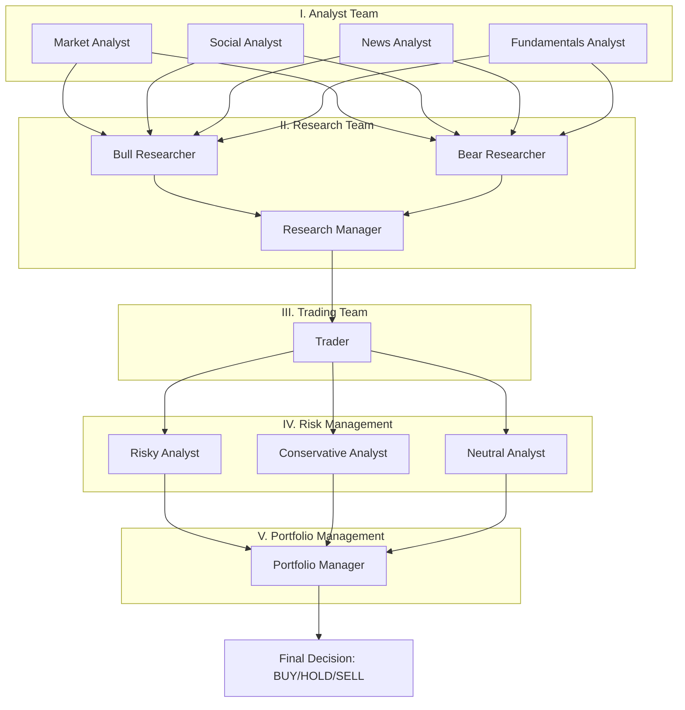
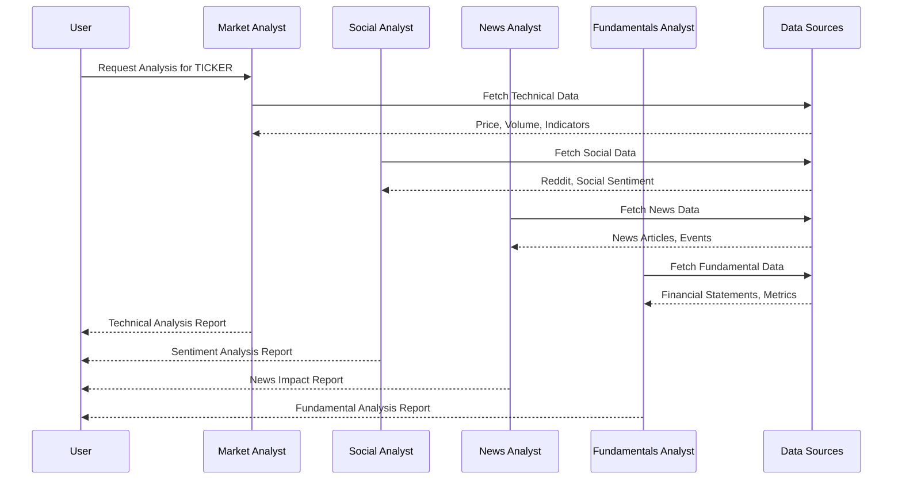
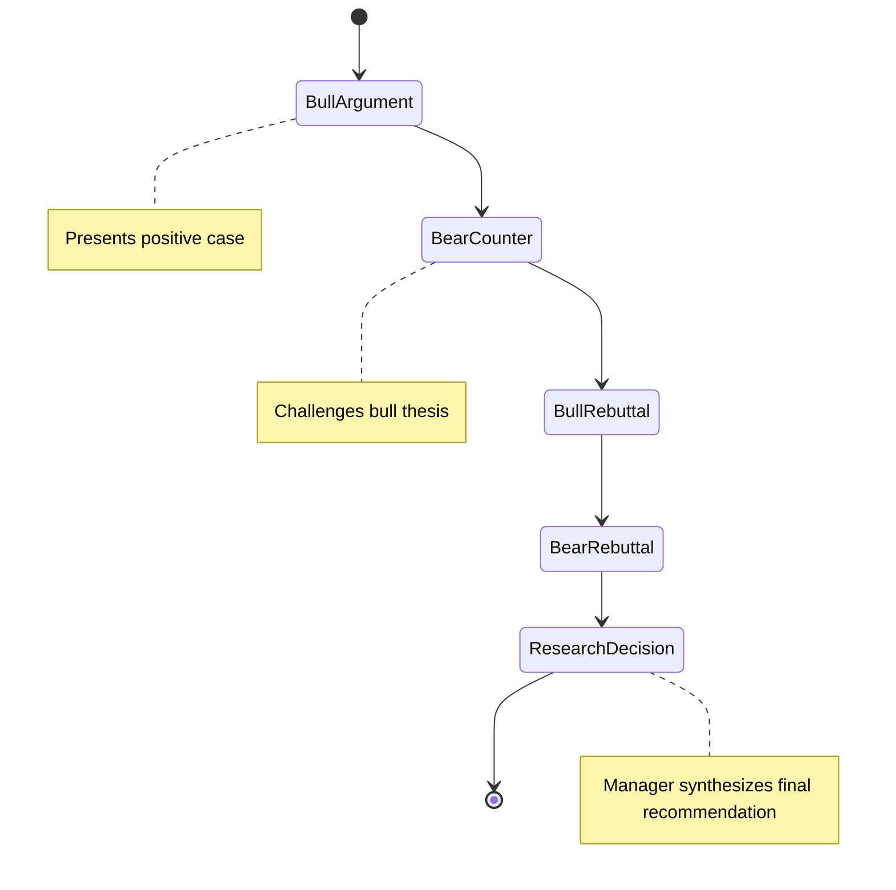
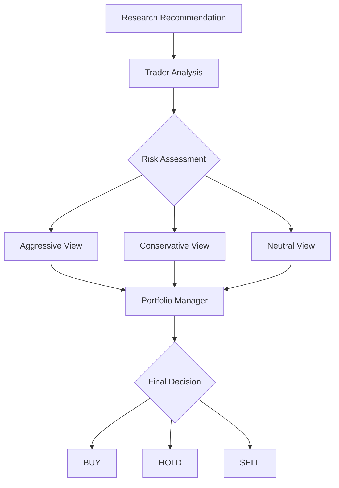
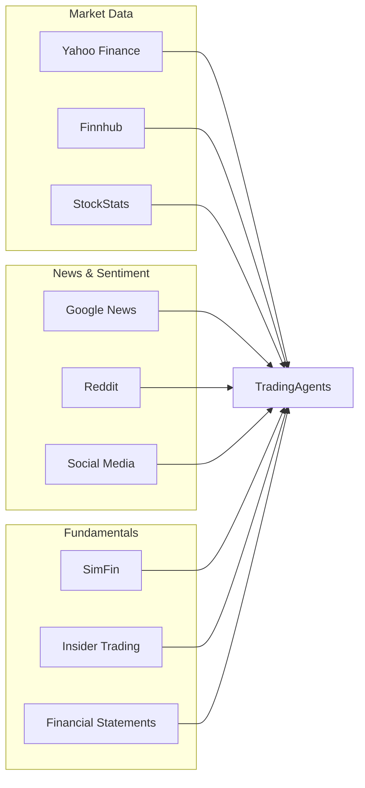

# TradingAgents Overview

## ⚠️ IMPORTANT: What TradingAgents Is and Isn't

**TradingAgents is a DECISION SUPPORT SYSTEM, not an automated trading platform.**

- ✅ **Provides**: Intelligent analysis, investment recommendations, risk assessment
- ❌ **Does NOT provide**: Actual trade execution, broker integration, or fund management
- 🎯 **Purpose**: Enhance human investment decisions, not replace human judgment

👉 **For complete details, see [System Capabilities & Limitations](system-capabilities.md)**

## 🎯 What is TradingAgents?

TradingAgents is a cutting-edge **Multi-Agents LLM Financial Trading Framework** that revolutionizes investment decision-making through collaborative AI agents. It simulates a professional trading firm's decision-making process using specialized AI agents that work together to analyze markets and provide informed investment recommendations.

## 🌟 Key Features

### Multi-Agent Collaboration
- **5-Stage Pipeline**: Analyst → Research → Trading → Risk Management → Portfolio Management
- **Specialized Agents**: Each agent has a specific role and expertise
- **Debate Mechanism**: Bull vs Bear researchers ensure balanced analysis
- **Consensus Building**: Multiple perspectives lead to robust decisions

### Comprehensive Analysis
- **Technical Analysis**: RSI, MACD, Bollinger Bands, ATR, and more
- **Fundamental Analysis**: Financial statements, insider transactions, company metrics
- **Sentiment Analysis**: Social media sentiment from Reddit and news sources
- **News Analysis**: Real-time news impact assessment

### Advanced AI Integration
- **Multiple LLM Support**: OpenAI, Anthropic, Google, and custom providers
- **Memory System**: Agents learn from past decisions and mistakes
- **Adaptive Learning**: Continuous improvement through reflection
- **Flexible Configuration**: Customizable models and parameters

## 🏗️ System Architecture

## 🔄 Workflow Process

### Stage 1: Data Collection & Analysis

### Stage 2: Research Debate

### Stage 3-5: Trading & Risk Management

## 🎯 Use Cases

### Individual Investors
- **Personal Portfolio Management**: Get professional-grade analysis for your investments
- **Learning Tool**: Understand different analytical perspectives
- **Risk Assessment**: Comprehensive risk evaluation before trading

### Financial Professionals
- **Research Augmentation**: Enhance existing research with AI insights
- **Second Opinion**: Get independent analysis to validate decisions
- **Process Automation**: Streamline repetitive analysis tasks

### Institutional Investors
- **Systematic Analysis**: Consistent, repeatable investment process
- **Risk Management**: Multi-layered risk assessment framework
- **Compliance**: Documented decision-making process

## 🔧 Data Sources Integration

## 🚀 Getting Started

Ready to start using TradingAgents? Here are your next steps:

1. **[Quick Start Guide](quick-start.md)** - Get running in 5 minutes
2. **[User Guide](user-guide.md)** - Comprehensive usage instructions
3. **[Configuration](configuration.md)** - Customize for your needs

## 🔬 Research Foundation

TradingAgents is built on solid research foundations:

- **Multi-Agent Systems**: Leveraging collective intelligence
- **Behavioral Finance**: Understanding market psychology
- **Machine Learning**: Continuous improvement through experience
- **Risk Management**: Systematic approach to uncertainty

## 📊 Performance Characteristics

### Strengths
- ✅ **Comprehensive Analysis**: Multiple analytical perspectives
- ✅ **Bias Reduction**: Bull/Bear debate mechanism
- ✅ **Adaptability**: Learns from past decisions
- ✅ **Transparency**: Full decision audit trail
- ✅ **Scalability**: Handles multiple assets simultaneously

### Considerations
- ⚠️ **Computational Cost**: Multiple LLM calls per analysis
- ⚠️ **Data Dependency**: Quality depends on data source availability
- ⚠️ **Market Conditions**: Performance may vary across market regimes
- ⚠️ **Latency**: Thorough analysis takes time

---

**Next Steps**: Ready to dive deeper? Check out our [Quick Start Guide](quick-start.md) or explore the [System Architecture](../design/architecture.md) for technical details.