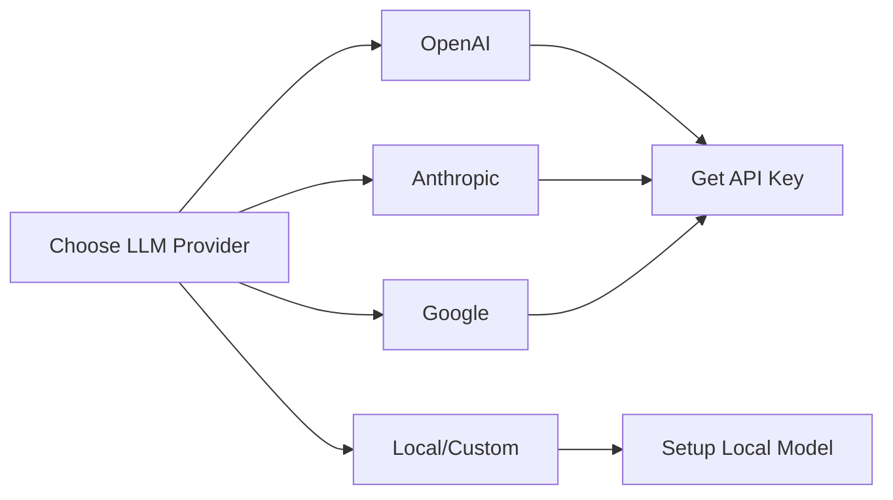
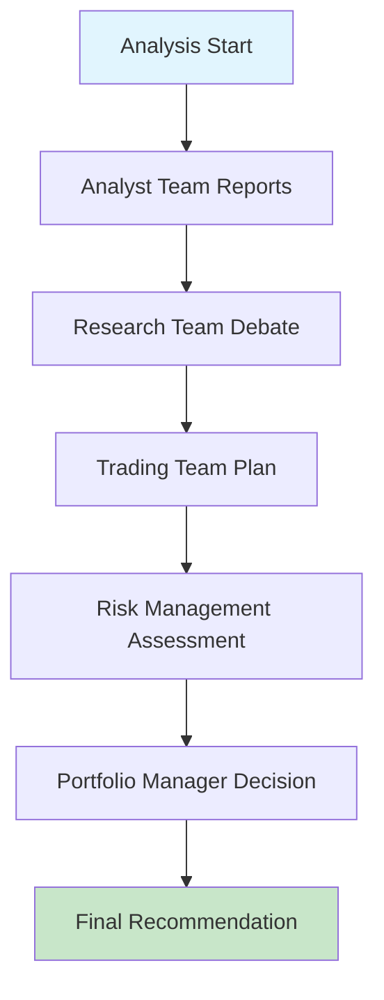
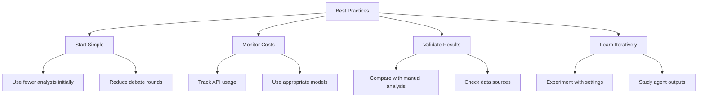

# Quick Start Guide

## 🚀 Get Started in 5 Minutes

This guide will help you get TradingAgents up and running quickly. Follow these steps to perform your first stock analysis.

## 📋 Prerequisites

### System Requirements
- **Python**: 3.10 or higher
- **Memory**: At least 4GB RAM
- **Storage**: 2GB free space
- **Internet**: Required for data fetching and LLM calls

### API Keys (Choose One)
You'll need at least one LLM provider API key:



**Recommended for beginners**: OpenAI (GPT-4 or GPT-3.5-turbo)

## 🛠️ Installation

### Option 1: Using pip (Recommended)
```bash
# Install TradingAgents
pip install tradingagents

# Verify installation
tradingagents --help
```

### Option 2: From Source
```bash
# Clone the repository
git clone https://github.com/TauricResearch/TradingAgents.git
cd TradingAgents

# Install dependencies
pip install -r requirements.txt

# Install in development mode
pip install -e .
```

### Option 3: Using uv (Fast)
```bash
# Install uv if you haven't already
pip install uv

# Install TradingAgents
uv pip install tradingagents
```

## 🔑 Configuration

### 1. Set Up Environment Variables

Create a `.env` file in your project directory:

```bash
# OpenAI Configuration (if using OpenAI)
OPENAI_API_KEY=your_openai_api_key_here

# Anthropic Configuration (if using Anthropic)
ANTHROPIC_API_KEY=your_anthropic_api_key_here

# Google Configuration (if using Google)
GOOGLE_API_KEY=your_google_api_key_here

# Optional: Data API Keys
FINNHUB_API_KEY=your_finnhub_key_here
REDDIT_CLIENT_ID=your_reddit_client_id
REDDIT_CLIENT_SECRET=your_reddit_client_secret
```

### 2. Basic Configuration File (Optional)

Create `config.py` for custom settings:

```python
from tradingagents.default_config import DEFAULT_CONFIG

# Create custom configuration
CUSTOM_CONFIG = DEFAULT_CONFIG.copy()
CUSTOM_CONFIG.update({
    "llm_provider": "openai",  # or "anthropic", "google"
    "deep_think_llm": "gpt-4",
    "quick_think_llm": "gpt-3.5-turbo",
    "max_debate_rounds": 2,
    "online_tools": True,
})
```

## 🎯 Your First Analysis

### Method 1: Command Line Interface (Easiest)

```bash
# Start the interactive CLI
tradingagents analyze
```

The CLI will guide you through:
1. **Ticker Selection**: Enter stock symbol (e.g., "AAPL", "TSLA")
2. **Analysis Date**: Choose date for analysis
3. **Analyst Team**: Select which analysts to include
4. **Research Depth**: Choose number of debate rounds
5. **LLM Provider**: Select your AI provider

### Method 2: Python Script

Create `my_analysis.py`:

```python
from tradingagents.graph.trading_graph import TradingAgentsGraph
from tradingagents.default_config import DEFAULT_CONFIG

# Configure TradingAgents
config = DEFAULT_CONFIG.copy()
config.update({
    "llm_provider": "openai",
    "deep_think_llm": "gpt-4",
    "quick_think_llm": "gpt-3.5-turbo",
    "max_debate_rounds": 1,  # Start with 1 for faster results
    "online_tools": True,
})

# Initialize TradingAgents
ta = TradingAgentsGraph(
    selected_analysts=["market", "news", "fundamentals"],
    debug=True,
    config=config
)

# Perform analysis
ticker = "AAPL"
date = "2024-01-15"

print(f"Analyzing {ticker} for {date}...")
final_state, decision = ta.propagate(ticker, date)

print(f"\nFinal Decision: {decision}")
print(f"Full Analysis: {final_state['final_trade_decision']}")
```

Run the script:
```bash
python my_analysis.py
```

## 📊 Understanding the Output

### CLI Output Structure


### Sample Output Interpretation

```
📊 ANALYST TEAM REPORTS
├── Market Analyst: Technical indicators show bullish momentum
├── News Analyst: Recent earnings beat expectations
└── Fundamentals Analyst: Strong balance sheet, reasonable valuation

🎭 RESEARCH TEAM DEBATE
├── Bull Researcher: Growth prospects justify current valuation
├── Bear Researcher: Market headwinds pose risks
└── Research Manager: MODERATE BUY recommendation

💼 TRADING TEAM
└── Trader: Suggests 2% position size with stop-loss at -5%

⚠️ RISK MANAGEMENT
├── Aggressive Analyst: Acceptable risk for potential returns
├── Conservative Analyst: Reduce position size to 1%
└── Risk Manager: Balanced approach recommended

🎯 FINAL DECISION: BUY
Position Size: 1.5% of portfolio
Stop Loss: -5%
Target: +15%
```

## 🔧 Common Configurations

### Quick Analysis (Fast)
```python
config = {
    "llm_provider": "openai",
    "quick_think_llm": "gpt-3.5-turbo",
    "deep_think_llm": "gpt-3.5-turbo",
    "max_debate_rounds": 1,
    "max_risk_discuss_rounds": 1,
    "online_tools": True,
}

# Select fewer analysts for speed
selected_analysts = ["market", "fundamentals"]
```

### Comprehensive Analysis (Thorough)
```python
config = {
    "llm_provider": "openai",
    "quick_think_llm": "gpt-4",
    "deep_think_llm": "gpt-4",
    "max_debate_rounds": 3,
    "max_risk_discuss_rounds": 2,
    "online_tools": True,
}

# Include all analysts
selected_analysts = ["market", "social", "news", "fundamentals"]
```

### Budget-Friendly (Fewer API Calls)
```python
config = {
    "llm_provider": "openai",
    "quick_think_llm": "gpt-3.5-turbo",
    "deep_think_llm": "gpt-3.5-turbo",
    "max_debate_rounds": 1,
    "online_tools": False,  # Use cached data
}
```

## 🎨 Customization Examples

### Custom Analyst Selection
```python
# Conservative analysis (focus on risk)
conservative_analysts = ["fundamentals", "news"]

# Growth-focused analysis
growth_analysts = ["market", "social", "news"]

# Comprehensive analysis
all_analysts = ["market", "social", "news", "fundamentals"]
```

### Different LLM Providers
```python
# Using Anthropic Claude
config = {
    "llm_provider": "anthropic",
    "deep_think_llm": "claude-3-opus-20240229",
    "quick_think_llm": "claude-3-haiku-20240307",
}

# Using Google Gemini
config = {
    "llm_provider": "google",
    "deep_think_llm": "gemini-pro",
    "quick_think_llm": "gemini-pro",
}
```

## 🔍 Troubleshooting

### Common Issues and Solutions

#### 1. API Key Errors
```bash
Error: OpenAI API key not found
```
**Solution**: Ensure your API key is set in environment variables:
```bash
export OPENAI_API_KEY="your_key_here"
```

#### 2. Rate Limiting
```bash
Error: Rate limit exceeded
```
**Solution**: Reduce analysis frequency or upgrade API plan:
```python
config["max_debate_rounds"] = 1  # Reduce LLM calls
```

#### 3. Data Fetching Issues
```bash
Error: Unable to fetch data for ticker
```
**Solution**: Check ticker symbol and internet connection:
```python
# Verify ticker exists
ticker = "AAPL"  # Use valid ticker symbols
```

#### 4. Memory Issues
```bash
Error: Out of memory
```
**Solution**: Reduce concurrent analysis or use lighter models:
```python
config["quick_think_llm"] = "gpt-3.5-turbo"  # Use lighter model
```

### Debug Mode
Enable debug mode for detailed logging:
```python
ta = TradingAgentsGraph(debug=True, config=config)
```

## 📈 Next Steps

### Explore Advanced Features
1. **[User Guide](user-guide.md)** - Comprehensive usage instructions
2. **[Configuration](configuration.md)** - Detailed configuration options
3. **[API Reference](../developer/api-reference.md)** - Complete API documentation

### Learn the System
1. **[Design Philosophy](../design/design-philosophy.md)** - Understand the thinking behind TradingAgents
2. **[Architecture](../design/architecture.md)** - Technical architecture overview
3. **[Workflow Design](../design/workflow-design.md)** - How agents collaborate

### Extend and Customize
1. **[Development Guide](../developer/development-guide.md)** - Set up development environment
2. **[Extending Agents](../developer/extending-agents.md)** - Add custom agents
3. **[Component Design](../developer/component-design.md)** - Internal architecture

## 💡 Tips for Success

### Best Practices


### Performance Tips
- **Start with 1 debate round** for faster results
- **Use GPT-3.5-turbo** for cost-effective analysis
- **Enable caching** to reduce repeated API calls
- **Select relevant analysts** based on your focus

### Quality Tips
- **Use recent dates** for better data availability
- **Verify ticker symbols** before analysis
- **Review agent reasoning** to understand decisions
- **Compare results** across different configurations

---

🎉 **Congratulations!** You're now ready to use TradingAgents for intelligent stock analysis. Start with simple configurations and gradually explore more advanced features as you become comfortable with the system.

**Need Help?** Check our [troubleshooting guide](../developer/troubleshooting.md) or join our [Discord community](https://discord.com/invite/hk9PGKShPK).