# System Capabilities and Limitations

## 🎯 What TradingAgents Does and Doesn't Do

This document clarifies the exact capabilities and limitations of TradingAgents to help users understand what to expect from the system.

## ✅ What TradingAgents PROVIDES

### 🎯 Single-Stock Deep Analysis System
**IMPORTANT**: TradingAgents analyzes **one specific stock at a time** that YOU provide. It does not scan markets or automatically select stocks.

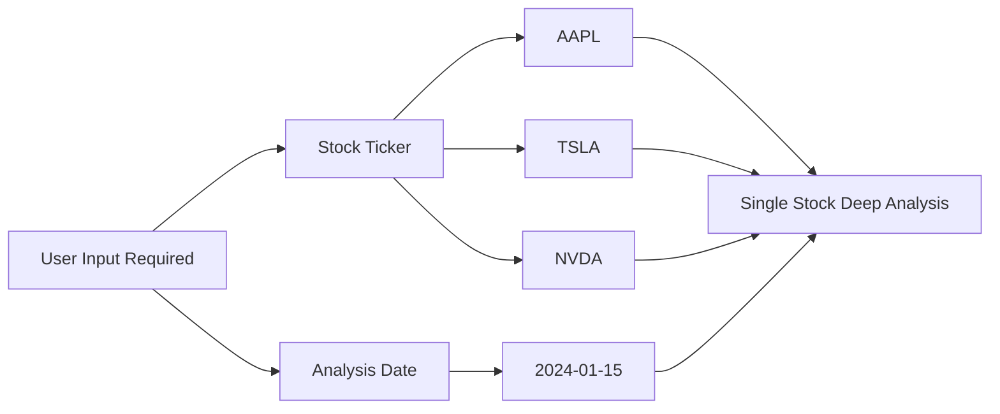

**Input Requirements**:
- ✅ **Stock Ticker**: You must provide specific stock symbol (e.g., "AAPL", "TSLA")
- ✅ **Analysis Date**: Specific date for analysis (YYYY-MM-DD format)
- ❌ **No Market Scanning**: System cannot find stocks for you

### 🧠 Intelligent Analysis Framework
TradingAgents is a **decision support system** that provides comprehensive investment analysis through AI-powered agents:

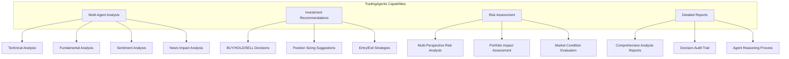

### 📊 Comprehensive Market Analysis
- **Technical Analysis**: RSI, MACD, Bollinger Bands, moving averages, volume analysis
- **Fundamental Analysis**: Financial statements, ratios, company metrics, insider trading data
- **Sentiment Analysis**: Social media sentiment, Reddit discussions, retail investor mood
- **News Analysis**: Market-moving events, company announcements, economic indicators
- **Risk Assessment**: Multi-layered risk evaluation from different perspectives

### 🤖 AI-Powered Decision Making
- **Multi-Agent Collaboration**: Specialized agents working together
- **Debate Mechanism**: Bull vs Bear researchers ensuring balanced analysis
- **Memory System**: Learning from past decisions and outcomes
- **Adaptive Reasoning**: Adjusting analysis based on market conditions

### 📈 Investment Recommendations
- **Clear Decisions**: BUY, HOLD, or SELL recommendations
- **Detailed Reasoning**: Complete explanation of decision logic
- **Risk-Adjusted Suggestions**: Position sizing and risk management advice
- **Market Timing**: Entry and exit strategy recommendations

## ❌ What TradingAgents DOES NOT PROVIDE

### 🚫 No Stock Selection or Market Scanning

**IMPORTANT**: TradingAgents does **NOT** help you find or select stocks. It only analyzes stocks YOU specify.

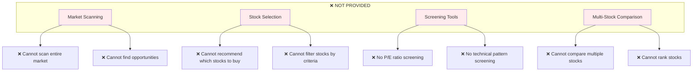

#### Stock Selection Limitations:
- ❌ **No Market Scanning**: Cannot search the entire market for opportunities
- ❌ **No Stock Screening**: Cannot filter stocks by P/E ratio, market cap, etc.
- ❌ **No Automatic Selection**: Cannot recommend which stocks to analyze
- ❌ **No Sector Analysis**: Cannot analyze entire industries or sectors
- ❌ **No Relative Comparison**: Cannot compare multiple stocks simultaneously
- ❌ **No Ranking System**: Cannot rank stocks from best to worst

### 🚫 No Actual Trading Execution

**IMPORTANT**: TradingAgents is **NOT** an automated trading system and does **NOT**:

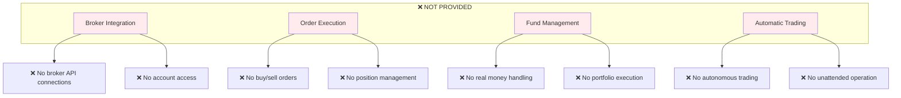

#### Specifically, TradingAgents Does NOT:
- ❌ **Execute trades** on any brokerage platform
- ❌ **Place orders** (buy, sell, stop-loss, etc.)
- ❌ **Manage real money** or access trading accounts
- ❌ **Connect to brokers** (TD Ameritrade, Interactive Brokers, etc.)
- ❌ **Automatically trade** without human intervention
- ❌ **Handle portfolio management** with real funds
- ❌ **Process payments** or financial transactions

### 🚫 No Financial Services
- ❌ **Investment advice** (for regulatory compliance)
- ❌ **Financial planning** services
- ❌ **Portfolio management** services
- ❌ **Tax advice** or reporting
- ❌ **Regulatory compliance** handling

## 🔄 Complete User Workflow

### Step-by-Step Process

```mermaid
sequenceDiagram
    participant U as User
    participant SS as Stock Screener
    participant TA as TradingAgents
    participant DS as Data Sources
    participant B as Broker Platform
    
    Note over U,B: Phase 1: Stock Selection (User's Responsibility)
    U->>SS: Use external tools to find stocks
    SS-->>U: Return candidate stocks
    U->>U: Create watchlist (e.g., AAPL, TSLA, NVDA)
    
    Note over U,B: Phase 2: Deep Analysis (TradingAgents)
    loop For each stock in watchlist
        U->>TA: Request analysis for specific ticker + date
        TA->>DS: Fetch comprehensive data for that stock
        DS-->>TA: Return stock-specific data
        TA->>TA: Multi-agent deep analysis
        TA-->>U: Provide BUY/HOLD/SELL + detailed report
    end
    
    Note over U,B: Phase 3: Decision & Execution (User's Responsibility)
    U->>U: Compare analysis results
    U->>U: Make final investment decision
    U->>B: Manually execute trades
    B-->>U: Confirm trade execution
    
    Note over U,B: Phase 4: Learning (Optional)
    U->>TA: Provide trade outcomes for learning
    TA->>TA: Update memory system
```

### Detailed Workflow Steps

#### 🔍 **Phase 1: Stock Selection (You Must Do This)**
TradingAgents cannot help with this phase. You need to:

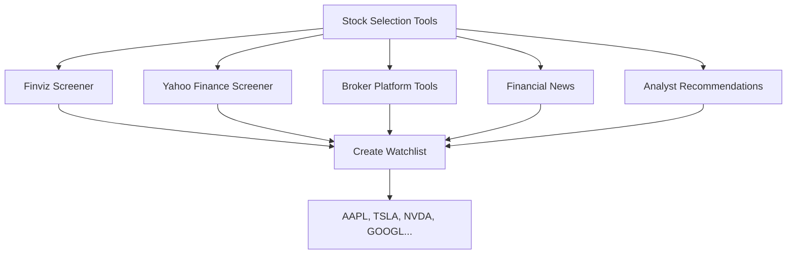

**Recommended Tools for Stock Selection**:
- **Finviz**: Advanced stock screener with technical and fundamental filters
- **Yahoo Finance Screener**: Free basic screening tools
- **Broker Platforms**: Most brokers offer screening tools
- **Financial News**: CNBC, Bloomberg, MarketWatch for ideas
- **Analyst Reports**: Professional research recommendations

**Example Selection Criteria**:
```
✅ Market cap > $1B
✅ P/E ratio < 25
✅ Revenue growth > 10%
✅ Strong technical momentum
✅ Positive analyst sentiment
```

#### 🧠 **Phase 2: Deep Analysis (TradingAgents)**
For each stock in your watchlist:

```python
# Example: Analyze your pre-selected stocks
watchlist = ["AAPL", "TSLA", "NVDA", "GOOGL"]
analysis_date = "2024-01-15"
results = {}

for ticker in watchlist:
    print(f"Analyzing {ticker}...")
    final_state, decision = ta.propagate(ticker, analysis_date)
    results[ticker] = {
        "decision": decision,
        "analysis": final_state["final_trade_decision"],
        "confidence": final_state.get("confidence_score", "N/A")
    }

# Review results
for ticker, result in results.items():
    print(f"{ticker}: {result['decision']}")
```

#### 🎯 **Phase 3: Decision Making (Your Responsibility)**
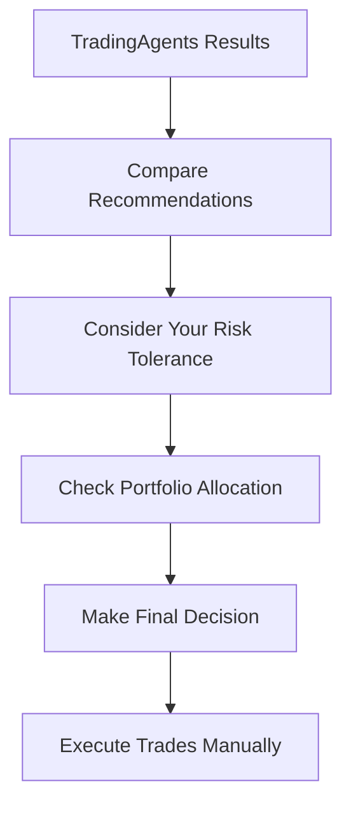

## 🎯 System Positioning

### TradingAgents is a **Decision Support Tool**
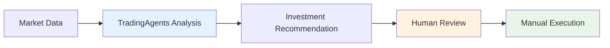

**Role**: Intelligent assistant that enhances human decision-making
**NOT**: Autonomous trading robot that replaces human judgment

### Design Philosophy: Human-in-the-Loop
- **AI Provides**: Comprehensive analysis, data processing, pattern recognition
- **Human Decides**: Final investment decisions, risk tolerance, execution timing
- **Human Executes**: All actual trading through their chosen platforms

## 📊 Data Sources and Capabilities

### Real-Time Data Integration
TradingAgents connects to multiple data sources to provide comprehensive analysis:

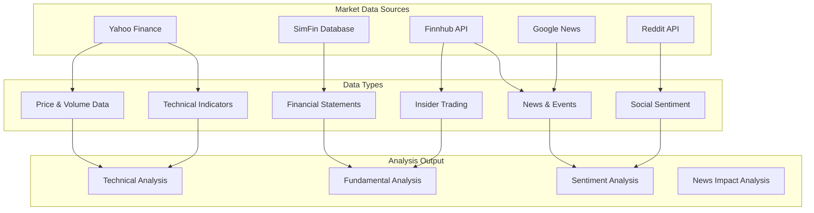

### Data Source Details

| Data Source | Type | Update Frequency | Coverage |
|-------------|------|------------------|----------|
| **Yahoo Finance** | Market Data | Real-time | Global stocks, OHLCV data |
| **Finnhub** | News & Fundamentals | Real-time | Company news, insider data |
| **Google News** | News Analysis | Real-time | Global financial news |
| **Reddit** | Social Sentiment | Real-time | Retail investor discussions |
| **SimFin** | Financial Statements | Quarterly | Balance sheets, income statements |
| **StockStats** | Technical Indicators | Calculated | RSI, MACD, Bollinger Bands |

### Online vs Offline Modes

#### Online Mode (`online_tools=True`)
- ✅ **Real-time data** from live APIs
- ✅ **Latest news** and market events
- ✅ **Current sentiment** analysis
- ⚠️ **Requires API keys** and internet connection
- ⚠️ **Higher latency** due to API calls

#### Offline Mode (`online_tools=False`)
- ✅ **Fast processing** with cached data
- ✅ **No API dependencies** or costs
- ✅ **Consistent results** for backtesting
- ⚠️ **Historical data only** (not real-time)
- ⚠️ **Limited to cached** news and sentiment

## 🔒 Safety and Compliance

### Why No Direct Trading?

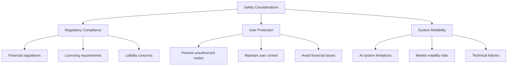

### Regulatory Considerations
- **Investment Advice**: TradingAgents provides analysis, not regulated investment advice
- **Fiduciary Responsibility**: Users maintain full responsibility for their investment decisions
- **Risk Disclosure**: All trading involves risk of financial loss
- **Compliance**: Users must comply with their local financial regulations

### User Responsibility
- ✅ **Review all analysis** before making decisions
- ✅ **Understand the risks** of trading and investing
- ✅ **Verify data accuracy** when possible
- ✅ **Comply with regulations** in your jurisdiction
- ✅ **Use appropriate position sizing** and risk management

## 🎯 Best Practices for Users

### Complete Investment Process with TradingAgents

#### 1. **Stock Selection Phase (Before Using TradingAgents)**
```
✅ Use external screeners to find candidate stocks
✅ Create a focused watchlist (5-20 stocks max)
✅ Consider your investment strategy and goals
✅ Research basic company information
✅ Check recent news and events
```

**Recommended Workflow**:
```python
# Step 1: Create your watchlist using external tools
watchlist = [
    "AAPL",  # From tech sector screening
    "TSLA",  # From growth stock screening  
    "JNJ",   # From dividend screening
    "NVDA",  # From AI/semiconductor theme
]

# Step 2: Prioritize based on your criteria
priority_stocks = ["AAPL", "NVDA"]  # Focus on top picks first
```

#### 2. **Analysis Phase (Using TradingAgents)**
```
✅ Analyze one stock at a time for deep insights
✅ Use consistent analysis dates for comparison
✅ Read the complete analysis report
✅ Understand the reasoning behind recommendations
✅ Pay attention to risk assessments
```

**Efficient Analysis Workflow**:
```python
# Analyze your watchlist systematically
analysis_date = "2024-01-15"
results = {}

for ticker in priority_stocks:
    print(f"\n=== Analyzing {ticker} ===")
    final_state, decision = ta.propagate(ticker, analysis_date)
    
    # Extract key information
    results[ticker] = {
        "decision": decision,
        "reasoning": final_state["final_trade_decision"],
        "market_analysis": final_state["market_report"],
        "risk_assessment": final_state["risk_debate_state"]["judge_decision"]
    }
    
    print(f"{ticker} Recommendation: {decision}")

# Compare results
print("\n=== Summary ===")
for ticker, result in results.items():
    print(f"{ticker}: {result['decision']}")
```

#### 3. **Decision Making Phase**
```
✅ Compare TradingAgents analysis with your own research
✅ Consider your personal risk tolerance
✅ Evaluate position sizing recommendations
✅ Check portfolio allocation and diversification
✅ Plan entry and exit strategies
✅ Set stop-loss and take-profit levels
```

#### 4. **Execution Phase**
```
✅ Use your preferred broker platform
✅ Double-check all order details
✅ Implement appropriate risk management
✅ Start with smaller position sizes
✅ Monitor positions actively
```

#### 5. **Learning Phase**
```
✅ Track your trading outcomes
✅ Provide feedback to TradingAgents for learning
✅ Analyze what worked and what didn't
✅ Continuously improve your process
✅ Update your stock selection criteria
```

### Common Usage Patterns

#### Pattern 1: Weekly Watchlist Review
```python
# Every Sunday, analyze your watchlist
watchlist = ["AAPL", "GOOGL", "MSFT", "TSLA"]
current_date = "2024-01-15"

weekly_analysis = {}
for ticker in watchlist:
    _, decision = ta.propagate(ticker, current_date)
    weekly_analysis[ticker] = decision

# Track changes from previous week
print("Weekly Analysis Summary:")
for ticker, decision in weekly_analysis.items():
    print(f"{ticker}: {decision}")
```

#### Pattern 2: Event-Driven Analysis
```python
# Analyze stocks around earnings or major events
earnings_stocks = ["AAPL", "TSLA"]  # Companies reporting earnings
event_date = "2024-01-15"  # Day before earnings

for ticker in earnings_stocks:
    print(f"\nPre-earnings analysis for {ticker}")
    final_state, decision = ta.propagate(ticker, event_date)
    
    # Focus on risk assessment before events
    risk_analysis = final_state["risk_debate_state"]["judge_decision"]
    print(f"Risk Assessment: {risk_analysis}")
```

#### Pattern 3: Sector Rotation Analysis
```python
# Compare stocks from different sectors
tech_stocks = ["AAPL", "GOOGL", "MSFT"]
healthcare_stocks = ["JNJ", "PFE", "UNH"]
finance_stocks = ["JPM", "BAC", "WFC"]

sectors = {
    "Technology": tech_stocks,
    "Healthcare": healthcare_stocks,
    "Finance": finance_stocks
}

analysis_date = "2024-01-15"
sector_results = {}

for sector, stocks in sectors.items():
    sector_results[sector] = {}
    for ticker in stocks:
        _, decision = ta.propagate(ticker, analysis_date)
        sector_results[sector][ticker] = decision

# Compare sector performance
for sector, results in sector_results.items():
    buy_count = sum(1 for decision in results.values() if decision == "BUY")
    print(f"{sector}: {buy_count}/{len(results)} BUY recommendations")
```

## 🌍 Market Applicability: Stocks vs Forex vs Other Assets

### 🎯 **Designed for Stock Markets**

TradingAgents is **specifically designed for equity (stock) analysis** and is **NOT suitable for forex trading** in its current form.

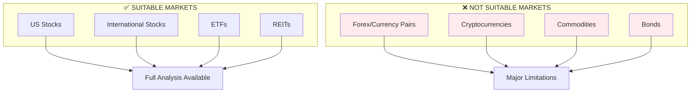

### ❌ **Why TradingAgents is NOT Suitable for Forex Trading**

#### 1. **Missing Critical Forex Data Sources**
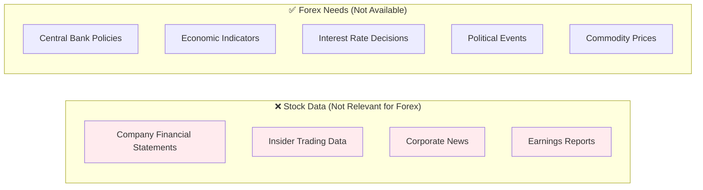

**Forex markets require data that TradingAgents doesn't have**:
- ❌ **Central Bank Policies**: Interest rate decisions, monetary policy statements
- ❌ **Economic Indicators**: GDP, CPI, employment data, PMI
- ❌ **Political Events**: Elections, policy changes, geopolitical tensions
- ❌ **Commodity Correlations**: Oil, gold prices affecting currencies
- ❌ **Capital Flows**: International money movement data

#### 2. **Wrong Analysis Framework**
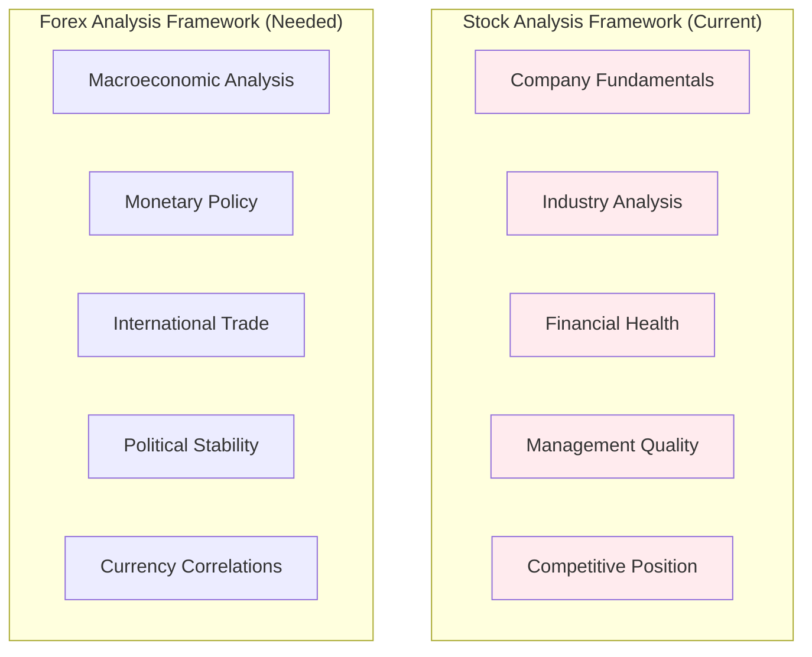

#### 3. **Inappropriate Agent Roles**
Current agents are designed for stock analysis:

| Current Agent | Stock Focus | Forex Limitation |
|---------------|-------------|------------------|
| **Fundamentals Analyst** | Company financial statements | ❌ No company in forex pairs |
| **Social Media Analyst** | Stock discussions on Reddit | ❌ Different forex discussion patterns |
| **News Analyst** | Company-specific news | ❌ Needs macroeconomic news |
| **Market Analyst** | Stock technical indicators | ⚠️ Limited - only technical analysis works |

### ⚠️ **Limited Technical Analysis Capability**

**What MIGHT work for forex**:
```python
# Technical indicators could theoretically work
ta.propagate("EURUSD=X", "2024-01-15")  # EUR/USD analysis
ta.propagate("GBPUSD=X", "2024-01-15")  # GBP/USD analysis

# Might provide:
# ✅ RSI, MACD, Bollinger Bands
# ✅ Moving averages
# ✅ Support/resistance levels
```

**What WON'T work for forex**:
```python
final_state["fundamentals_report"]  # ❌ No fundamental data
final_state["sentiment_report"]     # ❌ Wrong sentiment sources
final_state["news_report"]          # ❌ Company news irrelevant
```

### 🔧 **What Would Be Needed for Forex Support**

#### Required Data Sources
```python
forex_data_sources = {
    "economic_calendar": "Major economic events and releases",
    "central_banks": "Fed, ECB, BOJ, BOE policy decisions",
    "macro_indicators": "GDP, inflation, employment data",
    "political_events": "Elections, policy changes",
    "commodity_prices": "Oil, gold affecting currencies",
    "capital_flows": "International money movements"
}
```

#### Required Agent Redesign
```python
forex_agents = [
    "macro_economist",        # GDP, inflation, employment analysis
    "central_bank_analyst",   # Monetary policy interpretation
    "geopolitical_analyst",   # Political events and stability
    "commodity_analyst",      # Oil, gold correlation analysis
    "flow_analyst",          # Capital flow and sentiment
    "technical_analyst"       # Price action and indicators
]
```

#### Required Analysis Framework
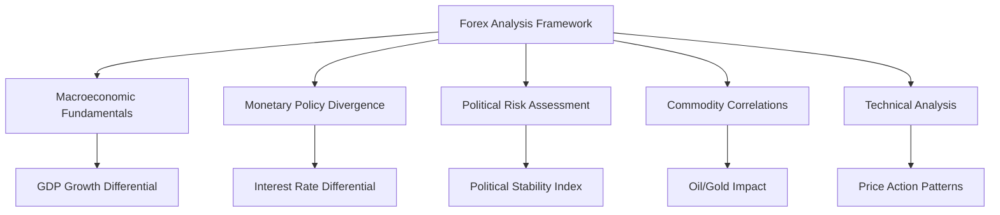

### 🎯 **Recommended Alternatives for Forex Trading**

If you're interested in forex analysis, consider these specialized tools:

#### Forex-Specific Platforms
- **MetaTrader 4/5**: Built-in forex analysis tools
- **TradingView**: Forex charts and community analysis
- **Forex.com**: Comprehensive forex research
- **DailyFX**: Economic calendar and forex analysis
- **Investing.com**: Economic indicators and news

#### Economic Data Sources
- **Federal Reserve Economic Data (FRED)**: US economic indicators
- **European Central Bank**: Eurozone data
- **Bank of Japan**: Japanese economic data
- **Economic Calendar Websites**: ForexFactory, Investing.com

### 📊 **Other Asset Classes**

#### ⚠️ **Limited Applicability**
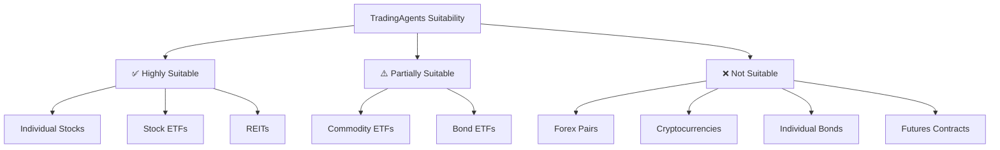

**Explanation**:
- **✅ Highly Suitable**: Full fundamental + technical analysis available
- **⚠️ Partially Suitable**: Technical analysis works, limited fundamental data
- **❌ Not Suitable**: Wrong data sources and analysis framework

## 🔮 Future Capabilities

While TradingAgents currently focuses on stock analysis and recommendations, potential future enhancements might include:

### Stock Market Enhancements
- **Paper Trading**: Simulated trading for strategy testing
- **Broker Integration**: Read-only account monitoring (no execution)
- **Portfolio Analytics**: Performance tracking and analysis
- **Alert Systems**: Notification of significant market events
- **Strategy Backtesting**: Historical performance evaluation

### Potential Market Expansion
- **Forex Module**: Dedicated forex analysis with appropriate data sources
- **Crypto Analysis**: Cryptocurrency-specific fundamental analysis
- **Commodity Analysis**: Supply/demand fundamentals for commodities
- **Bond Analysis**: Interest rate and credit analysis

**Note**: Any future trading-related features would maintain the human-in-the-loop principle and require explicit user authorization.

## ⚠️ Important Disclaimers

### Risk Warning
- **Trading Risk**: All trading and investing involves substantial risk of loss
- **No Guarantees**: Past performance does not guarantee future results
- **Market Volatility**: Markets can be unpredictable and volatile
- **System Limitations**: AI systems can make errors or have biases

### Legal Disclaimer
- **Not Investment Advice**: TradingAgents provides analysis tools, not investment advice
- **User Responsibility**: Users are solely responsible for their investment decisions
- **No Liability**: The system creators are not liable for trading losses
- **Regulatory Compliance**: Users must comply with applicable laws and regulations

---

## 📞 Getting Help

If you have questions about TradingAgents capabilities:

1. **Documentation**: Check our comprehensive [User Guide](user-guide.md)
2. **API Reference**: See [API Reference](../developer/api-reference.md) for technical details
3. **Community**: Join our [Discord community](https://discord.com/invite/hk9PGKShPK)
4. **Issues**: Report bugs on [GitHub Issues](https://github.com/TauricResearch/TradingAgents/issues)

**Remember**: TradingAgents is a powerful analysis tool designed to enhance your investment research and decision-making process, not to replace your judgment or execute trades automatically.