# System Capabilities and Limitations

## 🎯 What TradingAgents Does and Doesn't Do

This document clarifies the exact capabilities and limitations of TradingAgents to help users understand what to expect from the system.

## ✅ What TradingAgents PROVIDES

### 🧠 Intelligent Analysis Framework
TradingAgents is a **decision support system** that provides comprehensive investment analysis through AI-powered agents:


### 📊 Comprehensive Market Analysis
- **Technical Analysis**: RSI, MACD, Bollinger Bands, moving averages, volume analysis
- **Fundamental Analysis**: Financial statements, ratios, company metrics, insider trading data
- **Sentiment Analysis**: Social media sentiment, Reddit discussions, retail investor mood
- **News Analysis**: Market-moving events, company announcements, economic indicators
- **Risk Assessment**: Multi-layered risk evaluation from different perspectives

### 🤖 AI-Powered Decision Making
- **Multi-Agent Collaboration**: Specialized agents working together
- **Debate Mechanism**: Bull vs Bear researchers ensuring balanced analysis
- **Memory System**: Learning from past decisions and outcomes
- **Adaptive Reasoning**: Adjusting analysis based on market conditions

### 📈 Investment Recommendations
- **Clear Decisions**: BUY, HOLD, or SELL recommendations
- **Detailed Reasoning**: Complete explanation of decision logic
- **Risk-Adjusted Suggestions**: Position sizing and risk management advice
- **Market Timing**: Entry and exit strategy recommendations

## ❌ What TradingAgents DOES NOT PROVIDE

### 🚫 No Actual Trading Execution

**IMPORTANT**: TradingAgents is **NOT** an automated trading system and does **NOT**:

```mermaid
graph TB
    subgraph "❌ NOT PROVIDED"
        A[Broker Integration]
        B[Order Execution]
        C[Fund Management]
        D[Automatic Trading]
    end
    
    A --> A1[❌ No broker API connections]
    A --> A2[❌ No account access]
    
    B --> B1[❌ No buy/sell orders]
    B --> B2[❌ No position management]
    
    C --> C1[❌ No real money handling]
    C --> C2[❌ No portfolio execution]
    
    D --> D1[❌ No autonomous trading]
    D --> D2[❌ No unattended operation]
    
    style A fill:#ffebee
    style B fill:#ffebee
    style C fill:#ffebee
    style D fill:#ffebee
```



#### Specifically, TradingAgents Does NOT:
- ❌ **Execute trades** on any brokerage platform
- ❌ **Place orders** (buy, sell, stop-loss, etc.)
- ❌ **Manage real money** or access trading accounts
- ❌ **Connect to brokers** (TD Ameritrade, Interactive Brokers, etc.)
- ❌ **Automatically trade** without human intervention
- ❌ **Handle portfolio management** with real funds
- ❌ **Process payments** or financial transactions

### 🚫 No Financial Services
- ❌ **Investment advice** (for regulatory compliance)
- ❌ **Financial planning** services
- ❌ **Portfolio management** services
- ❌ **Tax advice** or reporting
- ❌ **Regulatory compliance** handling

## 🔄 Typical User Workflow


## 🎯 System Positioning

### TradingAgents is a **Decision Support Tool**


**Role**: Intelligent assistant that enhances human decision-making
**NOT**: Autonomous trading robot that replaces human judgment

### Design Philosophy: Human-in-the-Loop
- **AI Provides**: Comprehensive analysis, data processing, pattern recognition
- **Human Decides**: Final investment decisions, risk tolerance, execution timing
- **Human Executes**: All actual trading through their chosen platforms

## 📊 Data Sources and Capabilities

### Real-Time Data Integration
TradingAgents connects to multiple data sources to provide comprehensive analysis:


### Data Source Details

| Data Source | Type | Update Frequency | Coverage |
|-------------|------|------------------|----------|
| **Yahoo Finance** | Market Data | Real-time | Global stocks, OHLCV data |
| **Finnhub** | News & Fundamentals | Real-time | Company news, insider data |
| **Google News** | News Analysis | Real-time | Global financial news |
| **Reddit** | Social Sentiment | Real-time | Retail investor discussions |
| **SimFin** | Financial Statements | Quarterly | Balance sheets, income statements |
| **StockStats** | Technical Indicators | Calculated | RSI, MACD, Bollinger Bands |

### Online vs Offline Modes

#### Online Mode (`online_tools=True`)
- ✅ **Real-time data** from live APIs
- ✅ **Latest news** and market events
- ✅ **Current sentiment** analysis
- ⚠️ **Requires API keys** and internet connection
- ⚠️ **Higher latency** due to API calls

#### Offline Mode (`online_tools=False`)
- ✅ **Fast processing** with cached data
- ✅ **No API dependencies** or costs
- ✅ **Consistent results** for backtesting
- ⚠️ **Historical data only** (not real-time)
- ⚠️ **Limited to cached** news and sentiment

## 🔒 Safety and Compliance

### Why No Direct Trading?


### Regulatory Considerations
- **Investment Advice**: TradingAgents provides analysis, not regulated investment advice
- **Fiduciary Responsibility**: Users maintain full responsibility for their investment decisions
- **Risk Disclosure**: All trading involves risk of financial loss
- **Compliance**: Users must comply with their local financial regulations

### User Responsibility
- ✅ **Review all analysis** before making decisions
- ✅ **Understand the risks** of trading and investing
- ✅ **Verify data accuracy** when possible
- ✅ **Comply with regulations** in your jurisdiction
- ✅ **Use appropriate position sizing** and risk management

## 🎯 Best Practices for Users

### How to Use TradingAgents Effectively

1. **Analysis Review**
   ```
   ✅ Read the complete analysis report
   ✅ Understand the reasoning behind recommendations
   ✅ Consider multiple agent perspectives
   ✅ Evaluate risk assessments carefully
   ```

2. **Decision Making**
   ```
   ✅ Combine TradingAgents analysis with your own research
   ✅ Consider your personal risk tolerance
   ✅ Evaluate position sizing recommendations
   ✅ Plan entry and exit strategies
   ```

3. **Execution**
   ```
   ✅ Use your preferred broker platform
   ✅ Double-check all order details
   ✅ Implement appropriate risk management
   ✅ Monitor positions actively
   ```

4. **Learning**
   ```
   ✅ Track your trading outcomes
   ✅ Provide feedback to TradingAgents for learning
   ✅ Analyze what worked and what didn't
   ✅ Continuously improve your process
   ```

## 🔮 Future Capabilities

While TradingAgents currently focuses on analysis and recommendations, potential future enhancements might include:

- **Paper Trading**: Simulated trading for strategy testing
- **Broker Integration**: Read-only account monitoring (no execution)
- **Portfolio Analytics**: Performance tracking and analysis
- **Alert Systems**: Notification of significant market events
- **Strategy Backtesting**: Historical performance evaluation

**Note**: Any future trading-related features would maintain the human-in-the-loop principle and require explicit user authorization.

## ⚠️ Important Disclaimers

### Risk Warning
- **Trading Risk**: All trading and investing involves substantial risk of loss
- **No Guarantees**: Past performance does not guarantee future results
- **Market Volatility**: Markets can be unpredictable and volatile
- **System Limitations**: AI systems can make errors or have biases

### Legal Disclaimer
- **Not Investment Advice**: TradingAgents provides analysis tools, not investment advice
- **User Responsibility**: Users are solely responsible for their investment decisions
- **No Liability**: The system creators are not liable for trading losses
- **Regulatory Compliance**: Users must comply with applicable laws and regulations

---

## 📞 Getting Help

If you have questions about TradingAgents capabilities:

1. **Documentation**: Check our comprehensive [User Guide](user-guide.md)
2. **API Reference**: See [API Reference](../developer/api-reference.md) for technical details
3. **Community**: Join our [Discord community](https://discord.com/invite/hk9PGKShPK)
4. **Issues**: Report bugs on [GitHub Issues](https://github.com/TauricResearch/TradingAgents/issues)

**Remember**: TradingAgents is a powerful analysis tool designed to enhance your investment research and decision-making process, not to replace your judgment or execute trades automatically.